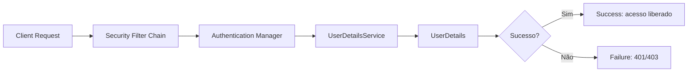

# Spring Security

Spring Security é o framework padrão para segurança em aplicações Spring. Ele intercepta requisições HTTP e verifica se o usuário tem permissão para acessar o recurso antes de chegar ao controller.

## Arquitetura do Spring Security

Antes de entrar em JWT e roles, ajuda entender o caminho que uma requisição percorre dentro do Spring Security:



Cada requisição passa primeiro pela **Security Filter Chain**, uma sequência de filtros que intercepta tudo antes de chegar ao controller. Um desses filtros aciona o **Authentication Manager**, responsável por autenticar o usuário. Ele delega para o **UserDetailsService**, que busca os dados do usuário (geralmente no banco) e devolve um objeto **UserDetails** com as informações necessárias (senha com hash, roles/authorities). Se tudo bater, a requisição segue autenticada; se não, o Spring devolve 401 ou 403.

As peças principais desse fluxo:

| Interface / Classe      | Papel                                                       |
| ----------------------- | ----------------------------------------------------------- |
| `UserDetails`           | Representa os dados de um usuário autenticado               |
| `UserDetailsService`    | Carrega os dados do usuário (normalmente do banco)          |
| `AuthenticationManager` | Autentica a requisição, delegando para o UserDetailsService |
| `PasswordEncoder`       | Codifica e compara senhas                                   |
| `GrantedAuthority`      | Representa uma role ou permissão do usuário                 |
| `SecurityFilterChain`   | Configura quais rotas exigem autenticação e como            |

Todo o código que você já viu nas seções anteriores (o bean `SecurityFilterChain`, o `PasswordEncoder`, o `JwtAuthFilter`) é uma implementação concreta dessas peças - o filtro JWT, por exemplo, é o que popula o `SecurityContextHolder` para que o `AuthenticationManager` saiba que a requisição já está autenticada.

## Autenticação vs Autorização

- **Autenticação:** confirmar quem você é (login com senha, token, etc.)
- **Autorização:** confirmar o que você pode fazer (admin pode deletar, usuário comum não)

A sequência sempre é: autenticar primeiro, autorizar depois.

## Dependência

```xml
<dependency>
    <groupId>org.springframework.boot</groupId>
    <artifactId>spring-boot-starter-security</artifactId>
</dependency>
```

Ao adicionar essa dependência, Spring Security protege todos os endpoints automaticamente, exigindo login com o usuário `user` e uma senha gerada no console.

## Configuração básica

A configuração é feita através de um bean `SecurityFilterChain`:

```java
import org.springframework.context.annotation.Bean;
import org.springframework.context.annotation.Configuration;
import org.springframework.security.config.annotation.web.builders.HttpSecurity;
import org.springframework.security.web.SecurityFilterChain;

@Configuration
public class SecurityConfig {

    @Bean
    public SecurityFilterChain filterChain(HttpSecurity http) throws Exception {
        http
            .authorizeHttpRequests(auth -> auth
                .requestMatchers("/login", "/registro").permitAll()  // público
                .requestMatchers("/admin/**").hasRole("ADMIN")       // só admin
                .anyRequest().authenticated()                         // resto precisa de login
            )
            .csrf(csrf -> csrf.disable()); // desabilitar para APIs REST

        return http.build();
    }
}
```

## Password Encoder com BCrypt

Nunca armazene senhas em texto puro. BCrypt é o algoritmo recomendado:

```java
@Bean
public PasswordEncoder passwordEncoder() {
    return new BCryptPasswordEncoder();
}
```

```java
// Ao cadastrar usuário
String senhaCriptografada = passwordEncoder.encode("minhasenha123");
usuario.setSenha(senhaCriptografada);

// Ao fazer login
boolean senhaCorreta = passwordEncoder.matches("minhasenha123", senhaCriptografada);
```

BCrypt inclui um salt aleatório em cada hash, então duas senhas iguais geram hashes diferentes.

## Autenticação com JWT

JWT (JSON Web Token) é a abordagem mais comum para APIs REST. Em vez de sessões no servidor, o token carrega as informações do usuário e é enviado em cada requisição.

### Estrutura do JWT

```
eyJhbGciOiJIUzI1NiJ9.eyJzdWIiOiJhbmFAZXhlbXBsby5jb20iLCJleHAiOjE3MTQ5NjgwMDB9.abc123
     header                              payload                                signature
```

- **Header:** algoritmo de assinatura
- **Payload:** dados (subject, expiração, roles, etc.)
- **Signature:** garante que o token não foi adulterado

### Dependência JWT

```xml
<dependency>
    <groupId>io.jsonwebtoken</groupId>
    <artifactId>jjwt-api</artifactId>
    <version>0.12.3</version>
</dependency>
<dependency>
    <groupId>io.jsonwebtoken</groupId>
    <artifactId>jjwt-impl</artifactId>
    <version>0.12.3</version>
    <scope>runtime</scope>
</dependency>
<dependency>
    <groupId>io.jsonwebtoken</groupId>
    <artifactId>jjwt-jackson</artifactId>
    <version>0.12.3</version>
    <scope>runtime</scope>
</dependency>
```

### JwtService

```java
import io.jsonwebtoken.*;
import io.jsonwebtoken.security.Keys;
import org.springframework.beans.factory.annotation.Value;
import org.springframework.stereotype.Service;

import javax.crypto.SecretKey;
import java.time.Instant;
import java.time.Duration;
import java.util.Date;

@Service
public class JwtService {

    @Value("${jwt.secret}")
    private String secret;

    private static final Duration EXPIRACAO = Duration.ofHours(24);

    private SecretKey getChave() {
        return Keys.hmacShaKeyFor(secret.getBytes());
    }

    public String gerar(String email) {
        return Jwts.builder()
            .subject(email)
            .issuedAt(Date.from(Instant.now()))
            .expiration(Date.from(Instant.now().plus(EXPIRACAO)))
            .signWith(getChave())
            .compact();
    }

    public String extrairEmail(String token) {
        return Jwts.parser()
            .verifyWith(getChave())
            .build()
            .parseSignedClaims(token)
            .getPayload()
            .getSubject();
    }

    public boolean isValido(String token) {
        try {
            extrairEmail(token);
            return true;
        } catch (JwtException e) {
            return false;
        }
    }
}
```

```properties
# application.properties
jwt.secret=sua-chave-secreta-com-pelo-menos-32-caracteres-aqui
```

### Filtro JWT

O filtro intercepta cada requisição e valida o token:

```java
import jakarta.servlet.*;
import jakarta.servlet.http.*;
import org.springframework.security.authentication.UsernamePasswordAuthenticationToken;
import org.springframework.security.core.context.SecurityContextHolder;
import org.springframework.stereotype.Component;
import org.springframework.web.filter.OncePerRequestFilter;

@Component
public class JwtAuthFilter extends OncePerRequestFilter {

    private final JwtService jwtService;
    private final UserDetailsService userDetailsService;

    public JwtAuthFilter(JwtService jwtService, UserDetailsService userDetailsService) {
        this.jwtService = jwtService;
        this.userDetailsService = userDetailsService;
    }

    @Override
    protected void doFilterInternal(HttpServletRequest request,
                                    HttpServletResponse response,
                                    FilterChain chain)
            throws ServletException, IOException {

        String authHeader = request.getHeader("Authorization");

        if (authHeader == null || !authHeader.startsWith("Bearer ")) {
            chain.doFilter(request, response);
            return;
        }

        String token = authHeader.substring(7);

        if (jwtService.isValido(token)) {
            String email = jwtService.extrairEmail(token);
            var userDetails = userDetailsService.loadUserByUsername(email);

            var auth = new UsernamePasswordAuthenticationToken(
                userDetails, null, userDetails.getAuthorities()
            );

            SecurityContextHolder.getContext().setAuthentication(auth);
        }

        chain.doFilter(request, response);
    }
}
```

### Configuração com JWT

```java
@Configuration
@EnableWebSecurity
public class SecurityConfig {

    private final JwtAuthFilter jwtAuthFilter;

    public SecurityConfig(JwtAuthFilter jwtAuthFilter) {
        this.jwtAuthFilter = jwtAuthFilter;
    }

    @Bean
    public SecurityFilterChain filterChain(HttpSecurity http) throws Exception {
        http
            .csrf(csrf -> csrf.disable())
            .sessionManagement(session ->
                session.sessionCreationPolicy(SessionCreationPolicy.STATELESS)
            )
            .authorizeHttpRequests(auth -> auth
                .requestMatchers("/auth/**").permitAll()
                .anyRequest().authenticated()
            )
            .addFilterBefore(jwtAuthFilter, UsernamePasswordAuthenticationFilter.class);

        return http.build();
    }

    @Bean
    public AuthenticationManager authManager(AuthenticationConfiguration config)
            throws Exception {
        return config.getAuthenticationManager();
    }

    @Bean
    public PasswordEncoder passwordEncoder() {
        return new BCryptPasswordEncoder();
    }
}
```

### Controller de autenticação

```java
@RestController
@RequestMapping("/auth")
public class AuthController {

    private final AuthService authService;

    public AuthController(AuthService authService) {
        this.authService = authService;
    }

    @PostMapping("/login")
    public ResponseEntity<TokenResponse> login(@RequestBody LoginRequest request) {
        String token = authService.autenticar(request.email(), request.senha());
        return ResponseEntity.ok(new TokenResponse(token));
    }

    @PostMapping("/registro")
    public ResponseEntity<Void> registrar(@RequestBody RegistroRequest request) {
        authService.registrar(request);
        return ResponseEntity.status(201).build();
    }
}

public record LoginRequest(String email, String senha) {}
public record RegistroRequest(String nome, String email, String senha) {}
public record TokenResponse(String token) {}
```

```java
@Service
public class AuthService {

    private final UsuarioRepository repository;
    private final PasswordEncoder encoder;
    private final JwtService jwtService;
    private final AuthenticationManager authManager;

    // construtor...

    public String autenticar(String email, String senha) {
        authManager.authenticate(
            new UsernamePasswordAuthenticationToken(email, senha)
        );
        return jwtService.gerar(email);
    }

    public void registrar(RegistroRequest request) {
        if (repository.existsByEmail(request.email())) {
            throw new EmailJaExisteException("Email já cadastrado");
        }
        Usuario usuario = new Usuario(
            request.nome(),
            request.email(),
            encoder.encode(request.senha())
        );
        repository.save(usuario);
    }
}
```

## Refresh Tokens

Access tokens têm vida curta (minutos/horas) por segurança. Refresh tokens têm vida longa e servem para obter novos access tokens sem login:

```java
@Entity
public class RefreshToken {
    @Id
    @GeneratedValue(strategy = GenerationType.IDENTITY)
    private Long id;

    @Column(nullable = false, unique = true)
    private String token;

    @ManyToOne
    @JoinColumn(name = "usuario_id")
    private Usuario usuario;

    @Column(nullable = false)
    private LocalDateTime expiracao;

    public boolean isExpirado() {
        return LocalDateTime.now().isAfter(expiracao);
    }
}
```

```java
@RestController
@RequestMapping("/auth")
public class AuthController {

    @PostMapping("/refresh")
    public ResponseEntity<TokenResponse> refresh(@RequestBody RefreshRequest request) {
        String novoToken = authService.renovarToken(request.refreshToken());
        return ResponseEntity.ok(new TokenResponse(novoToken));
    }
}
```

## Autorização por roles

```java
// Na entidade Usuario
@ElementCollection(fetch = FetchType.EAGER)
private Set<String> roles = Set.of("ROLE_USER");

// Na configuração
.authorizeHttpRequests(auth -> auth
    .requestMatchers(HttpMethod.GET, "/produtos/**").permitAll()
    .requestMatchers(HttpMethod.POST, "/produtos").hasRole("ADMIN")
    .requestMatchers(HttpMethod.DELETE, "/produtos/**").hasRole("ADMIN")
    .anyRequest().authenticated()
)

// Nos métodos do controller
@PreAuthorize("hasRole('ADMIN')")
@DeleteMapping("/{id}")
public ResponseEntity<Void> deletar(@PathVariable Long id) { ... }
```

Para usar `@PreAuthorize`, adicione `@EnableMethodSecurity` na classe de configuração.

## CORS e CSRF

São duas proteções diferentes, e é comum confundir uma com a outra.

**CORS** (Cross-Origin Resource Sharing) entra em cena quando o frontend roda em uma origem diferente da API - por exemplo, `app.exemplo.com` chamando `api.exemplo.com`. Por padrão, o navegador bloqueia essa chamada por segurança, a menos que o servidor diga explicitamente quais origens têm permissão:

```java
@Bean
public SecurityFilterChain filterChain(HttpSecurity http) throws Exception {
    http
        .cors(cors -> cors.configurationSource(request -> {
            var config = new CorsConfiguration();
            config.setAllowedOrigins(List.of("https://app.exemplo.com"));
            config.setAllowedMethods(List.of("GET", "POST", "PUT", "DELETE"));
            return config;
        }))
        // resto da configuração
        ;
    return http.build();
}
```

**CSRF** (Cross-Site Request Forgery) protege contra um site malicioso que engana o navegador do usuário para enviar uma requisição autenticada sem ele perceber - um ataque que depende de o navegador enviar cookies de sessão automaticamente junto com a requisição.

É por isso que, nas configurações vistas até aqui, `.csrf(csrf -> csrf.disable())` aparece toda vez: uma API REST stateless, autenticada via token JWT no header `Authorization`, não usa sessão nem cookie para autenticar - o navegador não envia o token sozinho, então o ataque de CSRF simplesmente não se aplica. Desabilitar CSRF só é seguro nesse cenário; numa aplicação que ainda usa sessão/cookie para autenticação, a proteção CSRF deve continuar ativa.

## OAuth2 / Login Social

Para autenticação com Google, GitHub, etc.:

```xml
<dependency>
    <groupId>org.springframework.boot</groupId>
    <artifactId>spring-boot-starter-oauth2-client</artifactId>
</dependency>
```

```properties
spring.security.oauth2.client.registration.google.client-id=SEU_CLIENT_ID
spring.security.oauth2.client.registration.google.client-secret=SEU_CLIENT_SECRET
```

```java
http.oauth2Login(oauth2 -> oauth2
    .successHandler(customSuccessHandler)
);
```

O fluxo OAuth2 é:

1. Usuário clica em "Login com Google"
2. App redireciona para Google
3. Usuário autoriza
4. Google retorna um code para o app
5. App troca o code por um access token com o Google
6. App busca os dados do usuário e cria uma sessão local
