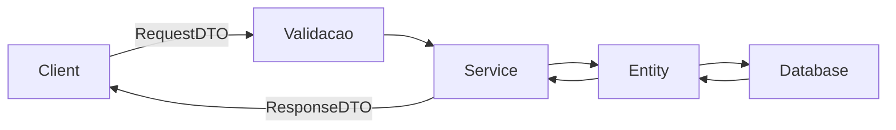

# Validação, DTO e Logging

Uma API que aceita qualquer dado sem checar nada é uma API que vai quebrar em produção. Este guia cobre três peças que andam juntas em qualquer projeto Spring sério: validar o que entra, isolar o que trafega com DTOs e registrar o que acontece com logs.

## Validação com Bean Validation

Adicione a dependência que traz as anotações de validação:

```xml
<dependency>
    <groupId>org.springframework.boot</groupId>
    <artifactId>spring-boot-starter-validation</artifactId>
</dependency>
```

A ideia é simples: antes de qualquer regra de negócio rodar, o Spring confere se os dados que chegaram do cliente fazem sentido. Nome vazio, email mal formatado, idade negativa - tudo isso é barrado na porta de entrada, sem precisar escrever `if` manual em cada service.

| Anotação                | Valida                                      |
| ----------------------- | ------------------------------------------- |
| `@NotNull`              | Valor não pode ser `null`                   |
| `@NotBlank`             | String não pode ser vazia nem só espaços    |
| `@NotEmpty`             | Coleção, String ou Map não pode estar vazia |
| `@Size(min = , max = )` | Tamanho dentro de um intervalo              |
| `@Min(value)`           | Valor numérico mínimo                       |
| `@Max(value)`           | Valor numérico máximo                       |
| `@Email`                | Formato de email válido                     |
| `@Pattern(regexp = )`   | Valor precisa bater com uma regex           |

Aplicando isso em um DTO de requisição:

```java
public record CadastroRequest(
    @NotBlank(message = "Nome é obrigatório")
    String nome,

    @Min(value = 1, message = "Idade deve ser maior ou igual a 1")
    @Max(value = 120, message = "Idade deve ser menor ou igual a 120")
    int idade,

    @Email(message = "Email inválido")
    String email
) {}
```

O `message` de cada anotação é o texto que volta pro cliente quando a validação falha - vale escrever algo que faça sentido para quem está consumindo a API, não só para quem está lendo o código.

Para a validação realmente rodar, o controller precisa da anotação `@Valid` no parâmetro:

```java
@PostMapping
public ResponseEntity<Void> cadastrar(@Valid @RequestBody CadastroRequest request) {
    service.cadastrar(request);
    return ResponseEntity.status(201).build();
}
```

Sem `@Valid`, as anotações do DTO ficam decorativas - o Spring simplesmente não confere nada. Quando a validação falha, o Spring lança `MethodArgumentNotValidException`, que pode ser capturada no `@RestControllerAdvice` visto na nota de [Spring Web](/labs/java/spring/01-spring-web/) e transformada numa resposta de erro amigável, com a lista de campos inválidos e suas mensagens.

## DTO (Data Transfer Object) em profundidade

DTO é o objeto que carrega dados entre o cliente e a API - não é a entidade do banco, é uma cópia enxuta pensada só para aquele request ou response específico. A regra prática é: **a entidade nunca sai do controller para fora, e nunca entra direto nele**.



Por que não simplesmente expor a entidade `@Entity` direto no controller? Alguns motivos concretos:

- **Segurança** - a entidade pode ter campos como senha (com hash), flags internas ou relacionamentos que não deveriam nunca aparecer numa resposta JSON
- **Esconder campos internos** - `id` gerado pelo banco, timestamps de auditoria, colunas técnicas não interessam ao cliente
- **Reduzir dados trafegados** - o DTO leva só o que o endpoint precisa, sem carregar relacionamentos inteiros por engano
- **Melhor design de API** - o formato de entrada e saída da API fica desacoplado do modelo de persistência, então você pode mudar a tabela do banco sem quebrar o contrato da API

Na prática, isso normalmente vira um par de tipos por recurso:

```java
// O que o cliente envia
public record ProdutoRequest(String nome, BigDecimal preco) {}

// O que a API devolve
public record ProdutoResponse(Long id, String nome, BigDecimal preco) {}
```

O service faz a ponte entre os dois mundos, convertendo `RequestDTO -> Entity` na entrada e `Entity -> ResponseDTO` na saída - normalmente à mão, com um construtor ou método de fábrica, mas em projetos maiores é comum usar uma biblioteca de mapeamento como MapStruct para gerar esse código repetitivo.

## Logging com SLF4J

Log é a ferramenta mais simples e mais usada para entender o que uma aplicação está fazendo em produção - muito antes de pensar em debugger anexado a um processo rodando num servidor, você olha o log.

Spring Boot já vem com SLF4J como fachada de logging, geralmente implementado por Logback nos bastidores. Os níveis, do menos ao mais severo, são:

```
TRACE → DEBUG → INFO → WARN → ERROR
```

- **TRACE** - detalhe extremo, quase nunca usado fora de debug muito específico
- **DEBUG** - informação útil durante desenvolvimento, geralmente desligada em produção
- **INFO** - eventos relevantes do fluxo normal da aplicação (usuário cadastrado, pedido processado)
- **WARN** - algo inesperado, mas que não impede a aplicação de continuar
- **ERROR** - falha real que precisa de atenção

```java
import org.slf4j.Logger;
import org.slf4j.LoggerFactory;

@Service
public class PedidoService {
    private static final Logger log = LoggerFactory.getLogger(PedidoService.class);

    public void processar(Pedido pedido) {
        log.info("Processando pedido {}", pedido.getId());

        if (pedido.getItens().isEmpty()) {
            log.warn("Pedido {} chegou sem itens", pedido.getId());
        }

        try {
            // lógica de processamento
        } catch (Exception e) {
            log.error("Falha ao processar pedido {}", pedido.getId(), e);
        }
    }
}
```

Repare no `{}` como placeholder em vez de concatenação de String - o SLF4J só monta a mensagem final se aquele nível de log estiver ativo, o que evita gastar processamento à toa em produção com DEBUG desligado.

Duas regras que evitam dor de cabeça: nunca logar dados sensíveis como senha, token ou número de cartão (mesmo em DEBUG, porque log costuma ir parar em arquivo ou serviço externo), e usar o nível certo para cada situação - um sistema onde tudo é `ERROR` é tão inútil quanto um onde tudo é `INFO`, porque ninguém consegue filtrar o que realmente importa.
