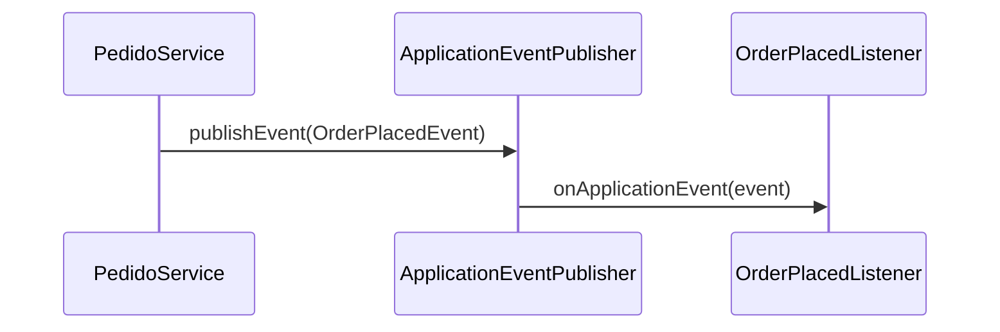

# Recursos Avançados do Spring Boot

Depois que a API básica está funcionando (controllers, JPA, segurança), o Spring Boot ainda tem uma caixa de ferramentas para os problemas que aparecem quando a aplicação vai para produção de verdade: configurações por ambiente, performance, tarefas em background e comunicação entre partes do sistema.

## Profiles

Profiles resolvem um problema comum: a URL do banco de dados de desenvolvimento não é a mesma de produção, a porta pode mudar, os logs podem precisar de mais detalhe localmente. Em vez de editar `application.properties` toda vez que troca de ambiente, você cria um arquivo por perfil e ativa o que precisa.

```properties
# application-dev.properties
server.port=8081
spring.datasource.url=jdbc:mysql://localhost:3306/devdb
```

```properties
# application-prod.properties
server.port=80
spring.datasource.url=jdbc:mysql://prod-server:3306/proddb
```

Para ativar um perfil, defina `spring.profiles.active` no `application.properties` principal ou passe como argumento na hora de rodar:

```properties
spring.profiles.active=dev
```

```bash
java -jar app.jar --spring.profiles.active=prod
```

O Spring carrega o `application.properties` base e depois sobrescreve com o que estiver em `application-{profile}.properties`, então valores que não mudam entre ambientes ficam só no arquivo base.

## Cache

Cache guarda o resultado de uma operação cara (geralmente uma consulta ao banco) em memória, para não repetir o trabalho toda vez que o mesmo dado é pedido de novo.

```xml
<dependency>
    <groupId>org.springframework.boot</groupId>
    <artifactId>spring-boot-starter-cache</artifactId>
</dependency>
```

```java
@SpringBootApplication
@EnableCaching
public class MinhaApiApplication { }
```

| Anotação         | Faz                                   |
| ---------------- | ------------------------------------- |
| `@Cacheable`     | Guarda o resultado do método em cache |
| `@CachePut`      | Atualiza o cache com o novo valor     |
| `@CacheEvict`    | Remove uma entrada do cache           |
| `@EnableCaching` | Liga o suporte a cache na aplicação   |

```java
@Service
public class ProdutoService {

    @Cacheable(value = "produtos", key = "#id")
    public Produto buscarPorId(Long id) {
        return produtoRepository.findById(id).orElse(null);
    }

    @CachePut(value = "produtos", key = "#produto.id")
    public Produto atualizar(Produto produto) {
        return produtoRepository.save(produto);
    }

    @CacheEvict(value = "produtos", key = "#id")
    public void deletar(Long id) {
        produtoRepository.deleteById(id);
    }
}
```

Na primeira chamada de `buscarPorId(1L)`, o método roda normalmente e o resultado é guardado sob a chave `1`. Na segunda chamada com o mesmo id, o Spring nem executa o corpo do método - devolve direto o que está em cache. Por padrão o Spring usa um cache em memória simples (`ConcurrentHashMap`), mas em produção é comum trocar por **Redis**, que permite compartilhar o cache entre várias instâncias da aplicação.

## Processamento assíncrono

Algumas operações demoram e não precisam bloquear quem fez a chamada - enviar um email, gerar um relatório, notificar um serviço externo. Para isso, o Spring oferece execução assíncrona em outra thread.

```java
@SpringBootApplication
@EnableAsync
public class MinhaApiApplication { }
```

```java
@Service
public class EmailService {

    @Async
    public void enviar(String destinatario) {
        // operação demorada, ex: chamar um provedor de email externo
        System.out.println("Email enviado para " + destinatario);
    }
}
```

O método marcado com `@Async` roda numa thread separada assim que é chamado, e quem chamou continua sua execução sem esperar. O tipo de retorno pode ser `void` (dispara e esquece) ou `CompletableFuture<T>`, quando você precisa acompanhar o resultado depois:

```java
@Async
public CompletableFuture<String> gerarRelatorio() {
    // processamento demorado
    return CompletableFuture.completedFuture("relatório pronto");
}
```

Os ganhos são diretos: a requisição HTTP responde mais rápido, a experiência de quem está usando a API melhora, e a thread principal fica livre para atender outras requisições em vez de travada esperando uma operação de I/O terminar.

## Agendamento de tarefas

Para rodar algo em intervalos fixos, sem depender de uma requisição externa disparar - um relatório diário, uma limpeza de dados antigos - use `@Scheduled`.

```java
@SpringBootApplication
@EnableScheduling
public class MinhaApiApplication { }
```

```java
@Service
public class RelatorioService {

    @Scheduled(cron = "0 0 9 * * MON-FRI")
    public void relatorioDiario() {
        System.out.println("Relatório gerado");
    }
}
```

A expressão dentro de `cron` segue o formato `segundo minuto hora dia-do-mês mês dia-da-semana`:

| Expressão           | Significado               |
| ------------------- | ------------------------- |
| `0 0 0 * * ?`       | Toda meia-noite           |
| `0 0 * * * ?`       | Toda hora, no minuto zero |
| `0 0/10 * * * ?`    | A cada 10 minutos         |
| `0 0 9 * * MON-FRI` | Toda dia útil, às 9h      |

Existem também `fixedRate` (roda a cada X milissegundos, contando do início da execução anterior) e `fixedDelay` (roda X milissegundos depois que a execução anterior terminou), úteis quando você não precisa de um horário exato, só de um intervalo.

## Spring Boot Actuator

Actuator expõe endpoints prontos para monitorar e gerenciar a aplicação rodando em produção, sem você precisar escrever esse código manualmente.

```xml
<dependency>
    <groupId>org.springframework.boot</groupId>
    <artifactId>spring-boot-starter-actuator</artifactId>
</dependency>
```

Com a dependência adicionada, esses endpoints já ficam disponíveis (alguns exigem habilitar explicitamente em `application.properties`):

- `/actuator/health` - status da aplicação (UP/DOWN) e das dependências (banco, disco)
- `/actuator/info` - informações customizadas sobre a build/versão
- `/actuator/metrics` - métricas de uso (memória, requisições, threads)
- `/actuator/env` - variáveis de ambiente e propriedades carregadas
- `/actuator/mappings` - lista de todas as rotas registradas na aplicação

Em produção, é comum restringir o acesso a esses endpoints (com Spring Security) e conectar `/actuator/metrics` a uma ferramenta como Prometheus e Grafana para visualizar tudo em dashboards.

## Eventos e Listeners

Eventos permitem desacoplar "o que aconteceu" de "o que fazer a respeito", seguindo o padrão publisher/listener: uma parte do código publica um evento, e outra parte (ou várias) reage a ele sem que uma conheça os detalhes da outra.



Primeiro, a classe do evento:

```java
public class OrderPlacedEvent {
    private final Long orderId;

    public OrderPlacedEvent(Long orderId) {
        this.orderId = orderId;
    }

    public Long getOrderId() {
        return orderId;
    }
}
```

Quem publica o evento:

```java
@Service
public class PedidoService {
    private final ApplicationEventPublisher publisher;

    public PedidoService(ApplicationEventPublisher publisher) {
        this.publisher = publisher;
    }

    public void criarPedido(Long orderId) {
        // lógica de criação do pedido
        publisher.publishEvent(new OrderPlacedEvent(orderId));
    }
}
```

Quem escuta:

```java
@Component
public class OrderPlacedListener implements ApplicationListener<OrderPlacedEvent> {

    @Override
    public void onApplicationEvent(OrderPlacedEvent event) {
        System.out.println("Pedido criado: " + event.getOrderId());
        // enviar email, atualizar estoque, notificar outro serviço...
    }
}
```

Vale usar eventos quando uma ação dispara efeitos colaterais que não fazem parte da responsabilidade principal do service - por exemplo, `PedidoService` não precisa saber que existe um serviço de email ou de estoque, ele só anuncia que um pedido foi criado. Para uma chamada direta e simples entre duas classes que sempre vão evoluir juntas, um método comum ainda é mais fácil de seguir do que um evento.
