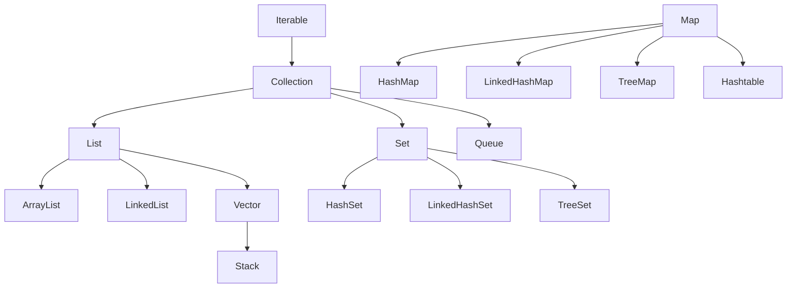
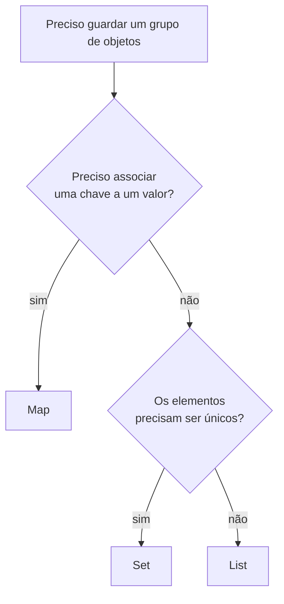

# Java Collections Framework

Toda vez que você guarda uma lista de produtos, um conjunto de emails únicos ou um mapa de usuários por ID, está usando o Collections Framework. Ele é o conjunto de interfaces e classes prontas do Java para guardar e manipular grupos de objetos, e escolher a implementação certa faz diferença real em performance e correção do código.

## Hierarquia do framework

A raiz de tudo é `Iterable` - qualquer coisa que pode ser percorrida em um `for-each`. `Collection` estende `Iterable` e é a interface base de `List`, `Set` e `Queue`. `Map` fica fora dessa árvore porque não trabalha com uma sequência de elementos, e sim com pares chave-valor.



`Map` não aparece ligado a `Collection` no diagrama de propósito - ela é uma família à parte, mas segue as mesmas convenções de nomes e métodos das outras estruturas.

## Interfaces principais

- **Collection** - representa um grupo de objetos, é a interface mais genérica das três famílias abaixo dela
- **List** - sequência ordenada, permite elementos duplicados, acesso por índice
- **Set** - não permite elementos duplicados
- **Queue** - fila, pensada para elementos que aguardam processamento (FIFO na maioria das implementações)
- **Map** - pares chave-valor, cada chave aparece no máximo uma vez

## List, Set ou Map: qual escolher

As três guardam um grupo de objetos, mas cada uma responde a uma pergunta diferente. Antes de pensar em `ArrayList` ou `HashMap`, decida qual das interfaces encaixa no problema. Um jeito de chegar lá é seguir essas três perguntas, nessa ordem:



`Map` entra quando cada dado tem um identificador e você vai buscar por ele: usuários por ID, preço por código de produto, contador por palavra. `Set` entra quando o que importa é "esse valor já está aqui?" e repetição não faz sentido: e-mails cadastrados, tags de um post, IDs já processados. `List` fica com o resto, que é a maioria dos casos: uma sequência em que a ordem importa e o mesmo valor pode aparecer duas vezes.

```java
List<String> carrinho = new ArrayList<>();   // itens na ordem em que foram adicionados, repetição ok
Set<String> emailsUsados = new HashSet<>();  // "esse e-mail já foi cadastrado?"
Map<Long, Usuario> usuariosPorId = new HashMap<>(); // pega o usuário pelo ID
```

Existe um argumento comum de que `List` resolveria 90% dos casos, e ele não está errado: `List` é o padrão quando você está na dúvida. Mas `Set` e `Map` não são só conveniência de organização, eles mudam o custo das operações, e é aí que a escolha aparece no perfil de performance.

### Custo de buscar um elemento

Procurar um valor dentro de uma `List` é uma busca sequencial. A estrutura olha um elemento por vez, do começo ao fim, até achar ou acabar a lista. Numa lista de 1 milhão de itens, no pior caso, são 1 milhão de comparações. Isso é O(n): o tempo cresce junto com o tamanho.

`HashSet` e `HashMap` usam uma tabela hash. O valor (ou a chave) é convertido num número que aponta direto para o "gaveteiro" certo, então a busca não depende de quantos elementos existem. Isso é O(1) em média, esteja a coleção com 10 ou com 10 milhões de itens.

```java
List<String> emails = new ArrayList<>(carregarMilharesDeEmails());
emails.contains("ana@exemplo.com"); // pode varrer a lista inteira

Set<String> emails = new HashSet<>(carregarMilharesDeEmails());
emails.contains("ana@exemplo.com"); // vai direto ao ponto
```

| Operação                     | `ArrayList` | `HashSet` / `HashMap` | `TreeSet` / `TreeMap` |
| ---------------------------- | ----------- | --------------------- | --------------------- |
| buscar por valor / por chave | O(n)        | O(1) em média         | O(log n)              |
| adicionar                    | O(1) no fim | O(1) em média         | O(log n)              |

O O(1) do hash é uma média. No pior caso (muitas chaves caindo no mesmo bucket) ele degrada, e desde o Java 8 o `HashMap` reorganiza esses buckets cheios numa árvore para segurar o pior caso em O(log n) em vez de O(n). Como isso funciona por dentro está em [HashMap por dentro](/labs/java/java/15-hashmap-por-dentro/). `TreeSet` e `TreeMap` já são O(log n) por natureza, porque guardam tudo numa árvore balanceada, e entregam a coleção sempre ordenada como parte do pacote.

Na prática, um `contains` rodando dentro de um laço sobre uma `List` grande é um sinal de alerta: quase sempre esses dados deveriam estar num `Set` ou num `Map`. O preço a pagar é memória, `Set` e `Map` gastam mais que uma `List` com os mesmos valores, por causa da tabela hash ou dos nós da árvore.

### As fábricas `List.of`, `Set.of` e `Map.of` com duplicados

Desde o Java 9 dá para criar coleções pequenas e imutáveis direto com `List.of(...)`, `Set.of(...)` e `Map.of(...)`. Tem uma pegadinha aqui que vale conhecer:

```java
List.of("Ana", "João", "Ana");         // ok: lista imutável com 3 elementos
Set.of("Ana", "João", "Ana");          // IllegalArgumentException: duplicate element
Map.of("Ana", 1, "João", 2, "Ana", 3); // IllegalArgumentException: duplicate key
```

`List.of` aceita repetidos, porque repetição é normal numa lista. Já `Set.of` e `Map.of` lançam `IllegalArgumentException` na hora da criação se encontrarem um elemento ou uma chave duplicada. Elas não removem a duplicata em silêncio de propósito: a ideia é que escrever `Set.of("Ana", "Ana")` no código é quase sempre um bug, e falhar na cara é melhor do que esconder.

Quando os dados vêm de fora e podem ter duplicatas de verdade (uma lista carregada do banco, por exemplo), use `Set.copyOf(lista)` ou `new HashSet<>(lista)`, que aí sim descartam as repetições sem reclamar. Vale lembrar também que nenhuma das três fábricas aceita `null`, e que `Map.of` só vai até 10 pares chave-valor, acima disso é `Map.ofEntries(...)`.

### Combinar as estruturas

As três não são exclusivas. O valor de um `Map` pode ser qualquer coleção, e é comum precisar disso:

```java
Map<String, List<Pedido>> pedidosPorCliente = new HashMap<>();
pedidosPorCliente
    .computeIfAbsent("ana@exemplo.com", cliente -> new ArrayList<>())
    .add(novoPedido);
```

Aqui o `Map` dá a busca rápida pelo cliente e a `List` mantém os pedidos daquele cliente em ordem. Escolher a estrutura certa em cada nível é o que deixa esse tipo de código legível.

## Implementações de List

| Classe       | Ordem | Duplicatas | Null | Thread-safe | Performance                   |
| ------------ | ----- | ---------- | ---- | ----------- | ----------------------------- |
| `ArrayList`  | Sim   | Sim        | Sim  | Não         | Rápida para `get`/`set`       |
| `LinkedList` | Sim   | Sim        | Sim  | Não         | Rápida para `add`/`remove`    |
| `Vector`     | Sim   | Sim        | Sim  | Sim         | Lenta (sincronização em tudo) |
| `Stack`      | Sim   | Sim        | Sim  | Sim         | Lenta                         |

`ArrayList` é apoiada por um array que cresce automaticamente por trás dos panos. Isso torna o acesso por índice (`get(i)`) muito rápido, mas inserir ou remover no meio da lista é caro, porque os elementos seguintes precisam ser deslocados:

```java
List<String> nomes = new ArrayList<>();
nomes.add("Ana");
nomes.add("Bruno");
nomes.add(0, "Zeca"); // desloca Ana e Bruno uma posição para a direita
```

`LinkedList` é uma lista duplamente encadeada - cada elemento aponta para o anterior e para o próximo. Inserir e remover no meio é barato (só rearranja os ponteiros vizinhos), mas acessar um índice qualquer exige percorrer a lista a partir de uma das pontas:

```java
List<String> fila = new LinkedList<>();
fila.add("primeiro");
fila.addFirst("zero"); // insere no início, O(1)
```

`Vector` e `Stack` são classes antigas, de antes do Collections Framework existir formalmente. Elas sincronizam todos os métodos internamente, o que as torna mais lentas mesmo em código single-thread. Use `ArrayList` no dia a dia e recorra a `Vector`/`Stack` só se algum código legado exigir.

## Implementações de Set

| Classe          | Ordem                         | Duplicatas | Null | Ordenação       |
| --------------- | ----------------------------- | ---------- | ---- | --------------- |
| `HashSet`       | Não garantida                 | Não        | Sim  | Nenhuma         |
| `LinkedHashSet` | Ordem de inserção             | Não        | Sim  | Nenhuma         |
| `TreeSet`       | Ordem natural (ou Comparator) | Não        | Não  | Sempre ordenado |

```java
Set<String> semOrdem = new HashSet<>();
Set<String> porInsercao = new LinkedHashSet<>();
Set<String> ordenado = new TreeSet<>();

for (Set<String> conjunto : List.of(semOrdem, porInsercao, ordenado)) {
    conjunto.add("banana");
    conjunto.add("maçã");
    conjunto.add("banana"); // ignorado, já existe
}
```

`HashSet` usa uma tabela hash por trás, então não há garantia nenhuma sobre a ordem de iteração - ela pode até mudar entre execuções. `LinkedHashSet` resolve isso mantendo uma lista ligada extra só para preservar a ordem de inserção. `TreeSet` guarda os elementos em uma árvore rubro-negra internamente, o que garante iteração sempre em ordem crescente, mas custa um pouco mais em cada inserção.

## Implementações de Map

| Classe          | Ordem               | Chaves duplicadas | Chave null  | Valores null | Ordenação       |
| --------------- | ------------------- | ----------------- | ----------- | ------------ | --------------- |
| `HashMap`       | Não garantida       | Não               | 1 permitida | Sim          | Nenhuma         |
| `LinkedHashMap` | Ordem de inserção   | Não               | 1 permitida | Sim          | Nenhuma         |
| `TreeMap`       | Ordenado pela chave | Não               | Não         | Sim          | Sempre ordenado |
| `Hashtable`     | Não garantida       | Não               | Não         | Não          | Nenhuma         |

```java
Map<String, Integer> idades = new HashMap<>();
idades.put("Ana", 28);
idades.put(null, -1); // HashMap aceita uma chave null, TreeMap não aceitaria
```

`TreeMap` exige que as chaves implementem `Comparable`, ou que você passe um `Comparator` no construtor - sem isso, ele não sabe em que ordem organizar as entradas. `Hashtable` é a versão legada e sincronizada do `HashMap`, criada antes do Java 1.2; hoje é melhor usar `HashMap` (ou `ConcurrentHashMap` em cenário multi-thread) e evitar `Hashtable` em código novo.

Entender como o `HashMap` guarda e busca as entradas por dentro (buckets, hash, treeification, resize) é assunto clássico de entrevista e ajuda a escrever `hashCode()` e `equals()` decentes. Isso está detalhado em [HashMap por dentro](/labs/java/java/15-hashmap-por-dentro/).

## Métodos comuns

Grande parte do trabalho com coleções usa sempre o mesmo punhado de métodos, então vale ter esse vocabulário na ponta da língua.

Em `Collection` (válido para `List` e `Set`):

```java
lista.add(elemento);
lista.remove(elemento);
lista.contains(elemento);
lista.size();
lista.isEmpty();
lista.clear();
lista.iterator();
```

Em `Map`:

```java
mapa.put(chave, valor);
mapa.get(chave);
mapa.remove(chave);
mapa.containsKey(chave);
mapa.containsValue(valor);
mapa.keySet();   // Set com todas as chaves
mapa.values();   // Collection com todos os valores
mapa.entrySet(); // Set de pares chave-valor, útil para iterar
```

## Iterator e fail-fast

`Iterator<E>` é o objeto que sabe percorrer uma coleção passo a passo, independente de como ela é implementada por dentro:

```java
Iterator<String> it = nomes.iterator();
while (it.hasNext()) {
    String nome = it.next();
    if (nome.equals("Bruno")) {
        it.remove(); // única forma segura de remover durante a iteração
    }
}
```

Repare que a remoção acontece pelo `Iterator`, não pela lista diretamente. Se você tentar `nomes.remove("Bruno")` dentro de um `for-each` que está iterando sobre `nomes`, o Java lança `ConcurrentModificationException`. Esse comportamento se chama **fail-fast**: as coleções do `java.util` detectam quando a estrutura foi modificada por fora do próprio iterador durante uma iteração e preferem falhar imediatamente a devolver um resultado inconsistente.

```java
for (String nome : nomes) {
    if (nome.equals("Bruno")) {
        nomes.remove(nome); // ConcurrentModificationException
    }
}
```

## For-each loop

O `for-each` foi introduzido no Java 5 como uma forma mais enxuta de percorrer qualquer `Iterable`:

```java
for (String nome : nomes) {
    System.out.println(nome);
}
```

Por baixo dos panos ele usa exatamente o `Iterator` que vimos acima, então herda a mesma limitação: é somente leitura em relação à estrutura da coleção. Dá para ler e até alterar o conteúdo de um objeto mutável dentro do loop, mas não dá para adicionar ou remover elementos da coleção enquanto ele roda.

## Classe utilitária Collections

Não confunda a interface `Collection` (singular) com a classe `Collections` (plural, com métodos estáticos utilitários):

```java
List<Integer> numeros = new ArrayList<>(List.of(3, 1, 4, 1, 5, 9, 2, 6));

Collections.sort(numeros);              // [1, 1, 2, 3, 4, 5, 6, 9]
Collections.reverse(numeros);           // inverte a lista atual
Collections.shuffle(numeros);           // embaralha aleatoriamente
int max = Collections.max(numeros);
int min = Collections.min(numeros);
int vezes = Collections.frequency(numeros, 1); // quantas vezes o 1 aparece

List<Integer> copia = new ArrayList<>(numeros);
Collections.copy(copia, numeros);

List<Integer> segura = Collections.synchronizedList(numeros); // envolve a lista para uso thread-safe
```

`Collections` é útil justamente para operações que fazem sentido "de fora" da coleção - ordenar, embaralhar, tornar thread-safe - em vez de espalhar essa lógica pelas próprias classes `ArrayList`, `HashSet` etc.

## Comparable e Comparator sem armadilha de overflow

`Comparable<T>` define a ordem natural de uma classe (o método `compareTo`), usada quando existe um único critério óbvio de ordenação para aquele tipo. `Comparator<T>` é para ordens que dependem do contexto ou combinam vários critérios, sem precisar mexer na classe original:

```java
Comparator<Pedido> porValorEData = Comparator
    .comparing(Pedido::getValor)
    .thenComparing(Pedido::getData);

pedidos.sort(porValorEData);
```

A armadilha mais comum acontece dentro de `compareTo`, quando o instinto leva a subtrair dois valores para decidir a ordem:

```java
@Override
public int compareTo(Pedido outro) {
    return (int) (this.valorEmCentavos - outro.valorEmCentavos); // parece ok, não é
}
```

Isso parece direto, mas sofre overflow quando os valores têm sinais opostos e magnitude grande: o resultado da subtração pode estourar os limites do `int`, o sinal inverte, e a ordenação sai errada exatamente nos casos extremos, difíceis de pegar num teste com números pequenos. A correção é usar os métodos `compare` das classes wrapper, que já lidam com isso corretamente, ou os construtores de `Comparator`:

```java
@Override
public int compareTo(Pedido outro) {
    return Long.compare(this.valorEmCentavos, outro.valorEmCentavos); // sem risco de overflow
}
```

Outro cuidado vale para `TreeSet` e `TreeMap`: essas estruturas tratam um resultado `0` de `compare` como equivalência para fins de ordenação e unicidade, não só de sequência. Um `Comparator` que devolve `0` para objetos diferentes (por comparar só um subconjunto de campos, por exemplo) pode fazer um `TreeSet` "perder" elementos que pareciam distintos, ou um `TreeMap` substituir uma entrada pela outra sem aviso.

## Collectors.toMap() e chaves duplicadas

`Collectors.toMap()` transforma um stream num `Map`, mas tem uma letra miúda que pega gente desprevenida: se duas entradas do stream gerarem a mesma chave, o coletor lança `IllegalStateException` em tempo de execução, não em compilação.

```java
Map<String, Usuario> porEmail = usuarios.stream()
    .collect(Collectors.toMap(Usuario::getEmail, u -> u)); // quebra se algum email repetir
```

Como isso só aparece quando o dado real tem duplicata, é comum passar despercebido em desenvolvimento e estourar só em produção, com um dado específico. A correção é decidir explicitamente o que fazer com a duplicata, passando uma função de merge como terceiro argumento:

```java
Map<String, Usuario> porEmail = usuarios.stream()
    .collect(Collectors.toMap(Usuario::getEmail, u -> u, (existente, novo) -> novo)); // fica com o último
```

Se a ordem original da lista for relevante para o resultado, `Collectors.toMap` sozinho não garante isso (o `Map` resultante não preserva ordem por padrão); passe `LinkedHashMap::new` como quarto argumento quando a ordem de inserção importar.

## Sequenced Collections (Java 21+)

Antes do Java 21, cada coleção lidava com "primeiro" e "último" elemento de um jeito diferente e sem interface em comum: `List` tinha `add(0, x)` para inserir no início (uma operação cara em `ArrayList`, como já vimos), `LinkedHashMap` não tinha um jeito direto de pegar a primeira entrada, e um `Set` ordenado exigia `NavigableSet` (disponível só em `TreeSet`) para percorrer de trás para frente.

As interfaces `SequencedCollection`, `SequencedSet` e `SequencedMap` padronizaram isso para qualquer coleção que preserve ordem (`List`, `LinkedHashSet`, `LinkedHashMap`), com operações consistentes de início e fim:

```java
List<String> fila = new ArrayList<>(List.of("b", "c"));
fila.addFirst("a");           // ["a", "b", "c"]
fila.addLast("d");            // ["a", "b", "c", "d"]
fila.getFirst();              // "a"
fila.removeLast();            // remove "d"

List<String> invertida = fila.reversed(); // vista invertida, não uma cópia
```

O detalhe que mais gera confusão em revisão de código é que `reversed()` devolve uma view viva da coleção original, não uma cópia independente. Alterações feitas através dessa view refletem na coleção original, e vice-versa, o que é ótimo para percorrer de trás para frente sem custo (a operação é O(1)), mas perigoso se você precisar de uma versão invertida independente para modificar sem afetar o original, nesse caso, copie explicitamente com `new ArrayList<>(fila.reversed())`.

## Cópia rasa, cópia profunda e List.copyOf()

Atribuir um objeto a outra variável em Java copia o valor da referência (o "endereço"), não o conteúdo do objeto. Duas variáveis apontando para o mesmo objeto enxergam qualquer mutação feita através de qualquer uma delas, o que vale igualmente para coleções.

Existem dois níveis de cópia de verdade. A cópia rasa duplica o objeto (ou a coleção) mas mantém as mesmas referências internas, então campos ou elementos mutáveis continuam compartilhados entre original e cópia. A cópia profunda duplica esses elementos recursivamente, criando uma estrutura totalmente independente.

O erro mais comum aparece em classes que se pretendem imutáveis, mas recebem ou devolvem uma coleção sem copiar:

```java
class Pedido {
    private final List<Item> itens;
    Pedido(List<Item> itens) {
        this.itens = itens; // guarda a referência recebida, não uma cópia
    }
    List<Item> getItens() { return itens; } // devolve a referência interna
}

List<Item> lista = new ArrayList<>(List.of(new Item("A")));
Pedido pedido = new Pedido(lista);
lista.add(new Item("B")); // pedido.getItens() também muda, mesmo já "construído"
```

Desde o Java 10, `List.copyOf()`, `Set.copyOf()` e `Map.copyOf()` criam uma coleção nova, independente da original e não modificável:

```java
class Pedido {
    private final List<Item> itens;
    Pedido(List<Item> itens) {
        this.itens = List.copyOf(itens); // cópia independente, o campo interno é seguro
    }
    List<Item> getItens() { return itens; } // pode devolver o campo direto, já é imutável
}
```

Isso é diferente de `Collections.unmodifiableList(...)`, que não copia nada, só embrulha a lista original numa view que bloqueia `add`/`remove` feitos através dela. A lista original continua viva e mutável por quem ainda tiver a referência dela: se alguém adicionar um elemento na lista original, essa mudança aparece através da view "não modificável" também. `List.copyOf()` quebra esse vínculo de vez, criando uma cópia própria, sem caminho de volta para mutar o que está lá dentro por fora. Vale notar que `List.copyOf()` não aceita elementos `null`, o que costuma ajudar a manter invariantes, mas precisa estar claro no contrato do método.

Para grafos mutáveis mais complexos, com objetos aninhados, um copy constructor recursivo funciona bem quando a estrutura é pequena e conhecida; para conversão entre tipos diferentes ao mesmo tempo (entidade para DTO, por exemplo), uma ferramenta de mapeamento dedicada resolve os dois problemas juntos.

## Referências

- [Entendendo as Coleções do Java: List, Set e Map](https://dev.to/isaacmaciel/entendendo-as-colecoes-do-java-list-set-e-map-33jh) - Isaac Maciel (DEV Community), pt-BR
- [The Collections Framework](https://dev.java/learn/api/collections-framework/) - Oracle / Dev.java, inglês
- [Time Complexity of Java Collections](https://www.baeldung.com/java-collections-complexity) - Baeldung, inglês
- [Performance of contains() in a HashSet vs ArrayList](https://www.baeldung.com/java-hashset-arraylist-contains-performance) - Baeldung, inglês
- [Set (documentação oficial do Java)](https://docs.oracle.com/en/java/javase/21/docs/api/java.base/java/util/Set.html) - Oracle, inglês
