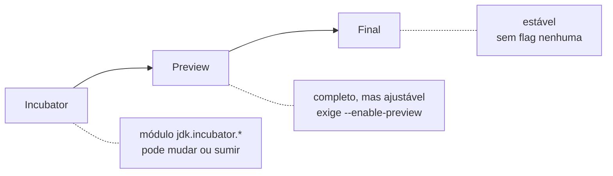

# Java Recente: Releases, LTS e o que Mudou

As notas anteriores marcam cada recurso com um "(Java 21+)", "(Java 16+)" e por aí vai. Esta aqui explica o que está por trás desses números: com que frequência sai uma versão nova, qual você deveria usar no trabalho, e o que a linguagem ganhou nas versões mais recentes, com foco no Java 27.

## O ciclo de releases do Java

Até 2017, versão nova do Java era um evento raro. O Java 6 saiu em 2006, o Java 7 em 2011, o Java 8 em 2014. Cada uma segurava um monte de features até ficar "pronta", e quem esperava um recurso específico às vezes esperava anos.

Isso mudou no Java 9. Desde então o Java tem uma data de entrega fixa: **uma versão nova a cada seis meses**, sempre em março e em setembro. Não importa se a leva de novidades é grande ou pequena, na data marcada sai a release e o número sobe.

| Data     | Versão  | Suporte       |
| -------- | ------- | ------------- |
| set/2018 | Java 11 | LTS           |
| set/2021 | Java 17 | LTS           |
| set/2023 | Java 21 | LTS           |
| mar/2024 | Java 22 | intermediária |
| set/2024 | Java 23 | intermediária |
| mar/2025 | Java 24 | intermediária |
| set/2025 | Java 25 | LTS           |
| mar/2026 | Java 26 | intermediária |
| set/2026 | Java 27 | intermediária |

Uma LTS a cada dois anos, versões intermediárias no meio do caminho.

A vantagem: uma feature fica pronta e sai na próxima janela, sem represar o resto. A "desvantagem" aparente é que o número da versão anda rápido, mas na prática você não precisa acompanhar todas.

## LTS x versões intermediárias

Nem toda versão recebe o mesmo tratamento depois de lançada.

As versões **LTS** (Long-Term Support, ou suporte de longo prazo) ganham anos de correções de bug e de segurança. Hoje as LTS são a 11, a 17, a 21 e a 25, com uma nova a cada dois ou três anos. São elas que a maioria das empresas usa em produção, porque dá para ficar naquela versão com calma, recebendo patch, sem precisar migrar toda hora.

As versões **intermediárias** (a 22, 23, 24, 26, 27) têm só seis meses de suporte. Quando sai a próxima, a anterior para de receber atualização. Elas servem para quem quer usar um recurso novo cedo, testar as features em preview e mandar feedback para o time do OpenJDK antes da API congelar.

Qual instalar? A regra prática para projeto de produção é: **a LTS mais recente que o seu ecossistema já suporta bem**. "Ecossistema" aqui é o Spring Boot, o driver do banco, as bibliotecas que você usa, as ferramentas de build e a plataforma de deploy. Se todas já rodam liso no Java 25, vá de 25. Para estudar e brincar com o que há de mais novo, aí sim pega a intermediária mais recente.

O Java 27 é uma versão intermediária. Não é para migrar a produção inteira para ela, é para conhecer o que vem por aí e o que já dá para usar.

## Incubator, preview e final

Quando você lê que um recurso está "em preview", isso tem um significado técnico. O Java tem um funil por onde uma API nova passa antes de virar parte permanente da linguagem:



**Incubator** é o estágio mais cru. A API vive num módulo separado, com nome tipo `jdk.incubator.vector`, e não há promessa nenhuma: ela pode mudar de forma radical ou ser abandonada. A Vector API está em incubator há mais de dez rodadas, esperando outras peças da JVM ficarem prontas.

**Preview** é uma feature que o time considera completa, mas ainda quer poder ajustar com base no uso real antes de fixar. Para compilar e rodar código que usa um recurso em preview, você precisa passar a flag `--enable-preview`:

```bash
javac --release 27 --enable-preview Exemplo.java
java --enable-preview Exemplo
```

Uma feature costuma passar por duas, três ou mais rodadas de preview em versões seguidas, às vezes com pequenas mudanças entre elas, até sair como final.

**Final** é o recurso estável, sem flag, que você pode usar em produção sem medo de a assinatura mudar na próxima versão.

Esse funil existe porque uma vez que a API é final, ela precisa ser mantida praticamente para sempre por compatibilidade. É melhor descobrir que um método tem o nome errado durante o preview do que dez anos depois.

## Melhorias que você ganha só atualizando

Boa parte do que muda entre versões não aparece no seu código. São otimizações dentro da JVM que passam a valer só por você trocar a versão que executa a aplicação.

O **Compact Object Headers** é um bom exemplo. Todo objeto Java carrega um cabeçalho interno, e reduzir esse cabeçalho de 12 para 8 bytes economiza memória em qualquer aplicação com muitos objetos vivos. Ele foi experimental no Java 24, virou opcional no 25 e passa a ser **o padrão no Java 27**. O detalhe de como isso funciona está em [Memória e OutOfMemoryError](/labs/java/java/06-memoria-e-outofmemoryerror/).

Na mesma linha, o Java 27 torna o **G1 o garbage collector padrão em todos os ambientes**. Antes, uma máquina com poucos núcleos ou pouca RAM caía automaticamente no coletor Serial, que é mais simples e costuma dar pausas piores. Agora o G1, que é o coletor de uso geral, é o default em qualquer configuração. O panorama dos coletores também está na nota de [Memória e OutOfMemoryError](/labs/java/java/06-memoria-e-outofmemoryerror/).

O ponto em comum: você atualiza a JVM, roda os testes, e a aplicação fica um pouco mais econômica e previsível sem uma linha de código mudar.

## Module Import Declarations (Java 25)

Esse recurso ataca um incômodo pequeno mas diário: a lista gigante de `import` no topo de cada arquivo.

Desde o Java 25 dá para importar um módulo inteiro de uma vez:

```java
// antes: um import por tipo usado
import java.util.List;
import java.util.Map;
import java.util.ArrayList;
import java.util.stream.Collectors;
import java.time.LocalDate;

// depois: um import só, traz todos os pacotes exportados por java.base
import module java.base;
```

O `import module java.base` traz para o arquivo todos os pacotes que o módulo `java.base` exporta, que é onde mora quase tudo que você usa no dia a dia (`java.util`, `java.time`, `java.io`, `java.util.stream` e companhia).

É especialmente útil em três situações: código não-modular (a maioria dos projetos), exemplos e material didático onde a lista de imports só atrapalha a leitura, e scripts de arquivo único executados direto com `java Script.java`. Num projeto grande e organizado, com IDE gerenciando os imports, o ganho é menor.

## Panorama: do Java 21 ao 27

Um resumo rápido do que apareceu nas versões recentes, com link para as notas que entram no detalhe:

| Versão        | Novidades de destaque                                                                                                                           |
| ------------- | ----------------------------------------------------------------------------------------------------------------------------------------------- |
| Java 21 (LTS) | Virtual threads, pattern matching para `switch`, sequenced collections, records e sealed classes já finais                                      |
| Java 24       | Stream Gatherers final, visto em [Java Moderno](/labs/java/java/03-java-moderno/)                                                               |
| Java 25 (LTS) | Scoped Values, Module Import Declarations, Compact Object Headers pronto para produção                                                          |
| Java 27       | Compact Object Headers e G1 por padrão, criptografia pós-quântica no TLS (ver [Segurança Básica em Java](/labs/java/java/14-seguranca-basica/)) |

Se você está num projeto no Java 21 hoje, pular para o 25 traz principalmente Scoped Values e os imports de módulo do lado da linguagem, mais as melhorias de JVM que vêm de brinde.

## Ainda em preview ou incubator

Alguns recursos que aparecem em listas de "novidades do Java 27" ainda não são para produção:

- **Structured Concurrency** (preview): trata um grupo de tarefas concorrentes como uma unidade só, com cancelamento e propagação de erro embutidos. Está detalhado em [Concorrência](/labs/java/java/13-concorrencia/).
- **Lazy Constants** (preview): um jeito oficial de ter uma constante que só é calculada no primeiro uso. Hoje, para isso, a gente escreve à mão um padrão com classe interna estática ou double-checked locking; a API nova (`LazyConstant`, que já se chamou `StableValue`) resolve isso com a mesma performance de um campo `final`, porque a JVM trata o valor como constante de verdade depois de escrito.
- **Primitive Types in Patterns** (preview): estende o pattern matching para tipos primitivos, deixando escrever `case int i` num `switch` sobre `Object`, por exemplo.
- **Vector API** (incubator): permite escrever cálculos que a JVM compila para instruções SIMD da CPU (uma operação processando vários números de uma vez), útil em machine learning, criptografia e processamento de imagem. Está em incubator há anos porque depende do Project Valhalla, então não conte com ela ainda.

## Java 27 em resumo

O Java 27 entra em disponibilidade geral em **15 de setembro de 2026**, é uma versão não-LTS e traz **9 JEPs** (JDK Enhancement Proposals, as propostas formais de mudança).

Não tem aquela feature única de sintaxe nova que muda como você escreve. O tema é melhoria incremental: a JVM fica mais econômica de memória (Compact Object Headers), com pausas mais previsíveis por padrão (G1), e o TLS passa a se defender de ataques quânticos futuros sem você mexer em nada. É um bom lembrete de que a maior parte da evolução do Java acontece por baixo do seu código, e chega até você só por atualizar a versão.

## Para se aprofundar

- [JDK 27 and JDK 28: What We Know So Far](https://www.infoq.com/news/2026/08/java-27-so-far/) - InfoQ, panorama dos 9 JEPs do Java 27
- [Java 27 Features (with Examples)](https://www.happycoders.eu/java/java-27-features/) - HappyCoders, cada recurso com código
- [JEP 534: Compact Object Headers](https://openjdk.org/jeps/534) e [JEP 523: Make G1 the Default Garbage Collector in All Environments](https://openjdk.org/jeps/523)
- [JEP 511: Module Import Declarations](https://openjdk.org/jeps/511)
- [JEP 531: Lazy Constants (Third Preview)](https://openjdk.org/jeps/531), [JEP 537: Vector API](https://openjdk.org/jeps/537)
- [The Arrival of Java 25](https://inside.java/2025/09/16/the-arrival-of-java-25/) - blog oficial do OpenJDK, contexto da última LTS
- [Java version history](https://en.wikipedia.org/wiki/Java_version_history) - Wikipédia, linha do tempo completa das releases
- [Oracle Java SE Support Roadmap](https://www.oracle.com/java/technologies/java-se-support-roadmap.html) - datas de fim de suporte de cada versão LTS
