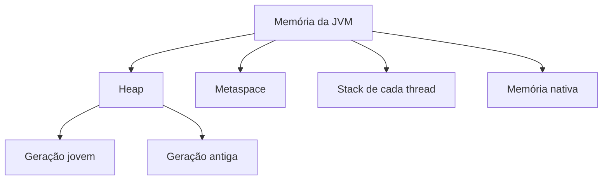
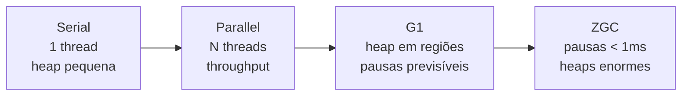

# Memória na JVM e OutOfMemoryError

Lá em Fundamentos você viu que o Garbage Collector cuida da memória automaticamente, então o programador não precisa dar `free()` em nada. Só que "automático" não significa "infalível": quando o GC não consegue liberar espaço suficiente para o programa continuar rodando, a JVM desiste e lança um `OutOfMemoryError`. Essa nota destrincha por que isso acontece, os principais tipos de `OutOfMemoryError` que você vai encontrar em produção e o que fazer a respeito de cada um.

## Como a JVM organiza a memória

Antes de falar de erro, ajuda saber onde a memória mora dentro da JVM. As áreas mais relevantes para esse assunto são:



- **Heap** - onde vivem os objetos criados com `new`. É dividida em gerações (jovem e antiga) porque a maioria dos objetos morre rápido, e separar por idade deixa o Garbage Collector mais eficiente
- **Metaspace** - guarda metadados das classes carregadas (estrutura, métodos, bytecode). Substituiu a antiga PermGen a partir do Java 8
- **Stack** - cada thread tem a sua, guarda variáveis locais e o histórico de chamadas de método. É de onde vem o `StackOverflowError`
- **Memória nativa** - fora do controle direto do GC, usada por buffers diretos, bibliotecas nativas via JNI e pela própria estrutura interna da JVM

O tamanho de cada área é configurável por flags na hora de iniciar a JVM, e boa parte dos `OutOfMemoryError` vem justamente de uma dessas áreas se esgotar.

## O que é OutOfMemoryError

`OutOfMemoryError` estende `Error`, não `Exception` - lembra da hierarquia do `Throwable` vista em Java Core? Isso é proposital: um `Error` sinaliza um problema sério demais para o código tentar se recuperar sozinho, geralmente ligado ao ambiente de execução, não à lógica de negócio. Por isso você quase nunca vê (nem deveria escrever) um `catch (OutOfMemoryError e)` tentando seguir o fluxo normal depois.

Repare que a mensagem que acompanha o erro muda de acordo com qual área da memória estourou:

| Mensagem                                | Área afetada               |
| --------------------------------------- | -------------------------- |
| `Java heap space`                       | Heap                       |
| `Metaspace`                             | Metaspace                  |
| `GC overhead limit exceeded`            | Heap (GC não acompanha)    |
| `Unable to create new native thread`    | Memória nativa/stack       |
| `Requested array size exceeds VM limit` | Heap (array grande demais) |
| `Direct buffer memory`                  | Memória nativa             |

Saber ler essa mensagem já elimina metade do trabalho de diagnóstico, porque ela aponta direto pra qual das causas abaixo procurar primeiro.

## Java Heap Space

É a causa mais comum e a mais direta: o programa cria objetos mais rápido do que o GC consegue descartar os que não são mais usados, até a heap encher de vez. Às vezes é só falta de espaço mesmo (processamento de um volume de dados maior do que o esperado), outras vezes é sintoma de um problema mais profundo, como o memory leak que vem duas seções abaixo.

```java
List<byte[]> blocos = new ArrayList<>();
while (true) {
    blocos.add(new byte[1_000_000]); // 1 MB por iteração, sem nunca remover
}
// Exception in thread "main" java.lang.OutOfMemoryError: Java heap space
```

## Metaspace

O Metaspace guarda os metadados das classes: nome, métodos, campos, bytecode. Ele estoura quando a aplicação carrega classes demais, o que é raro em código de negócio comum, mas comum em cenários como geração dinâmica de classes (proxies, frameworks que usam bytecode generation em runtime) ou em aplicações que fazem hot reload de módulos sem descarregar as classes antigas corretamente.

Diferente da heap, o Metaspace por padrão não tem um limite fixo - ele cresce usando memória nativa do sistema operacional até um teto configurável (`-XX:MaxMetaspaceSize`). Sem esse limite definido, um vazamento de classes pode consumir memória do SO inteiro antes de a JVM perceber o problema.

## GC Overhead Limit Exceeded

Esse é o aviso de que o Garbage Collector está trabalhando demais para pouco resultado: a JVM detecta que está gastando a maior parte do tempo de CPU coletando lixo (por padrão, mais de 98%) e recuperando muito pouca memória a cada ciclo (menos de 2%). Em vez de deixar a aplicação travada nesse looping de coleta sem fim, a JVM prefere lançar o erro e parar.

Na prática, é quase sempre sintoma de heap perto do limite com muitos objetos de vida longa que o GC não consegue descartar - o mesmo problema da seção anterior, só que capturado um pouco antes da heap estourar de vez.

## Memory Leak

Em C ou C++ um memory leak acontece quando você aloca memória e esquece de liberar. Em Java o GC libera automaticamente, então o "leak" aqui é outra coisa: objetos que não são mais usados pela lógica do programa, mas que continuam **referenciados** por algo, então o GC não pode tocar neles - ele só remove o que está inalcançável.

Os suspeitos mais comuns:

- coleções estáticas (`static List`, `static Map`) que só recebem `add`/`put` e nunca `remove`
- listeners ou callbacks registrados e nunca removidos
- `ThreadLocal` que guarda objetos grandes e não é limpo com `remove()` ao final do uso da thread
- caches implementados na mão, sem política de expiração

```java
public class Cache {
    private static final Map<String, byte[]> dados = new HashMap<>();

    public static void guardar(String chave, byte[] valor) {
        dados.put(chave, valor); // nunca sai daqui, mesmo que ninguém mais precise
    }
}
```

Memory leak é o tipo de `OutOfMemoryError` mais chato de resolver, porque não trava na primeira execução - a aplicação sobe normal e só quebra depois de horas ou dias em produção, quando o consumo acumulado finalmente estoura a heap. Ferramentas de heap dump (mais na seção de boas práticas) são o caminho para achar exatamente qual objeto está sendo retido e por quem.

## A classe interna que prende a externa sem querer

Uma classe interna não-`static` carrega, por baixo dos panos, uma referência oculta para a instância da classe externa que a criou, mesmo que o código dela nunca use essa referência. Isso raramente aparece no código que você escreve, o compilador insere essa referência no bytecode automaticamente.

```java
class ProcessadorDePagamento {
    // classe interna SEM static: guarda uma referência oculta a ProcessadorDePagamento
    class RetornoDeCallback {
        void aoConcluir() { /* ... */ }
    }
}
```

Se um objeto `RetornoDeCallback` desses for registrado em algo de vida longa, um gateway externo, uma fila, um processamento assíncrono, a referência oculta para `ProcessadorDePagamento` impede o coletor de lixo de liberar essa instância enquanto o callback existir, mesmo que o resto do sistema já tenha terminado de usá-la. Essa retenção não aparece em lugar nenhum do código, só num heap dump, o que a torna fácil de passar despercebida em revisão.

A correção é declarar `static` sempre que a classe interna não precisar acessar campos ou métodos da instância externa:

```java
class ProcessadorDePagamento {
    static class RetornoDeCallback { // sem referência oculta
        void aoConcluir() { /* ... */ }
    }
}
```

Desde o Java 17, classes aninhadas dentro de um `record` já nascem implicitamente estáticas, o que elimina essa categoria de leak por definição nesses casos.

## WeakHashMap: entradas que desaparecem sozinhas

Um `HashMap` comum nunca esquece uma entrada por conta própria, ela só sai de lá se alguém chamar `remove()` explicitamente. Enquanto a chave estiver dentro do mapa, existe uma referência forte "ativa" para ela, então o coletor de lixo nunca considera aquela entrada elegível para remoção, mesmo que o resto do sistema já não use mais aquele objeto-chave.

Isso é o comportamento certo na maioria dos casos (você quer controlar quando um dado sai do mapa), mas é o formato errado para um cache cuja validade deveria estar amarrada à vida útil da própria chave. Pense num cache de cotação de frete, guardado enquanto a cotação em si ainda existe em algum outro lugar do sistema, e sem necessidade de continuar depois que ninguém mais referencia aquela cotação:

```java
Map<CotacaoDeFrete, ResultadoDeFrete> cache = new WeakHashMap<>();
cache.put(cotacao, resultado);
// quando "cotacao" deixar de ser referenciada em qualquer outro lugar do sistema,
// o GC pode coletar a chave, e a entrada correspondente some do mapa sozinha
```

`WeakHashMap` guarda a chave como referência fraca: quando o GC não encontra mais nenhuma referência forte para aquela chave em lugar nenhum do sistema, ele pode coletá-la, e a entrada correspondente desaparece do mapa automaticamente, sem precisar de nenhum código de limpeza manual.

Duas ressalvas importantes: `WeakHashMap` não é thread-safe (para uso concorrente, envolva com `Collections.synchronizedMap(new WeakHashMap<>())`), e a referência fraca vale só para a chave, não para o valor. Se o valor guardar uma referência de volta para a chave (uma referência circular), a chave nunca fica de fato inalcançável, porque o próprio valor dentro do mapa continua segurando ela, e a entrada nunca é coletada.

## Recursão sem condição de parada

Tecnicamente, uma recursão infinita estoura primeiro a **stack**, não a heap, e o erro lançado é o `StackOverflowError` - você já viu isso em Java Core, dentro da hierarquia de `Throwable`. Mas ele é da mesma família de `OutOfMemoryError`: ambos são `Error`, ambos significam "a JVM ficou sem uma área de memória para trabalhar".

```java
static int fatorial(int n) {
    return n * fatorial(n - 1); // faltou o caso base (n == 0)
}
```

Cada chamada empilha um novo frame na stack da thread, e sem uma condição de parada esse empilhamento nunca cessa. A correção é sempre a mesma: garantir que toda função recursiva tenha um caso base alcançável.

## Objetos grandes

Alocar um array ou objeto único gigante pode estourar a heap de uma vez só, mesmo que o resto da aplicação use pouca memória. É diferente do memory leak: aqui não tem acúmulo gradual, é uma única alocação grande demais para o espaço livre disponível no momento.

```java
int[] enorme = new int[Integer.MAX_VALUE]; // ~8 GB só nesse array
```

Processar arquivos grandes inteiros na memória, montar uma imagem ou fazer o parse de uma resposta de API sem paginação são situações típicas onde isso aparece. A solução geralmente passa por processar em streaming ou em lotes menores, em vez de carregar tudo de uma vez.

## O custo de criar objetos desnecessários em loop

Nem todo problema de memória é um vazamento de verdade, às vezes é só desperdício acumulado. Instanciar um objeto caro dentro de um loop, quando ele poderia ser criado uma única vez fora dele, não costuma travar nada de imediato, mas aumenta a pressão sobre o Garbage Collector a cada execução, e isso se paga em throughput.

Alguns exemplos comuns em revisão de código:

```java
for (String linha : linhas) {
    if (linha.matches("\\d+")) { /* ... */ } // String.matches() recompila a regex A CADA chamada
}
```

`String.matches(...)` compila a expressão regular de novo a cada chamada. Rodando sobre milhares de linhas, isso significa milhares de objetos `Pattern` temporários sendo criados e descartados só para fazer a mesma verificação repetida. `Pattern` é imutável e thread-safe, então pode (e deve) ser compilado uma única vez:

```java
private static final Pattern SOMENTE_DIGITOS = Pattern.compile("\\d+");

for (String linha : linhas) {
    if (SOMENTE_DIGITOS.matcher(linha).matches()) { /* ... */ } // reaproveita o Pattern já compilado
}
```

O mesmo padrão vale para `DateTimeFormatter`, `ObjectMapper` e `Random`, criados de novo a cada chamada quando poderiam ser um único campo `static final` (ou, no caso de `Random` em ambiente com várias threads, `ThreadLocalRandom`, visto em Concorrência). Nenhum desses casos costuma dar erro nem gerar `OutOfMemoryError` sozinho, mas cada objeto temporário criado à toa é trabalho a mais para o GC recolher depois, então vale revisar esse tipo de instanciação especialmente dentro de loops que processam volume alto de dados.

## Compact Object Headers

Todo objeto Java carrega um pequeno cabeçalho interno, usado pela JVM para guardar informação como o hash e o estado de sincronização do objeto. Historicamente esse cabeçalho ocupava 12 bytes por objeto. Isso parece pouco, mas multiplicado por milhões de objetos vivos na heap de uma aplicação de alto volume, vira uma fatia relevante do consumo total de memória.

O recurso de Compact Object Headers reduz esse cabeçalho para 8 bytes. A adoção foi acontecendo por etapas: experimental no Java 24, pronto para produção no Java 25 (habilitável com a flag `-XX:+UseCompactObjectHeaders`) e, a partir do Java 27, ligado por padrão, sem flag nenhuma.

```bash
# no Java 25 e 26, ainda precisa pedir explicitamente
java -XX:+UseCompactObjectHeaders -jar aplicacao.jar
```

Não é uma mudança de código, é puramente comportamento da JVM, o que torna simples testar num ambiente de homologação antes de levar para produção. O ganho é proporcionalmente maior em aplicações que mantêm muitos objetos pequenos vivos na heap ao mesmo tempo, exatamente o tipo de cenário que este capítulo inteiro discute. Esse é um exemplo do que [Java Recente](/labs/java/java/05-java-recente/) chama de melhoria que você ganha só atualizando a JVM.

## Garbage collectors: qual a JVM escolhe

Até aqui a nota tratou "o GC" como uma coisa só, mas a HotSpot vem com vários coletores, e eles têm perfis bem diferentes. Todos fazem a mesma tarefa central, achar os objetos que ninguém mais alcança e devolver esse espaço para a heap, mas cada um resolve de um jeito o dilema entre pausar a aplicação e gastar CPU.

Quando o GC roda, ele precisa de momentos em que a aplicação para completamente para ele mexer nas referências com segurança. Esses momentos são as pausas ("stop-the-world"). Um coletor pode fazer pausas raras e longas, ou muitas pausas curtíssimas, e essa escolha afeta direto a latência que o seu usuário sente.



- **Serial**: usa uma thread só para coletar e para a aplicação inteira enquanto trabalha. Simples e com pouco custo fixo, serve bem para heap pequena, aplicação de linha de comando curta ou container com um núcleo só.
- **Parallel**: usa várias threads para coletar mais rápido. O foco é throughput, ou seja, terminar o máximo de trabalho da aplicação num intervalo, aceitando pausas maiores quando elas acontecem. Foi o padrão por muitos anos.
- **G1** (Garbage-First): divide a heap em muitas regiões pequenas e coleta primeiro as que têm mais lixo. A meta dele é manter as pausas dentro de um alvo que você configura (por padrão, 200ms). É o coletor de uso geral hoje.
- **ZGC**: trabalha quase todo o tempo em paralelo com a aplicação, com pausas na casa de menos de 1 milissegundo mesmo em heaps de centenas de GB. O preço é um consumo de CPU e de memória um pouco maior.

Você raramente escolhe o coletor na mão. A JVM decide um padrão, e até o Java 26 essa decisão levava o hardware em conta: máquina com menos de 2 núcleos ou menos de ~2 GB de RAM caía no Serial automaticamente, o que às vezes pegava gente de surpresa num container apertado. O Java 27 (JEP 523) acaba com essa regra e torna o **G1 o padrão em qualquer ambiente**.

Se em algum momento você precisar trocar de propósito, a flag é direta:

```bash
java -XX:+UseZGC -jar aplicacao.jar
java -XX:+UseParallelGC -jar aplicacao.jar
```

Antes de mexer, meça. Ligue os logs de GC com `-Xlog:gc*` e olhe a frequência das coletas, a duração das pausas e quanta memória cada ciclo recupera. Trocar de coletor sem esse dado costuma só mudar o sintoma de lugar. Na maioria dos serviços web, o G1 no padrão dá conta, e o ganho real vem de reduzir a alocação de objetos (as seções anteriores dessa nota) antes de pensar em trocar de GC.

### Quando trocar o G1 pelo ZGC

- Heap grande (dezenas de GB ou mais) e a pausa do G1 já incomoda mesmo depois de ajustada
- Requisito de latência de cauda: p99/p99.9 sensível a pausas de dezenas ou centenas de milissegundos
- Cargas com muito objeto vivo ao mesmo tempo (caches grandes em memória, processamento de grafos)
- Quando NÃO trocar: heap pequeno ou médio, serviço sem requisito de latência apertado, ou antes de ter medido o G1 sob carga real
- O custo do ZGC: mais CPU e mais memória de folga; o ZGC hoje é geracional (JEP 439), o que reduziu bastante esse overhead

Para se aprofundar: o [HotSpot Virtual Machine Garbage Collection Tuning Guide](https://docs.oracle.com/en/java/javase/25/gctuning/) da Oracle, [JEP 439: Generational ZGC](https://openjdk.org/jeps/439), [JEP 534: Compact Object Headers](https://openjdk.org/jeps/534) e [JEP 523: Make G1 the Default Garbage Collector in All Environments](https://openjdk.org/jeps/523).

## Uso inadequado de coleções

Isso é um caso específico de memory leak, mas comum o suficiente para merecer destaque próprio: guardar dados em `List`, `Map` ou `Set` e nunca remover as entradas que já não são necessárias. Diferente das outras causas dessa nota, aqui o problema não é um bug de referência escondida, é simplesmente esquecer de limpar a estrutura.

```java
Map<String, Sessao> sessoesAtivas = new HashMap<>();

void login(String usuarioId, Sessao sessao) {
    sessoesAtivas.put(usuarioId, sessao);
}
// sem um logout() correspondente removendo do mapa, cada sessão vira memória presa pra sempre
```

O antídoto costuma ser usar uma estrutura com política de expiração automática (como um `Map` com TTL, ou `WeakHashMap` quando faz sentido chaves fracas) em vez de depender de lembrar de chamar `remove()` manualmente em todo caminho de código.

## Heap size muito pequeno

Às vezes o código está correto e não tem leak nenhum - a aplicação genuinamente precisa de mais memória do que a JVM recebeu para trabalhar. Isso é controlado por duas flags na hora de subir a aplicação:

```bash
java -Xms256m -Xmx512m -jar aplicacao.jar
```

- `-Xms` - tamanho inicial da heap
- `-Xmx` - tamanho máximo que a heap pode crescer

Se `-Xmx` estiver configurado abaixo do que a carga de trabalho real exige (por exemplo, um valor padrão de ambiente de dev usado sem revisão em produção), a aplicação vai bater no teto de heap mesmo sem nenhum bug de memória. Antes de sair caçando leak, vale confirmar se o problema não é simplesmente "faltou pedir mais memória".

## Excesso de threads

Cada thread criada na JVM reserva sua própria stack, com tamanho padrão configurável via `-Xss` (geralmente 512 KB a 1 MB). Isso é memória nativa do sistema operacional, fora da heap - então criar threads demais pode esgotar essa memória e disparar a mensagem `Unable to create new native thread`, mesmo com a heap tranquila e sobrando espaço.

```java
for (int i = 0; i < 100_000; i++) {
    new Thread(() -> processar()).start(); // cada thread reserva sua stack própria
}
```

Isso costuma aparecer em código que cria uma `Thread` nova por requisição em vez de usar um `ExecutorService` com um pool limitado, ou em serviços que sobem sob carga alta sem nenhum controle de concorrência.

## Problemas de memória nativa

Nem toda memória usada pela JVM é gerenciada pelo Garbage Collector. `ByteBuffer.allocateDirect()`, chamadas via JNI para bibliotecas nativas e certas otimizações internas da própria JVM usam memória fora da heap, alocada diretamente do sistema operacional. Esse tipo de vazamento é particularmente difícil de rastrear porque ferramentas de heap dump tradicionais, focadas em objetos Java, não enxergam esses buffers nativos.

```java
ByteBuffer buffer = ByteBuffer.allocateDirect(10_000_000); // fora da heap, GC não gerencia sozinho
```

Buffers diretos costumam ser liberados só quando o objeto Java que os referencia é coletado, o que pode demorar - então uso pesado dessa API sem cuidado de liberação explícita tende a acumular memória nativa aos poucos.

## A JVM dentro de um container

Rodar a aplicação num container muda de onde a JVM tira os números. Desde o Java 10 ela é "container-aware": lê os limites de CPU e memória do cgroup do container, não os da máquina física por baixo. Numa VM de 64 GB rodando um container limitado a 512 MB, a JVM enxerga 512 MB, e é sobre isso que ela dimensiona a heap.

O tamanho da heap num container costuma ser definido por percentual, não por valor fixo:

```bash
java -XX:MaxRAMPercentage=75.0 -jar aplicacao.jar
```

O default é conservador (em torno de 25%); 75% é um valor comum depois de medir quanto a aplicação usa de fato. O erro clássico é querer aproveitar toda a memória e setar `-Xmx` igual ao limite do container. A heap não é o único consumo do processo: metaspace, pilhas de thread, code cache, memória nativa e buffers diretos ficam todos fora dela. Se a heap sozinha já ocupa o limite inteiro, qualquer uso de não-heap empurra o processo para além do teto do cgroup.

Quando isso acontece, o kernel mata o processo e o container registra `OOMKilled`. É diferente do `OutOfMemoryError`: no `OOMKilled` a JVM nem chega a reclamar, ela some de uma vez, sem stack trace e sem heap dump automático. Ver o pod reiniciando com `OOMKilled` no evento aponta para "o processo inteiro passou do limite", não necessariamente para um vazamento de heap.

Antes de apertar os limites, meça o não-heap com Native Memory Tracking:

```bash
java -XX:NativeMemoryTracking=summary -jar aplicacao.jar
jcmd <pid> VM.native_memory summary
```

Vale lembrar que o limite de CPU também conta. Um `--cpus=1` faz a JVM escolher menos threads de GC e um `ForkJoinPool.commonPool` minúsculo, então "o Java está lento no container" às vezes é só CPU de menos, não um problema de código.

Para se aprofundar: [Java Heap Space Inside Docker](https://www.baeldung.com/ops/docker-jvm-heap-size) no Baeldung e a seção de [Native Memory Tracking](https://docs.oracle.com/en/java/javase/25/troubleshoot/diagnostic-tools.html) do Troubleshooting Guide da Oracle.

## Boas práticas

- **Monitorar** o uso de memória com ferramentas como VisualVM, JConsole ou `jcmd`, em vez de só reagir depois que o erro já aconteceu em produção
- **Configurar heap dump automático** com `-XX:+HeapDumpOnOutOfMemoryError -XX:HeapDumpPath=./dump.hprof`, para ter um retrato exato do estado da memória no momento do erro, em vez de tentar reproduzir o problema depois
- **Ajustar `-Xmx`, `-XX:MaxMetaspaceSize` e `-Xss`** de acordo com a carga real da aplicação, medindo em vez de chutar valores
- **Revisar coleções estáticas, caches e listeners** em busca de referências que nunca são liberadas
- **Preferir streaming e processamento em lotes** a carregar arquivos ou respostas inteiras na memória
- **Usar um `ExecutorService`** com pool de threads limitado em vez de criar `Thread` nova sob demanda

Para investigar um pico de CPU, um thread dump ou uma gravação de JFR num processo que já está rodando, veja [Diagnóstico da JVM em Produção](/labs/java/java/18-diagnostico-em-producao/).
