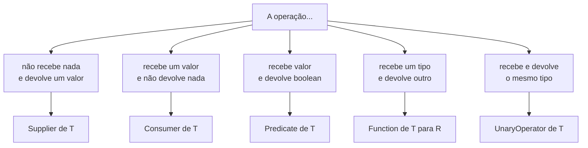

# Interfaces Funcionais

Lambda e method reference (vistos em [Java Moderno](/labs/java/java/03-java-moderno/)) precisam de um "molde" para encaixar: uma interface funcional. O pacote `java.util.function` traz esses moldes prontos, e conhecer o catálogo evita que você reinvente `Predicate` toda semana com outro nome. Esta nota é o mapa desse pacote. As decisões mais finas (quando o boxing pesa, quando criar a sua própria interface) estão em [Programação Funcional Avançada](/labs/java/java/08-programacao-funcional-avancada/).

## O que é uma interface funcional

Uma interface funcional é uma interface com exatamente um método abstrato. Esse "um método só" é o que deixa o compilador casar uma lambda com ela: quando você escreve `s -> s.isEmpty()` onde se espera um `Predicate<String>`, o Java entende que esse corpo é a implementação do único método que falta (`test`).

O nome técnico disso é SAM, de Single Abstract Method. A interface pode ter quantos métodos `default` e `static` quiser, isso não conta, só o número de métodos abstratos importa.

```java
@FunctionalInterface
interface Conversor {
    String converter(int valor); // único método abstrato
}

Conversor emReais = valor -> "R$ " + valor;
System.out.println(emReais.converter(50)); // R$ 50
```

A anotação `@FunctionalInterface` é opcional, mas vale a pena: ela não muda nada em tempo de execução, só faz o compilador recusar a interface se alguém adicionar um segundo método abstrato por engano, o que quebraria todo mundo que usa ela como alvo de lambda.

Interfaces funcionais não são novidade do Java 8. `Runnable` (um método `run()`), `Callable` (um `call()`) e `Comparator` (um `compare()`) já eram SAM desde sempre, só que antes você era obrigado a implementá-las com classe anônima. O que o Java 8 trouxe foi a sintaxe de lambda e um pacote cheio de interfaces genéricas para não precisar criar uma nova a cada callback.

## O pacote java.util.function

Antes do Java 8, cada API inventava a própria interface de callback. O `java.util.function` padronizou isso em algumas formas genéricas que cobrem a maioria dos casos. São quatro formas básicas, e o nome de cada uma já entrega o que ela faz:

| Interface        | Recebe | Devolve   | Método      |
| ---------------- | ------ | --------- | ----------- |
| `Supplier<T>`    | nada   | um `T`    | `get()`     |
| `Consumer<T>`    | um `T` | nada      | `accept(T)` |
| `Function<T, R>` | um `T` | um `R`    | `apply(T)`  |
| `Predicate<T>`   | um `T` | `boolean` | `test(T)`   |

A partir dessas quatro, o pacote deriva o resto: versões que recebem dois argumentos (`BiFunction`, `BiConsumer`, `BiPredicate`), versões em que entrada e saída são do mesmo tipo (`UnaryOperator`, `BinaryOperator`) e um monte de especializações para `int`, `long` e `double`.

Para escolher, pergunte quantos valores a operação recebe e o que ela devolve.



## Predicate: um teste que devolve boolean

`Predicate<T>` recebe um valor e responde sim ou não. É a interface dos filtros e das validações, e casa direto com `Stream.filter`:

```java
Predicate<String> naoVazio = s -> !s.isBlank();

List<String> validos = List.of("ana", "  ", "bruno").stream()
    .filter(naoVazio)
    .toList(); // [ana, bruno]
```

O que faz o `Predicate` render mais que um `if` solto são os métodos `default` de composição. `and`, `or` e `negate` montam um predicado novo a partir de outros, sem você escrever a lógica booleana na mão:

```java
Predicate<String> naoVazio = s -> !s.isBlank();
Predicate<String> ateDezChars = s -> s.length() <= 10;

Predicate<String> apelidoValido = naoVazio.and(ateDezChars);

apelidoValido.test("bruno");               // true
apelidoValido.test("nome-gigante-demais"); // false
naoVazio.negate().test("   ");             // true (está vazio)
```

Tem também dois métodos `static` úteis: `Predicate.isEqual(x)` cria um predicado que testa igualdade com `x`, e `Predicate.not(p)` inverte um predicado, o que fica mais legível que `p.negate()` quando `p` é um method reference:

```java
lista.stream().filter(Predicate.not(String::isBlank)).toList();
```

## Function: transforma um tipo em outro

`Function<T, R>` pega um valor de um tipo e devolve outro. É a interface do `Stream.map`, de converter entidade em DTO, de extrair um campo:

```java
Function<Usuario, String> pegarEmail = usuario -> usuario.getEmail();

List<String> emails = usuarios.stream()
    .map(pegarEmail)
    .toList();
```

Duas `Function` se combinam de duas formas, e a diferença entre elas confunde bastante gente:

- `f.andThen(g)` aplica `f` primeiro e passa o resultado para `g`
- `f.compose(g)` aplica `g` primeiro e passa o resultado para `f`

```java
Function<Integer, Integer> dobrar = x -> x * 2;
Function<Integer, Integer> maisUm = x -> x + 1;

dobrar.andThen(maisUm).apply(10); // (10*2)+1 = 21
dobrar.compose(maisUm).apply(10); // (10+1)*2 = 22
```

Na prática `andThen` é o que se usa quase sempre, porque ler "faça isso e depois aquilo" é mais natural que ler de trás para frente.

Existe ainda `Function.identity()`, um método `static` que devolve uma função que retorna o próprio argumento sem mexer nele. Parece inútil, mas aparece quando uma API pede uma `Function` e você quer dizer "não transforme nada", como no `Collectors.toMap` quando o valor do mapa é o próprio elemento:

```java
Map<String, Usuario> porEmail = usuarios.stream()
    .collect(Collectors.toMap(Usuario::getEmail, Function.identity()));
```

## Consumer: recebe e não devolve nada

`Consumer<T>` recebe um valor e faz alguma coisa com ele sem retornar resultado. É a interface do efeito colateral: imprimir, gravar no banco, mandar e-mail, logar. `Stream.forEach` e `Optional.ifPresent` pedem um `Consumer`:

```java
Consumer<Pedido> notificar = pedido -> emailService.enviarConfirmacao(pedido);

pedidosNovos.forEach(notificar);
```

`Consumer` também tem `andThen`, que encadeia dois consumidores sobre o mesmo valor:

```java
Consumer<Pedido> registrar = pedido -> log.info("processando {}", pedido.getId());
Consumer<Pedido> processar = registrar.andThen(notificar);

processar.accept(pedido); // registra no log e depois notifica
```

Um cuidado: `andThen` não isola falhas. Se o primeiro consumidor lançar uma exceção, o segundo não roda.

## Supplier: produz um valor sob demanda

`Supplier<T>` é o oposto do `Consumer`: não recebe nada e devolve um valor quando alguém chama `get()`. A graça dele é adiar trabalho. Uma variável comum guarda um valor já calculado; um `Supplier` guarda a receita, e a receita só executa quando (e se) o valor for pedido.

```java
Supplier<Conexao> conexao = () -> abrirConexaoCara();
// nada aconteceu ainda

Conexao c = conexao.get(); // só agora a conexão abre
```

Isso resolve a armadilha clássica do `Optional.orElse` contra `orElseGet`: `orElse` recebe um valor pronto, calculado sempre, mesmo sem precisar; `orElseGet` recebe um `Supplier` e só executa quando o `Optional` está vazio.

```java
// buscarPadrao() roda mesmo que o Optional já tenha valor
config.orElse(buscarPadrao());

// buscarPadrao() só roda se o Optional estiver vazio
config.orElseGet(() -> buscarPadrao());
```

A diferença entre "guardar o valor" e "guardar o jeito de obter o valor" tem mais desdobramentos, e eles estão em [Programação Funcional Avançada](/labs/java/java/08-programacao-funcional-avancada/).

## UnaryOperator e BinaryOperator: entrada e saída do mesmo tipo

Quando a transformação devolve o mesmo tipo que recebeu, existem dois atalhos com nome próprio:

- `UnaryOperator<T>` é uma `Function<T, T>` (recebe um `T`, devolve um `T`)
- `BinaryOperator<T>` é uma `BiFunction<T, T, T>` (recebe dois `T`, devolve um `T`)

Elas de fato estendem `Function` e `BiFunction`, então dá para usar uma `UnaryOperator<String>` em qualquer lugar que espere `Function<String, String>`. O nome curto existe para deixar a intenção clara e para APIs que exigem o mesmo tipo dos dois lados, como `List.replaceAll`:

```java
List<String> nomes = new ArrayList<>(List.of("ana", "bruno"));

UnaryOperator<String> maiuscula = s -> s.toUpperCase();
nomes.replaceAll(maiuscula); // [ANA, BRUNO]
```

`BinaryOperator` aparece toda vez que você reduz uma coleção a um valor só, combinando os elementos dois a dois. É o segundo argumento de `Stream.reduce` e o desempate do `Collectors.toMap` quando duas chaves colidem:

```java
BinaryOperator<Integer> somar = (a, b) -> a + b;

int total = List.of(10, 20, 30).stream().reduce(0, somar); // 60
```

Ela ainda traz dois métodos `static`, `minBy(comparator)` e `maxBy(comparator)`, que devolvem um `BinaryOperator` escolhendo o menor ou o maior dos dois valores:

```java
BinaryOperator<Pedido> maisCaro = BinaryOperator.maxBy(Comparator.comparing(Pedido::getValor));
```

## Variantes de dois argumentos

Quando a operação precisa de dois valores de entrada, o pacote tem as versões `Bi`:

| Interface             | O que faz                           | Método         |
| --------------------- | ----------------------------------- | -------------- |
| `BiFunction<T, U, R>` | recebe `T` e `U`, devolve `R`       | `apply(T, U)`  |
| `BiConsumer<T, U>`    | recebe `T` e `U`, não devolve nada  | `accept(T, U)` |
| `BiPredicate<T, U>`   | recebe `T` e `U`, devolve `boolean` | `test(T, U)`   |

`BiConsumer` é o que o `Map.forEach` usa, já que ele entrega chave e valor de uma vez:

```java
Map<String, Integer> estoque = Map.of("caneta", 12, "caderno", 5);
estoque.forEach((produto, qtd) -> System.out.println(produto + ": " + qtd));
```

Não existe `BiSupplier`: um fornecedor não recebe entrada nenhuma, então "dois argumentos" não faria sentido. Quando você precisa devolver dois valores, a saída é devolver um objeto que agrupa os dois, um `record` por exemplo.

## Especializações para tipos primitivos

Todas as interfaces acima trabalham com objetos. Usar `Function<Integer, Integer>` para uma conta com `int` obriga o Java a empacotar e desempacotar `Integer` a cada chamada, e num pipeline que processa milhões de itens isso vira trabalho extra pro coletor de lixo.

Por isso o pacote tem versões especializadas que falam primitivo direto:

```java
IntUnaryOperator somarDez = n -> n + 10;        // int -> int, sem Integer no meio
int resultado = somarDez.applyAsInt(5);         // 15

IntPredicate ehPar = n -> n % 2 == 0;           // int -> boolean
ToIntFunction<String> tamanho = String::length; // String -> int
```

A família é grande: `IntPredicate`, `IntFunction<R>`, `ToIntFunction<T>`, `IntUnaryOperator`, `IntBinaryOperator`, `IntConsumer`, `IntSupplier`, e os equivalentes trocando `Int` por `Long` e `Double`. Tem ainda `BooleanSupplier`, um `Supplier` que devolve `boolean` primitivo. Usadas junto de `IntStream`, `LongStream` e `DoubleStream`, o valor atravessa o pipeline inteiro sem nunca virar objeto.

Isso não é motivo para trocar toda `Function` do código por versão primitiva. Na maior parte da regra de negócio a clareza pesa mais que esse microcusto. O peso real, e quando vale medir com profiling antes de reescrever, está em [Programação Funcional Avançada](/labs/java/java/08-programacao-funcional-avancada/) e em [Memória e OutOfMemoryError](/labs/java/java/06-memoria-e-outofmemoryerror/).

## Qual interface escolher

Roteiro rápido, na ordem das perguntas:

1. A operação não recebe nada e só devolve um valor? `Supplier<T>`
2. Recebe valor e não devolve nada? `Consumer<T>` (dois valores: `BiConsumer<T, U>`)
3. Recebe valor e devolve `boolean`? `Predicate<T>` (dois: `BiPredicate<T, U>`)
4. Recebe um valor e devolve outro de tipo diferente? `Function<T, R>` (dois: `BiFunction<T, U, R>`)
5. Recebe e devolve o mesmo tipo? `UnaryOperator<T>` (dois: `BinaryOperator<T>`)
6. Está mexendo com `int`, `long` ou `double` num caminho quente? Pegue a versão especializada (`IntFunction`, `IntPredicate` e companhia)

E antes de escrever `@FunctionalInterface` na sua própria interface: se a assinatura cabe numa das do pacote, use a do pacote. Ela já é conhecida por quem lê, já se integra com o resto da API e já vem com os combinadores prontos. Os casos em que criar a sua compensa estão em [Programação Funcional Avançada](/labs/java/java/08-programacao-funcional-avancada/).
