# Concorrência

Em Java Moderno você viu Virtual Threads e a Concurrency API por cima. Essa nota entra em alguns detalhes práticos que aparecem assim que um código que "funcionava sozinho" passa a rodar com mais de uma thread ao mesmo tempo: coleções que parecem seguras e não são, geradores de número aleatório que viram gargalo, um problema específico que pegou até times grandes de olho em Virtual Threads, e como disparar várias chamadas ao mesmo tempo sem transformar isso num novo gargalo.

## HashMap não é thread-safe

Um `HashMap` acessado por várias threads ao mesmo tempo não garante nada sobre o resultado, mesmo em uma operação que parece atômica de tão simples:

```java
Map<String, Integer> contadores = new HashMap<>();
// em várias threads ao mesmo tempo:
contadores.put("chave", contadores.get("chave") + 1); // race condition
```

Essa linha parece uma única operação, mas por dentro é ler, somar e escrever, três passos separados. Se duas threads lerem o mesmo valor antes de qualquer uma escrever de volta, uma das atualizações se perde silenciosamente, sem nenhuma exceção avisando. Em cenários piores, `HashMap` sob concorrência pode até corromper sua estrutura interna (a lista encadeada de um mesmo bucket virando um ciclo, por exemplo), travando a aplicação num loop infinito.

`ConcurrentHashMap` resolve o problema de estrutura, mas a operação de ler-e-incrementar continua precisando de um método atômico dedicado, não de duas chamadas separadas:

```java
ConcurrentHashMap<String, LongAdder> contadores = new ConcurrentHashMap<>();
contadores.computeIfAbsent("chave", k -> new LongAdder()).increment(); // atômico de verdade
```

`computeIfAbsent` cria o contador na primeira vez de forma segura, e `LongAdder` (pensado justamente para contagem concorrente com alto volume) faz o incremento sem a corrida que existia no `get` seguido de `put`.

## Random em ambiente multithread

`java.util.Random` sincroniza internamente o estado da semente a cada chamada, para garantir que múltiplas threads não corrompam esse estado compartilhado. Isso funciona, mas em carga alta com muitas threads gerando números ao mesmo tempo, essa sincronização vira um ponto de contenção, todas as threads disputando o mesmo lock para pegar o próximo número aleatório.

`ThreadLocalRandom` (desde o Java 7) resolve isso dando a cada thread sua própria instância de gerador, sem nenhum estado compartilhado para sincronizar:

```java
// gargalo sob carga multithread
int valor = new Random().nextInt(100);

// cada thread tem seu próprio gerador, sem contenção
int valor = ThreadLocalRandom.current().nextInt(100);
```

Não existe motivo para preferir `new Random()` num contexto que já roda em múltiplas threads, a troca é direta e sem efeito colateral.

## Virtual Threads e o problema do pinning

Virtual Threads (introduzidas no Java 21, vistas em Java Moderno) são threads leves, gerenciadas pela própria JVM em cima de um número menor de threads reais do sistema operacional, chamadas de carrier threads. A ideia central: quando uma virtual thread bloqueia esperando I/O, ela se desmonta da carrier thread, liberando essa carrier para rodar outra virtual thread enquanto a primeira espera.

O problema, presente no lançamento do Java 21, é que esse desmonte não acontecia dentro de um bloco `synchronized`. Uma virtual thread que bloqueava dentro de `synchronized` ficava presa (pinned) à carrier thread até a operação terminar:

```java
synchronized (lock) {
    resultado = chamadaBloqueanteDeIO(); // virtual thread fica PRESA à carrier durante isso
}
```

Com carrier threads suficientes presas esperando I/O dentro de blocos `synchronized`, o sistema podia travar por completo, sem carrier livre para rodar mais nenhuma virtual thread nova. O agravante era o diagnóstico: um thread dump nesse cenário podia parecer um sistema ocioso, porque as virtual threads presas não apareciam claramente como o gargalo, enquanto na real todas as carriers estavam ocupadas segurando threads pinned.

Esse problema levou a uma revisão do mecanismo, e o Java 24 (JEP 491) eliminou o pinning em `synchronized`, passando a amarrar o monitor à própria virtual thread em vez de à carrier. Para quem está em versões anteriores (Java 21 a 23) usando Virtual Threads, duas medidas práticas ajudam: evitar chamada bloqueante dentro de `synchronized` (trocando por `ReentrantLock`, que não sofre desse problema) e monitorar eventos de pinning com a flag `-Djdk.tracePinnedThreads=full`, que imprime onde o pinning está acontecendo.

## Chamar serviços em paralelo com CompletableFuture

Um endpoint que monta a tela de um pedido às vezes precisa de dados de três lugares: o serviço de usuários, o de pedidos e o de pagamentos. Se você chama um depois do outro, os tempos se somam:

```mermaid
gantt
    title Buscar dados de 3 serviços
    dateFormat X
    axisFormat %ss
    section Sequencial
    User (2s)    :0, 2
    Order (3s)   :2, 5
    Payment (2s) :5, 7
    section Paralelo
    User (2s)    :0, 2
    Order (3s)   :0, 3
    Payment (2s) :0, 2
```



Sequencial dá 2 + 3 + 2 = 7 segundos. Disparando as três ao mesmo tempo, o total cai para a chamada mais lenta, 3 segundos. A regra é simples: só dá para paralelizar chamadas que não dependem umas das outras. Se o pagamento precisa do id que vem na resposta do pedido, aí não tem paralelismo possível, é encadear com `thenCompose`.

### Disparar as chamadas

Cada chamada vira um `CompletableFuture.supplyAsync`, e o segundo argumento (o executor) não é opcional na prática:

```java
var userFut = CompletableFuture.supplyAsync(() -> userClient.buscar(usuarioId), pool);
var orderFut = CompletableFuture.supplyAsync(() -> orderClient.buscar(pedidoId), pool);
var payFut = CompletableFuture.supplyAsync(() -> paymentClient.buscar(pedidoId), pool);
```

Sem passar o `pool`, o `supplyAsync` usa o `ForkJoinPool.commonPool()`, que tem mais ou menos um thread por núcleo de CPU. Isso é ótimo para trabalho que gasta CPU e péssimo para chamada de rede: numa máquina de 4 núcleos, você consegue no máximo 3 ou 4 chamadas de fato simultâneas, e o resto fica na fila. Como chamada HTTP passa quase todo o tempo esperando resposta, você quer um pool com bem mais threads que núcleos:

```java
ExecutorService pool = Executors.newFixedThreadPool(32);
```

Esse pool tem que ser dedicado a essas chamadas de saída e separado do pool que atende as requisições que chegam na sua API. Se for o mesmo, uma dependência lenta segura todas as threads e a aplicação para de responder até para quem nem depende dela. Num projeto Spring, declare o pool como um `@Bean` para o container fechar ele no shutdown, e nunca crie um `newFixedThreadPool` novo a cada requisição.

No Java 21+ dá para trocar o pool fixo por virtual threads, que resolvem justo o caso de muita chamada bloqueante ao mesmo tempo:

```java
ExecutorService pool = Executors.newVirtualThreadPerTaskExecutor();
```

### Esperar e coletar os resultados

`CompletableFuture.allOf` espera todas as futures terminarem, mas o retorno dele é `CompletableFuture<Void>`, ou seja, ele não te entrega os resultados. Você junta o `allOf` para saber que acabou e depois pega cada resultado com `.join()`:

```java
CompletableFuture<Dashboard> montar(Long pedidoId, Long usuarioId) {
    var userFut = CompletableFuture.supplyAsync(() -> userClient.buscar(usuarioId), pool);
    var orderFut = CompletableFuture.supplyAsync(() -> orderClient.buscar(pedidoId), pool);
    var payFut = CompletableFuture.supplyAsync(() -> paymentClient.buscar(pedidoId), pool);

    return CompletableFuture.allOf(userFut, orderFut, payFut)
        .thenApply(v -> new Dashboard(userFut.join(), orderFut.join(), payFut.join()));
}
```

Os `.join()` de dentro do `thenApply` não bloqueiam de verdade: quando aquele trecho roda, o `allOf` já garantiu que as três futures terminaram, então é só pegar o valor que já está lá. O erro comum é chamar `.join()` em cada future na hora de criar, antes do `allOf`, o que faz uma esperar a outra e mata o paralelismo.

Quando são só duas chamadas, `thenCombine` já resolve sem `allOf`:

```java
userFut.thenCombine(orderFut, (usuario, pedido) -> new Resumo(usuario, pedido));
```

E quando a quantidade de chamadas é dinâmica (buscar N itens por id, por exemplo), o padrão é montar uma lista de futures e coletar com stream:

```java
List<CompletableFuture<Item>> futuros = ids.stream()
    .map(id -> CompletableFuture.supplyAsync(() -> itemClient.buscar(id), pool))
    .toList();

CompletableFuture.allOf(futuros.toArray(CompletableFuture[]::new)).join();

List<Item> itens = futuros.stream().map(CompletableFuture::join).toList();
```

### Quando uma chamada falha ou demora

Numa busca sequencial, se o serviço de pagamentos cai, a exceção sobe e você trata num lugar só. Em paralelo, uma future que falha faz o `join()` dela relançar a exceção, e isso pode derrubar a resposta inteira por causa de uma parte só. Se dá para viver sem aquele pedaço, trate por chamada com `exceptionally`:

```java
var payFut = CompletableFuture
    .supplyAsync(() -> paymentClient.buscar(pedidoId), pool)
    .orTimeout(2, TimeUnit.SECONDS)
    .exceptionally(erro -> Pagamento.desconhecido());
```

O `orTimeout` (Java 9+) completa a future com `TimeoutException` se ela passar do prazo, e aí o `exceptionally` devolve um valor de reserva. Se você prefere já entregar o fallback direto no timeout, sem passar pela exceção, use `completeOnTimeout(Pagamento.desconhecido(), 2, TimeUnit.SECONDS)`. Sem nenhum dos dois, uma dependência travada segura a thread do pool e o resultado agregado até o socket estourar sozinho, o que costuma ser bem mais que 2 segundos.

A diferença entre `exceptionally`, `handle` e `whenComplete` está em [Exceções: técnicas avançadas](/labs/java/java/10-excecoes-avancado/). Para quem quer ir além do fallback manual, Retry, Circuit Breaker e Bulkhead com Resilience4j estão em [Spring Boot e System Design](/labs/java/spring/08-system-design-com-spring/).

## Não bloqueie dentro de código assíncrono

Um padrão que aparece com frequência e quebra a proposta de código assíncrono por dentro: chamar `.get()` ou `.join()` de um `CompletableFuture` dentro de uma camada que deveria continuar assíncrona.

```java
@Service
class PedidoService {
    ResultadoPedido processar(Long id) {
        return buscarPedidoAsync(id).join(); // bloqueia a thread aqui dentro do serviço
    }
}
```

Isso trava a thread atual esperando o resultado, exatamente o que a programação assíncrona tenta evitar, e sob carga alta pode levar a thread starvation (todas as threads disponíveis presas esperando, nenhuma livre para atender novas requisições), reduzindo a escalabilidade do sistema.

A prática melhor é manter o encadeamento assíncrono dentro do serviço, e materializar o resultado (com `.join()`) só na borda, no controller, que é o ponto em que uma resposta síncrona realmente precisa existir:

```java
@Service
class PedidoService {
    CompletableFuture<ResultadoPedido> processar(Long id) {
        return buscarPedidoAsync(id).thenApply(this::transformar); // continua assíncrono
    }
}

@RestController
class PedidoController {
    @GetMapping("/pedidos/{id}")
    ResultadoPedido buscar(@PathVariable Long id) {
        return pedidoService.processar(id).join(); // só aqui, na borda, materializa
    }
}
```

Retornar o próprio `CompletableFuture` do serviço preserva a natureza assíncrona do método e deixa a aplicação preparada para escalar sob concorrência, em vez de gargalar numa camada interna que deveria só compor operações, não esperar por elas.
