# Concorrência

Em Java Moderno você viu Virtual Threads e a Concurrency API por cima. Essa nota entra em alguns detalhes práticos que aparecem assim que um código que "funcionava sozinho" passa a rodar com mais de uma thread ao mesmo tempo: coleções que parecem seguras e não são, como o `ConcurrentHashMap` faz o trabalho seguro por dentro, o modelo de memória do Java e a relação happens-before, geradores de número aleatório que viram gargalo, um problema específico que pegou até times grandes de olho em Virtual Threads, thread pool exhaustion, como disparar várias chamadas ao mesmo tempo sem criar um novo gargalo, e as APIs mais recentes para organizar tudo isso (Structured Concurrency e Scoped Values).

## HashMap não é thread-safe

Um `HashMap` acessado por várias threads ao mesmo tempo não garante nada sobre o resultado, mesmo em uma operação que parece atômica de tão simples:

```java
Map<String, Integer> contadores = new HashMap<>();
// em várias threads ao mesmo tempo:
contadores.put("chave", contadores.get("chave") + 1); // race condition
```

Essa linha parece uma única operação, mas por dentro é ler, somar e escrever, três passos separados. Se duas threads lerem o mesmo valor antes de qualquer uma escrever de volta, uma das atualizações se perde silenciosamente, sem nenhuma exceção avisando. Em cenários piores, `HashMap` sob concorrência pode até corromper sua estrutura interna (a lista encadeada de um mesmo bucket virando um ciclo, por exemplo), travando a aplicação num loop infinito.

`ConcurrentHashMap` resolve o problema de estrutura, mas a operação de ler-e-incrementar continua precisando de um método atômico dedicado, não de duas chamadas separadas:

```java
ConcurrentHashMap<String, LongAdder> contadores = new ConcurrentHashMap<>();
contadores.computeIfAbsent("chave", k -> new LongAdder()).increment(); // atômico de verdade
```

`computeIfAbsent` cria o contador na primeira vez de forma segura, e `LongAdder` (pensado justamente para contagem concorrente com alto volume) faz o incremento sem a corrida que existia no `get` seguido de `put`.

## Como o ConcurrentHashMap garante thread-safety

`ConcurrentHashMap` deixa várias threads lerem e escreverem ao mesmo tempo sem um lock único em volta da estrutura inteira. O jeito como ele consegue isso mudou bastante entre versões.

Até o Java 7, ele dividia o mapa em 16 pedaços (`Segment`), cada um com seu próprio lock. Duas threads mexendo em segmentos diferentes não se atrapalhavam, mas duas no mesmo segmento disputavam o lock daquele pedaço inteiro, mesmo que fossem chaves distintas.

Desde o Java 8 os `Segment` sumiram. A estrutura passou a ser a mesma tabela de buckets do `HashMap`, e a sincronização ficou por bucket:

- inserir num bucket vazio é feito com um CAS (compare-and-swap), uma instrução atômica do processador, sem lock nenhum
- se o bucket já tem elementos (colisão), a thread trava só a cabeça daquele bucket com `synchronized` e mexe ali dentro
- a leitura (`get`) não pega lock: os campos dos nós são `volatile`, então a thread sempre enxerga a versão mais recente
- quando a tabela precisa crescer, várias threads ajudam a migrar os buckets ao mesmo tempo, em vez de uma segurar todas as outras

Na prática, `get` nunca bloqueia, e a única disputa que sobra é entre escritas que caem no mesmo bucket. Comparado com `Collections.synchronizedMap(new HashMap<>())` ou com `Hashtable`, que põem um lock em volta do mapa todo (qualquer operação espera qualquer outra), a diferença sob carga é grande.

O que continua sem garantia é a sequência `get` seguida de `put`, como você viu na seção do `HashMap`. Para ler e atualizar de forma atômica, use os métodos que fazem isso num passo só: `compute`, `merge`, `computeIfAbsent`, `putIfAbsent`.

## Visibilidade, ordenação e o happens-before

A race condition do começo dessa nota (duas threads incrementando o mesmo contador) é um caso de um problema mais amplo: sem sincronização, o Java não promete quase nada sobre como as threads enxergam a memória umas das outras. São dois efeitos separados.

O primeiro é visibilidade. Uma thread pode escrever num campo e outra continuar lendo o valor antigo por tempo indefinido, porque cada thread pode trabalhar com cópias em cache de CPU ou em registrador, e nada obriga a escrita a "aparecer" para as demais.

```java
class Worker {
    boolean parar = false;   // sem volatile

    void rodar() {
        while (!parar) {      // outra thread faz parar = true, e este loop pode nunca ver
            processar();
        }
    }
}
```

O segundo é ordenação. O compilador e o processador podem reordenar operações que, olhando uma thread isolada, dão no mesmo resultado. Para outra thread observando de fora, elas podem parecer acontecer fora da ordem escrita.

A regra que organiza isso é a relação happens-before: se a ação A happens-before a ação B, o efeito de A é visível em B, e A conta como anterior a B. Alguns pares que a estabelecem:

- o fim de um bloco `synchronized` happens-before a próxima entrada no mesmo lock
- uma escrita em variável `volatile` happens-before qualquer leitura seguinte dessa mesma variável
- `Thread.start()` happens-before todo o código da nova thread; o código de uma thread happens-before o `join()` dela
- as operações de `java.util.concurrent` (os `Lock`, as classes `Atomic*`, as filas concorrentes, `CountDownLatch`) estabelecem happens-before entre quem solta e quem pega

`volatile` resolve visibilidade e ordenação para aquela variável, e conserta o exemplo do `while (!parar)` acima. O que ele não faz é dar atomicidade a uma operação composta:

```java
volatile int contador = 0;
contador++;   // continua sendo ler, somar e escrever: três passos, com corrida entre threads
```

Para `contador++` você precisa de `synchronized`, de um `Lock`, ou de `AtomicInteger` (`incrementAndGet`). A regra prática: `volatile` serve para publicar uma flag ou uma referência que já está pronta; qualquer coisa que leia, modifique e escreva precisa de sincronização de verdade. Tratar `volatile` como "agora a variável é thread-safe" é um dos mal-entendidos mais comuns de código concorrente.

## Random em ambiente multithread

`java.util.Random` sincroniza internamente o estado da semente a cada chamada, para garantir que múltiplas threads não corrompam esse estado compartilhado. Isso funciona, mas em carga alta com muitas threads gerando números ao mesmo tempo, essa sincronização vira um ponto de contenção, todas as threads disputando o mesmo lock para pegar o próximo número aleatório.

`ThreadLocalRandom` (desde o Java 7) resolve isso dando a cada thread sua própria instância de gerador, sem nenhum estado compartilhado para sincronizar:

```java
// gargalo sob carga multithread
int valor = new Random().nextInt(100);

// cada thread tem seu próprio gerador, sem contenção
int valor = ThreadLocalRandom.current().nextInt(100);
```

Não existe motivo para preferir `new Random()` num contexto que já roda em múltiplas threads, a troca é direta e sem efeito colateral.

## Virtual Threads e o problema do pinning

Virtual Threads (introduzidas no Java 21, vistas em Java Moderno) são threads leves, gerenciadas pela própria JVM em cima de um número menor de threads reais do sistema operacional, chamadas de carrier threads. A ideia central: quando uma virtual thread bloqueia esperando I/O, ela se desmonta da carrier thread, liberando essa carrier para rodar outra virtual thread enquanto a primeira espera.

O problema, presente no lançamento do Java 21, é que esse desmonte não acontecia dentro de um bloco `synchronized`. Uma virtual thread que bloqueava dentro de `synchronized` ficava presa (pinned) à carrier thread até a operação terminar:

```java
synchronized (lock) {
    resultado = chamadaBloqueanteDeIO(); // virtual thread fica PRESA à carrier durante isso
}
```

Com carrier threads suficientes presas esperando I/O dentro de blocos `synchronized`, o sistema podia travar por completo, sem carrier livre para rodar mais nenhuma virtual thread nova. O agravante era o diagnóstico: um thread dump nesse cenário podia parecer um sistema ocioso, porque as virtual threads presas não apareciam claramente como o gargalo, enquanto na real todas as carriers estavam ocupadas segurando threads pinned.

Esse problema levou a uma revisão do mecanismo, e o Java 24 (JEP 491) eliminou o pinning em `synchronized`, passando a amarrar o monitor à própria virtual thread em vez de à carrier. Para quem está em versões anteriores (Java 21 a 23) usando Virtual Threads, duas medidas práticas ajudam: evitar chamada bloqueante dentro de `synchronized` (trocando por `ReentrantLock`, que não sofre desse problema) e monitorar eventos de pinning com a flag `-Djdk.tracePinnedThreads=full`, que imprime onde o pinning está acontecendo.

## Chamar serviços em paralelo com CompletableFuture

Um endpoint que monta a tela de um pedido às vezes precisa de dados de três lugares: o serviço de usuários, o de pedidos e o de pagamentos. Se você chama um depois do outro, os tempos se somam:

```mermaid
gantt
    title Buscar dados de 3 serviços
    dateFormat X
    axisFormat %ss
    section Sequencial
    User (2s)    :0, 2
    Order (3s)   :2, 5
    Payment (2s) :5, 7
    section Paralelo
    User (2s)    :0, 2
    Order (3s)   :0, 3
    Payment (2s) :0, 2
```



Sequencial dá 2 + 3 + 2 = 7 segundos. Disparando as três ao mesmo tempo, o total cai para a chamada mais lenta, 3 segundos. A regra é simples: só dá para paralelizar chamadas que não dependem umas das outras. Se o pagamento precisa do id que vem na resposta do pedido, aí não tem paralelismo possível, é encadear com `thenCompose`.

### Disparar as chamadas

Cada chamada vira um `CompletableFuture.supplyAsync`, e o segundo argumento (o executor) não é opcional na prática:

```java
var userFut = CompletableFuture.supplyAsync(() -> userClient.buscar(usuarioId), pool);
var orderFut = CompletableFuture.supplyAsync(() -> orderClient.buscar(pedidoId), pool);
var payFut = CompletableFuture.supplyAsync(() -> paymentClient.buscar(pedidoId), pool);
```

Sem passar o `pool`, o `supplyAsync` usa o `ForkJoinPool.commonPool()`, que tem mais ou menos um thread por núcleo de CPU. Isso é ótimo para trabalho que gasta CPU e péssimo para chamada de rede: numa máquina de 4 núcleos, você consegue no máximo 3 ou 4 chamadas de fato simultâneas, e o resto fica na fila. Como chamada HTTP passa quase todo o tempo esperando resposta, você quer um pool com bem mais threads que núcleos:

```java
ExecutorService pool = Executors.newFixedThreadPool(32);
```

Esse pool tem que ser dedicado a essas chamadas de saída e separado do pool que atende as requisições que chegam na sua API. Se for o mesmo, uma dependência lenta segura todas as threads e a aplicação para de responder até para quem nem depende dela. Num projeto Spring, declare o pool como um `@Bean` para o container fechar ele no shutdown, e nunca crie um `newFixedThreadPool` novo a cada requisição.

No Java 21+ dá para trocar o pool fixo por virtual threads, que resolvem justo o caso de muita chamada bloqueante ao mesmo tempo:

```java
ExecutorService pool = Executors.newVirtualThreadPerTaskExecutor();
```

### Esperar e coletar os resultados

`CompletableFuture.allOf` espera todas as futures terminarem, mas o retorno dele é `CompletableFuture<Void>`, ou seja, ele não te entrega os resultados. Você junta o `allOf` para saber que acabou e depois pega cada resultado com `.join()`:

```java
CompletableFuture<Dashboard> montar(Long pedidoId, Long usuarioId) {
    var userFut = CompletableFuture.supplyAsync(() -> userClient.buscar(usuarioId), pool);
    var orderFut = CompletableFuture.supplyAsync(() -> orderClient.buscar(pedidoId), pool);
    var payFut = CompletableFuture.supplyAsync(() -> paymentClient.buscar(pedidoId), pool);

    return CompletableFuture.allOf(userFut, orderFut, payFut)
        .thenApply(v -> new Dashboard(userFut.join(), orderFut.join(), payFut.join()));
}
```

Os `.join()` de dentro do `thenApply` não bloqueiam de verdade: quando aquele trecho roda, o `allOf` já garantiu que as três futures terminaram, então é só pegar o valor que já está lá. O erro comum é chamar `.join()` em cada future na hora de criar, antes do `allOf`, o que faz uma esperar a outra e mata o paralelismo.

Quando são só duas chamadas, `thenCombine` já resolve sem `allOf`:

```java
userFut.thenCombine(orderFut, (usuario, pedido) -> new Resumo(usuario, pedido));
```

E quando a quantidade de chamadas é dinâmica (buscar N itens por id, por exemplo), o padrão é montar uma lista de futures e coletar com stream:

```java
List<CompletableFuture<Item>> futuros = ids.stream()
    .map(id -> CompletableFuture.supplyAsync(() -> itemClient.buscar(id), pool))
    .toList();

CompletableFuture.allOf(futuros.toArray(CompletableFuture[]::new)).join();

List<Item> itens = futuros.stream().map(CompletableFuture::join).toList();
```

### Quando uma chamada falha ou demora

Numa busca sequencial, se o serviço de pagamentos cai, a exceção sobe e você trata num lugar só. Em paralelo, uma future que falha faz o `join()` dela relançar a exceção, e isso pode derrubar a resposta inteira por causa de uma parte só. Se dá para viver sem aquele pedaço, trate por chamada com `exceptionally`:

```java
var payFut = CompletableFuture
    .supplyAsync(() -> paymentClient.buscar(pedidoId), pool)
    .orTimeout(2, TimeUnit.SECONDS)
    .exceptionally(erro -> Pagamento.desconhecido());
```

O `orTimeout` (Java 9+) completa a future com `TimeoutException` se ela passar do prazo, e aí o `exceptionally` devolve um valor de reserva. Se você prefere já entregar o fallback direto no timeout, sem passar pela exceção, use `completeOnTimeout(Pagamento.desconhecido(), 2, TimeUnit.SECONDS)`. Sem nenhum dos dois, uma dependência travada segura a thread do pool e o resultado agregado até o socket estourar sozinho, o que costuma ser bem mais que 2 segundos.

A diferença entre `exceptionally`, `handle` e `whenComplete` está em [Exceções: técnicas avançadas](/labs/java/java/11-excecoes-avancado/). Para quem quer ir além do fallback manual, Retry, Circuit Breaker e Bulkhead com Resilience4j estão em [Spring Boot e System Design](/labs/java/spring/08-system-design-com-spring/).

## Thread pool exhaustion

Um pool de threads tem um número fixo de trabalhadoras e uma fila. Enquanto as tarefas entram e saem rápido, tudo flui. Thread pool exhaustion é quando todas as trabalhadoras ficam presas em tarefas que não terminam, a fila só cresce, e as tarefas novas esperam (ou são rejeitadas).

O sintoma engana: a latência dispara, as requisições empilham, o throughput despenca, e a CPU está baixa. A aplicação não está trabalhando demais, está esperando demais.

As causas quase sempre são uma destas:

- uma query lenta ou um lock no banco segurando cada thread por segundos
- uma chamada HTTP externa sem timeout, com a dependência do outro lado travada
- uma tarefa longa (gerar um relatório, processar um arquivo) rodando no mesmo pool que atende as requisições HTTP
- um deadlock entre threads do próprio pool
- o pool pequeno demais para a concorrência real
- um pico de tráfego acima do que a capacidade comporta
- código "assíncrono" que no meio do caminho chama `.join()` e volta a bloquear (o padrão descrito no fim dessa nota)

Aumentar o `maximumPoolSize` é a primeira reação e nem sempre ajuda. Se o gargalo verdadeiro é o banco ou a API externa, mais threads só transferem a fila para lá, e agora há mais conexões disputando um recurso que já estava no limite.

Para confirmar que é exhaustion, tire um thread dump: as threads do pool (`http-nio-*`, `ForkJoinPool-*`, o nome que for) vão aparecer todas em `WAITING` ou `BLOCKED`, paradas no mesmo ponto do código, normalmente uma chamada de I/O.

O que ataca a causa: timeout em toda chamada de saída, um pool dedicado por tipo de trabalho (requisições num, tarefas de fundo noutro), o padrão bulkhead para isolar dependências, uma fila com tamanho máximo e política de rejeição explícita em vez de crescimento infinito, e medir a duração real das tarefas antes de dimensionar o pool. Retry, Circuit Breaker e Bulkhead com Resilience4j estão em [Spring Boot e System Design](/labs/java/spring/08-system-design-com-spring/).

## Structured Concurrency

O padrão com `CompletableFuture` da seção anterior funciona, mas deixa buracos. Se você dispara três chamadas e a segunda falha na hora, as outras duas continuam rodando até terminarem sozinhas, gastando conexão e CPU por um resultado que ninguém vai usar. Cancelar tudo direito, propagar o erro certo e ainda respeitar um timeout global vira um monte de código de encanamento que é fácil errar.

A Structured Concurrency parte de uma ideia simples: se um método abre várias subtarefas para resolver uma coisa só, essas subtarefas deviam viver e morrer juntas, dentro de um escopo bem delimitado, do mesmo jeito que um bloco `{ }` delimita variáveis.

```java
import java.util.concurrent.StructuredTaskScope;
import java.util.concurrent.StructuredTaskScope.*;

Tela montarTela(Long id) throws Exception {
    try (var scope = StructuredTaskScope.open(Joiner.<Object>allSuccessfulOrThrow())) {
        Subtask<Usuario> usuario = scope.fork(() -> usuarioClient.buscar(id));
        Subtask<List<Pedido>> pedidos = scope.fork(() -> pedidoClient.buscar(id));

        scope.join(); // espera as duas terminarem

        return new Tela(usuario.get(), pedidos.get());
    }
}
```

O que o escopo garante:

- se `usuarioClient.buscar` lança uma exceção, o `scope` cancela a subtarefa de pedidos na hora e o `join()` relança o erro, sem esperar a outra chamada
- se a thread que chamou `montarTela` for interrompida, as duas subtarefas são canceladas juntas
- o `try-with-resources` fecha o escopo no fim, então nenhuma subtarefa "escapa" e continua rodando depois que o método retornou

Cada `fork` roda numa virtual thread nova, então não tem pool para dimensionar nem `shutdown()` para lembrar. O comportamento na hora de juntar os resultados vem do `Joiner` que você passa: `allSuccessfulOrThrow()` espera todas darem certo, `anySuccessfulResultOrThrow()` devolve o primeiro sucesso e cancela o resto (bom para consultar réplicas e ficar com a mais rápida).

Comparando com o `CompletableFuture.allOf` da seção anterior: o objetivo é o mesmo, fan-out de chamadas independentes, mas aqui o cancelamento e a propagação de erro já vêm prontos, e o ciclo de vida das tarefas fica preso ao bloco. A API ainda está em preview (precisa de `--enable-preview`) e aparece de novo no [Java Recente](/labs/java/java/05-java-recente/).

Para se aprofundar: [JEP 533: Structured Concurrency](https://openjdk.org/jeps/533), a [Javadoc de `StructuredTaskScope`](https://docs.oracle.com/en/java/javase/25/docs/api/java.base/java/util/concurrent/StructuredTaskScope.html) com exemplo de cada `Joiner`, e [Structured Concurrency in Java with StructuredTaskScope](https://www.happycoders.eu/java/structured-concurrency-structuredtaskscope/) no HappyCoders.

## Scoped Values

`ThreadLocal` é o jeito clássico de guardar um dado "da requisição atual" (usuário logado, id de rastreamento, locale) sem passar esse dado como parâmetro em toda função da pilha. O problema é que ele foi feito para threads que nascem e morrem. Em servidores que reaproveitam threads num pool, se você esquece de chamar `remove()` no fim, o valor da requisição anterior fica lá e vaza para a próxima que pegar aquela thread. E cada virtual thread carregar seu mapa de `ThreadLocal` não escala quando são milhões delas.

`ScopedValue` resolve os dois pontos. O valor fica visível só durante a execução de um bloco, e some sozinho quando o bloco termina:

```java
public static final ScopedValue<Usuario> USUARIO_ATUAL = ScopedValue.newInstance();

// na borda (um filtro HTTP, por exemplo):
ScopedValue.where(USUARIO_ATUAL, usuarioAutenticado)
    .run(() -> processarRequisicao(request));

// lá no fundo da pilha de chamadas, sem ter recebido nada por parâmetro:
void gravarAuditoria(String acao) {
    Usuario u = USUARIO_ATUAL.get();
    log.info("{} fez {}", u.id(), acao);
}
```

Fora do `run`, chamar `USUARIO_ATUAL.get()` lança exceção, porque o valor simplesmente não existe ali. Isso é proposital: não tem como uma requisição enxergar o contexto de outra por engano. O valor é imutável dentro do escopo, e as subtarefas de um `StructuredTaskScope` aberto lá dentro enxergam o mesmo valor de graça.

`ScopedValue` é final desde o Java 25. Onde ele encaixa: contexto de requisição em API, propagação de trace id, tenant em aplicação multi-cliente. Onde `ThreadLocal` ainda serve: quando você precisa de fato mudar o valor no meio do caminho, coisa que `ScopedValue` não deixa.

Para se aprofundar: [JEP 506: Scoped Values](https://openjdk.org/jeps/506) e [What Is a Scoped Value in Java?](https://www.happycoders.eu/java/scoped-values/) no HappyCoders.

Um padrão que aparece com frequência e quebra a proposta de código assíncrono por dentro: chamar `.get()` ou `.join()` de um `CompletableFuture` dentro de uma camada que deveria continuar assíncrona.

```java
@Service
class PedidoService {
    ResultadoPedido processar(Long id) {
        return buscarPedidoAsync(id).join(); // bloqueia a thread aqui dentro do serviço
    }
}
```

Isso trava a thread atual esperando o resultado, exatamente o que a programação assíncrona tenta evitar, e sob carga alta pode levar a thread starvation (todas as threads disponíveis presas esperando, nenhuma livre para atender novas requisições), reduzindo a escalabilidade do sistema.

A prática melhor é manter o encadeamento assíncrono dentro do serviço, e materializar o resultado (com `.join()`) só na borda, no controller, que é o ponto em que uma resposta síncrona realmente precisa existir:

```java
@Service
class PedidoService {
    CompletableFuture<ResultadoPedido> processar(Long id) {
        return buscarPedidoAsync(id).thenApply(this::transformar); // continua assíncrono
    }
}

@RestController
class PedidoController {
    @GetMapping("/pedidos/{id}")
    ResultadoPedido buscar(@PathVariable Long id) {
        return pedidoService.processar(id).join(); // só aqui, na borda, materializa
    }
}
```

Retornar o próprio `CompletableFuture` do serviço preserva a natureza assíncrona do método e deixa a aplicação preparada para escalar sob concorrência, em vez de gargalar numa camada interna que deveria só compor operações, não esperar por elas.

## Referências

- [Java Language Specification, cap. 17: Threads and Locks](https://docs.oracle.com/javase/specs/jls/se21/html/jls-17.html) - Oracle, inglês
- [A Guide to ConcurrentMap](https://www.baeldung.com/java-concurrent-map) - Baeldung, inglês
- [Guide to the Volatile Keyword in Java](https://www.baeldung.com/java-volatile) - Baeldung, inglês
- [JEP 491: Synchronize Virtual Threads without Pinning](https://openjdk.org/jeps/491) - OpenJDK, inglês
- [Thread Pools in Java](https://www.baeldung.com/thread-pool-java-and-guava) - Baeldung, inglês
