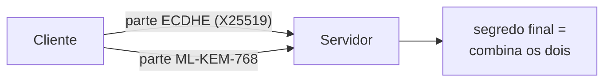

# Segurança Básica em Java

Spring Security (visto em Spring Security) cuida de autenticação e autorização na camada web. Essa nota é sobre decisões que acontecem um nível abaixo disso, na própria linguagem e na JVM: como lidar com dado sensível na memória, por que confiar cegamente em bytes vindos de fora pode custar caro, e o que muda na criptografia do TLS para aguentar a chegada dos computadores quânticos.

## Criptografia não é lugar para inventar

A primeira regra de criptografia seria engraçada se não fosse tão comum ver violada: não crie seu próprio algoritmo, não "embaralhe" texto como se fosse proteção, não use uma senha simples como chave, e nunca trate Base64 como segurança. Base64 é só uma codificação, transforma bytes em texto legível para transporte, qualquer um consegue reverter sem chave nenhuma.

Duas situações aparecem com frequência em aplicações Java, e pedem tratamento diferente:

**Dado que precisa ser lido de volta depois** (um documento, um token, um campo sensível de cadastro): use uma biblioteca de alto nível já revisada por especialistas, como o Tink do Google, em vez de montar a cifra na mão com `javax.crypto` puro. Quando você precisa de confidencialidade (esconder o conteúdo) e integridade (garantir que ninguém alterou o dado) ao mesmo tempo, o padrão certo é AEAD (Authenticated Encryption with Associated Data). Se você só precisa provar que uma mensagem não foi alterada, sem esconder o conteúdo, MAC (como HMAC) ou uma assinatura digital (quando a verificação precisa acontecer com uma chave pública, sem expor a chave privada) resolvem sem o custo extra de cifrar.

**Senha de usuário**: nunca use criptografia reversível. Uma senha não deveria poder ser "descriptografada" por ninguém, nem pelo próprio sistema. O caminho certo é hash adaptativo, não um hash rápido comum:

```java
// hash rápido (SHA-256, MD5) NÃO serve para senha, mesmo com salt
// é rápido demais: trivial de paralelizar em GPU e testar bilhões de combinações
String hashRuim = sha256(senha + salt);

// hash adaptativo: BCrypt, deliberadamente lento, com salt embutido
PasswordEncoder encoder = new BCryptPasswordEncoder();
String hash = encoder.encode(senhaDigitada);
boolean confere = encoder.matches(senhaDigitada, hash);
```

`BCryptPasswordEncoder` (do Spring Security) gera o salt automaticamente e aplica o algoritmo bcrypt, que é deliberadamente custoso de calcular, o que torna ataques de força bruta muito mais caros mesmo com hardware dedicado. O login nunca "descriptografa" a senha armazenada, ele recalcula o hash da senha digitada e compara os dois hashes.

Regra prática: precisa ler o dado de volta depois? AEAD. Só precisa provar que não foi alterado? MAC ou assinatura. É senha de usuário? Hash adaptativo, nunca texto plano, nunca reversível.

## Desserialização não é a mesma coisa que parsing

A serialização nativa do Java (`ObjectInputStream`/`ObjectOutputStream`) reconstrói objetos Java inteiros a partir de uma sequência de bytes. O risco central é tratar esses bytes como dado inofensivo quando eles vêm de uma fonte não confiável.

`ObjectInputStream` pode carregar qualquer classe presente no classpath da aplicação e acionar métodos como `readObject()` durante a reconstrução. Isso significa que bytes maliciosos, desenhados especificamente para o classpath daquela aplicação, podem encadear chamadas de métodos já existentes em bibliotecas legítimas (uma técnica chamada gadget chain) até conseguir executar código arbitrário no servidor, sem nunca ter explorado uma vulnerabilidade de memória, só a própria confiança do mecanismo de desserialização.

```java
// nunca desserialize bytes vindos de uma fonte não confiável assim
ObjectInputStream in = new ObjectInputStream(entradaDaRede);
Object objeto = in.readObject(); // pode instanciar QUALQUER classe do classpath
```

A defesa mais sólida é simplesmente não usar serialização nativa do Java para dado que atravessa uma fronteira não confiável (rede, fila, upload de arquivo). Formatos com schema explícito, como Protocol Buffers ou JSON com um contrato de tipo bem definido, resolvem melhor: o schema já define a estrutura esperada, e o payload não carrega nome de classe Java nenhum, então o receptor só lê dado, nunca é induzido a instanciar um tipo arbitrário.

Dado sensível (senha, token, chave, informação de sessão) não deveria fazer parte do que é serializado de forma alguma. Marcar um campo como `transient` remove ele da serialização automática:

```java
class Sessao implements Serializable {
    private String usuarioId;
    private transient String tokenSecreto; // nunca vai para o stream serializado
}
```

Quando a serialização nativa for realmente inevitável (integração com um sistema legado, por exemplo), `ObjectInputFilter` permite configurar uma allowlist explícita de classes aceitas, além de limites de profundidade e de número de referências, o que reduz bastante o espaço de ataque disponível para um payload malicioso. Vale reforçar: prefira sempre evitar o problema (schema explícito) a mitigar o problema (allowlist).

## Criptografia pós-quântica e o TLS

Quando dois sistemas abrem uma conexão HTTPS, a primeira coisa que acontece é uma troca de chave: os dois combinam, na frente de todo mundo, um segredo que só eles vão conhecer. Hoje isso é feito com ECDHE (uma variação de Diffie-Hellman sobre curvas elípticas), e a segurança disso depende de um problema matemático que os computadores atuais não conseguem resolver em tempo hábil.

Um computador quântico grande o suficiente resolve esse problema. Ele ainda não existe, mas isso não deixa a ameaça no futuro por causa de um detalhe: o ataque **"harvest now, decrypt later"** (colher agora, decifrar depois). Um adversário com recursos pode gravar hoje todo o tráfego cifrado que passa por um ponto da rede e guardar. No dia em que a máquina quântica ligar, ele volta nesse arquivo e decifra tudo de uma vez. Dado que precisa ficar secreto por dez, vinte anos (prontuário, contrato, segredo industrial) já está em risco agora.

A resposta da indústria são algoritmos novos, desenhados para resistir também ao ataque quântico. O NIST, órgão americano de padronização, publicou os principais: **ML-KEM** para troca de chave e **ML-DSA** para assinatura digital.

O Java 27, pela JEP 527, coloca isso no TLS 1.3 usando um esquema **híbrido**: em vez de trocar o ECDHE pelo ML-KEM, o handshake roda os dois e combina os dois segredos. O nome do esquema padrão é `X25519MLKEM768`.



A razão de ser híbrido é conservadora: o ML-KEM é recente e pode ter alguma falha ainda não descoberta. Enquanto o ECDHE segura contra os ataques clássicos de sempre e o ML-KEM segura contra o quântico, uma sessão só cai se **os dois** forem quebrados ao mesmo tempo.

Do seu lado, não muda nada. Se o seu código não força um esquema de chave específico (e quase nenhum código faz isso), a JVM já vai negociar o `X25519MLKEM768` quando o outro lado suportar, e cair no ECDHE puro quando não. É outra das melhorias que chegam só por atualizar a versão, como discutido em [Java Recente](/labs/java/java/05-java-recente/).

Duas ressalvas. Isso protege a **troca de chave** da conexão, não a assinatura do certificado TLS nem o dado guardado em banco, que continuam com algoritmos clássicos até os padrões pós-quânticos de assinatura amadurecerem. E o handshake híbrido troca mais bytes que o clássico, então em cenários com muitas conexões novas por segundo vale medir o efeito.

Para se aprofundar: [JEP 527: Post-Quantum Hybrid Key Exchange for TLS 1.3](https://openjdk.org/jeps/527), o artigo [Post-Quantum Hybrid Key Exchange for TLS 1.3](https://inside.java/2026/02/17/tls-post-quantum-hybrid-key-exchange/) no blog oficial do OpenJDK, e a página [Post-Quantum Cryptography](https://csrc.nist.gov/projects/post-quantum-cryptography) do NIST sobre os padrões ML-KEM e ML-DSA.
