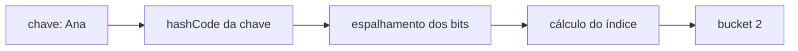
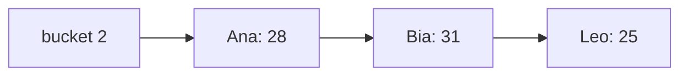
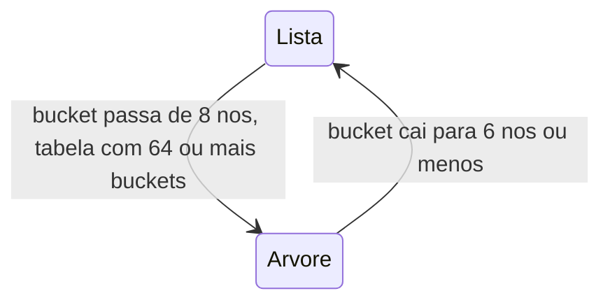
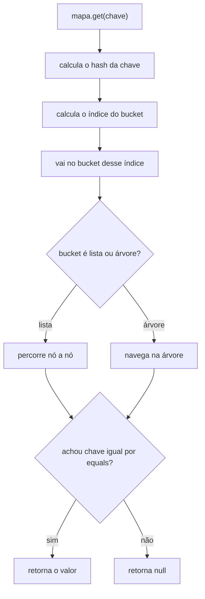

# HashMap por dentro

O `HashMap` entrega `get` e `put` em tempo praticamente constante, não importa se o mapa tem 10 ou 10 milhões de entradas. Essa nota abre a caixa preta e mostra como ele consegue isso, e em que situações a promessa começa a falhar. É também a pergunta de entrevista mais comum sobre coleções, então vale entender o mecanismo de verdade em vez de decorar uma frase pronta.

## A estrutura base: um array de buckets

Por dentro, o `HashMap` é um array. Cada posição desse array se chama **bucket** (balde), e é onde as entradas vão parar.

```java
transient Node<K,V>[] table;  // o array, dentro da classe HashMap
```

Cada `Node` guarda quatro coisas: o hash já calculado da chave, a própria chave, o valor e um ponteiro para o próximo nó (isso vai importar quando falarmos de colisão).

O array começa com **16 posições** (capacidade inicial padrão) e o tamanho é sempre uma potência de 2. Já já você vê por que essa escolha não é à toa.

## Da chave ao bucket

Quando você faz `mapa.put("Ana", 28)`, o `HashMap` precisa decidir em qual bucket a entrada "Ana" vai morar. São três passos:



**1. `hashCode()` da chave.** Todo objeto em Java tem um `hashCode()`. Para `String`, ele é calculado a partir dos caracteres.

**2. Espalhamento (o "spread").** O `HashMap` não usa o `hashCode()` cru. Ele aplica mais uma mistura:

```java
static final int hash(Object key) {
    int h;
    return (key == null) ? 0 : (h = key.hashCode()) ^ (h >>> 16);
}
```

`h >>> 16` empurra os 16 bits mais altos para a direita, e o `^` (XOR) mistura eles com os bits baixos. Isso existe porque o próximo passo só olha os bits de baixo do número, e sem essa mistura dois `hashCode()` que só diferem nos bits altos cairiam sempre no mesmo bucket.

**3. Índice do bucket.** Em vez de `hash % n`, o `HashMap` usa:

```java
index = (n - 1) & hash;  // n = tamanho do array
```

Como `n` é potência de 2, `(n - 1)` em binário é uma sequência de 1s (com 16, é `1111`), e o `&` funciona igual a `hash % n`, só que muito mais rápido. Esse é o motivo de a capacidade ser sempre potência de 2.

Chave `null` é um caso especial: hash 0, vai sempre para o bucket 0. Por isso o `HashMap` aceita uma chave `null`.

## Colisão: mais de uma chave no mesmo bucket

Buckets diferentes para chaves diferentes seria o mundo ideal, mas com 16 posições e centenas de chaves, cedo ou tarde duas caem no mesmo lugar. Isso é uma **colisão**, e não é um bug, é esperado.

Quando acontece, o bucket deixa de ter um único nó e vira uma **lista encadeada**:



Na hora do `put`, o `HashMap` percorre essa lista comparando: primeiro o `hash` (barato), e só se o hash bater, o `equals()` (mais caro). Se achar uma chave `equals` à nova, substitui o valor. Se chegar ao fim sem achar, adiciona um nó.

O problema: quanto mais longa a lista de um bucket, mais lento fica o `get` e o `put` naquele bucket, porque é uma varredura linear. Um `hashCode()` mal feito que devolve o mesmo valor para tudo transforma o `HashMap` inteiro numa lista encadeada, com busca O(n).

## Treeification: quando o bucket vira árvore

A partir do Java 8, o `HashMap` tem uma defesa contra buckets muito cheios: converter a lista encadeada numa **árvore Red-Black** (uma árvore binária balanceada). Numa árvore, a busca é O(log n) em vez de O(n).

Três constantes controlam isso:

| Constante              | Valor | O que faz                                        |
| ---------------------- | ----- | ------------------------------------------------ |
| `TREEIFY_THRESHOLD`    | 8     | bucket com mais de 8 nós é convertido em árvore  |
| `MIN_TREEIFY_CAPACITY` | 64    | só arvoriza se o array tiver ao menos 64 buckets |
| `UNTREEIFY_THRESHOLD`  | 6     | árvore com 6 nós ou menos volta a ser lista      |

O detalhe do `MIN_TREEIFY_CAPACITY` é o mais esquecido: se a tabela ainda é pequena (menos de 64 buckets) e um bucket já tem 8 nós, o `HashMap` prefere **dobrar a tabela** a arvorizar. A lógica: lista longa em tabela pequena quase sempre significa "tabela apertada demais", e espalhar as entradas num array maior resolve de graça. Arvorizar fica reservado para quando as colisões persistem mesmo num array de tamanho razoável.



A folga entre 8 (virar árvore) e 6 (voltar a ser lista) é de propósito: evita ficar convertendo ida e volta quando o tamanho do bucket fica oscilando em torno do limite.

Na prática, com um `hashCode()` decente e o load factor padrão, a chance de um bucket chegar a 8 elementos é minúscula (na casa de 1 em 10 milhões). A treeification é uma rede de segurança, não o caminho normal.

## A operação get, passo a passo



Repare que `equals()` é sempre a palavra final. O hash serve só para chegar rápido no bucket certo; dentro dele, quem decide se a chave é a mesma é o `equals()`.

## Load factor e resize

O `HashMap` não espera o array encher para crescer. Ele usa o **load factor**, que por padrão é `0.75`:

```
limite = capacidade * load factor
16 * 0.75 = 12 entradas
```

Quando a 13ª entrada entra, o `HashMap` faz um **resize**: cria um array com o dobro do tamanho (16 para 32) e recoloca todas as entradas, recalculando o bucket de cada uma. É uma operação cara, O(n), que acontece de tempos em tempos conforme o mapa cresce.

O `0.75` é um meio-termo: um valor mais baixo gasta mais memória mas tem menos colisão; mais alto economiza memória e colide mais. Raramente vale mexer nisso.

Se você já sabe quantas entradas vai ter, dá para evitar vários resizes dimensionando o mapa na criação:

```java
// vou colocar ~1000 entradas: 1000 / 0.75 ≈ 1334, arredonda pra cima
Map<String, Usuario> cache = new HashMap<>(1334);
```

## O contrato que a chave precisa cumprir

O `HashMap` só funciona se a chave respeitar duas coisas:

**`equals()` e `hashCode()` consistentes.** Se dois objetos são `equals`, eles têm que ter o mesmo `hashCode()`. Se você sobrescreve um e esquece o outro, o mapa guarda a entrada num bucket e procura em outro. O contrato completo entre os dois está em [Java Core](/labs/java/java/02-java-core/) e detalhado em [Exceções: o contrato entre equals e hashCode](/labs/java/java/11-excecoes-avancado/).

**Chave imutável nos campos usados no hash.** Se você usa um objeto como chave e depois muda um campo que entra no `hashCode()`, o hash da chave muda, mas ela continua guardada no bucket antigo. A entrada vira um fantasma: está no mapa, mas `get` com a mesma chave não acha mais.

```java
List<String> chave = new ArrayList<>(List.of("a"));
Map<List<String>, Integer> mapa = new HashMap<>();
mapa.put(chave, 1);
chave.add("b");              // mudou a chave depois de inserir
mapa.get(chave);             // null, a entrada sumiu
```

Por isso as boas chaves são tipos imutáveis: `String`, os wrappers numéricos (`Integer`, `Long`), enums e [records](/labs/java/java/03-java-moderno/).

## Como responder isso numa entrevista

O erro comum é reduzir demais: "HashMap é uma LinkedList" ou "HashMap é uma árvore Red-Black". Nenhum dos dois está certo sozinho.

A resposta boa descreve o fluxo inteiro:

1. Um array de buckets, indexado por `(n - 1) & hash` da chave
2. Colisão resolvida com nós encadeados no bucket
3. No Java 8+, bucket muito cheio (mais de 8 nós, tabela com 64+ buckets) vira árvore Red-Black, O(log n) no pior caso
4. Load factor 0.75 dispara o resize, que dobra a tabela e reindexa tudo
5. A comparação final de chave é sempre por `equals()`, e o mapa depende do contrato `equals`/`hashCode` e de a chave ser imutável
