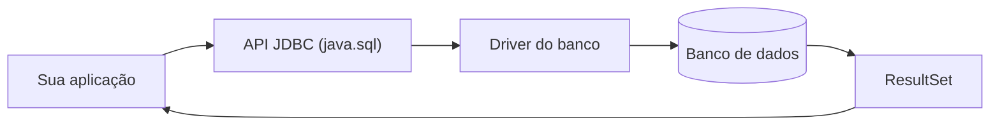

# JDBC: acesso a banco com a biblioteca padrão

Antes de qualquer framework de persistência existe o JDBC. É a API que o próprio Java traz para conversar com bancos relacionais, e é sobre ela que Hibernate, Spring Data e `JdbcTemplate` são construídos. Você raramente vai escrever JDBC puro no dia a dia, mas entender essa camada explica de onde vêm as conexões, o que é um pool, por que `PreparedStatement` importa e o que exatamente esses frameworks estão automatizando.

## O que é JDBC

JDBC (Java Database Connectivity) é a API padrão do Java para conectar a um banco de dados, mandar comandos SQL e ler o que volta. Ela mora no pacote `java.sql` (e um pouco no `javax.sql`), então já vem com o JDK, sem dependência nenhuma.

A ideia central é separar duas coisas:

- A **API** (`Connection`, `Statement`, `ResultSet`, ...): interfaces genéricas, iguais para qualquer banco.
- O **driver**: a implementação concreta dessas interfaces para um banco específico. O driver do PostgreSQL sabe falar o protocolo do PostgreSQL, o do MySQL sabe falar com o MySQL, e assim por diante. É a única peça que você troca ao mudar de banco.

O driver é um `.jar` que você adiciona ao projeto (via Maven ou Gradle). Um exemplo, para o PostgreSQL:

```xml
<dependency>
    <groupId>org.postgresql</groupId>
    <artifactId>postgresql</artifactId>
    <scope>runtime</scope>
</dependency>
```

O caminho que uma consulta percorre:



## O fluxo de uma operação

Toda interação com o banco via JDBC segue os mesmos passos:

1. **Ter o driver disponível.** Desde o JDBC 4.0 (Java 6) isso é automático: o driver se registra sozinho quando o `.jar` está no classpath, através do mecanismo `ServiceLoader`. Aquele `Class.forName("org.postgresql.Driver")` que aparece em tutoriais antigos não é mais necessário.
2. **Abrir uma conexão** com `DriverManager.getConnection(url, usuario, senha)`.
3. **Criar um `Statement` ou `PreparedStatement`** com o SQL.
4. **Executar** a consulta.
5. **Percorrer o `ResultSet`** (no caso de um `SELECT`).
6. **Fechar os recursos**, na ordem inversa da abertura.

A URL de conexão identifica o banco e seguindo o formato `jdbc:<banco>://<host>:<porta>/<nome-do-banco>`:

```
jdbc:postgresql://localhost:5432/loja
jdbc:mysql://localhost:3306/loja
jdbc:h2:mem:testdb
```

## Statement x PreparedStatement

Existem dois jeitos de mandar SQL, e um deles é quase sempre a escolha certa.

`Statement` recebe o SQL como uma string já montada. O banco precisa analisar (fazer o parse, planejar a execução) essa string toda vez, e você monta a query concatenando valores:

```java
// não faça isso
String email = req.getParameter("email");
Statement st = conn.createStatement();
ResultSet rs = st.executeQuery(
    "SELECT * FROM usuarios WHERE email = '" + email + "'"
);
```

`PreparedStatement` recebe o SQL com marcadores `?` no lugar dos valores. O banco pré-compila esse molde uma vez, e você preenche os parâmetros depois com métodos tipados:

```java
String sql = "SELECT id, nome FROM usuarios WHERE email = ?";
try (PreparedStatement ps = conn.prepareStatement(sql)) {
    ps.setString(1, email);
    try (ResultSet rs = ps.executeQuery()) {
        while (rs.next()) {
            System.out.println(rs.getLong("id") + " - " + rs.getString("nome"));
        }
    }
}
```

Os parâmetros são numerados a partir de 1, e cada tipo tem seu método: `setString`, `setLong`, `setInt`, `setBoolean`, `setBigDecimal`, `setTimestamp`.

### Por que isso protege contra SQL injection

No `Statement` concatenado, se alguém passar `email` valendo `' OR '1'='1`, a string final vira `SELECT * FROM usuarios WHERE email = '' OR '1'='1'` e retorna a tabela inteira. Pior ainda com `'; DROP TABLE usuarios; --`. O banco não tem como saber que aquilo era para ser um dado, não um comando.

No `PreparedStatement`, o SQL e os valores viajam separados. O banco recebe o molde `WHERE email = ?` primeiro, planeja a execução, e só depois recebe o valor. Não importa o que venha no parâmetro, ele é tratado como um único texto literal a comparar, nunca como parte do comando. Aspas, ponto e vírgula e palavras-chave de SQL no valor não têm efeito nenhum.

Isso e o ganho de performance quando a mesma query roda muitas vezes (o molde já está compilado) fazem do `PreparedStatement` o padrão. Use `Statement` só para DDL fixo ou scripts sem entrada externa.

## Executando queries e lendo resultados

O método de execução depende do tipo de comando:

| Método          | Para                          | Retorna                            |
| --------------- | ----------------------------- | ---------------------------------- |
| `executeQuery`  | `SELECT`                      | um `ResultSet`                     |
| `executeUpdate` | `INSERT`, `UPDATE`, `DELETE`  | o número de linhas afetadas        |
| `execute`       | quando não se sabe de antemão | `boolean` (se veio um `ResultSet`) |

O `ResultSet` é um cursor: ele começa antes da primeira linha, e cada `rs.next()` avança uma posição e devolve `false` quando acabou. As colunas são lidas por nome (`rs.getString("nome")`) ou por índice (`rs.getString(2)`).

Um cuidado: `rs.getInt("idade")` devolve `0` quando a coluna é `NULL`, não `null`. Para saber se o valor era nulo de verdade, cheque `rs.wasNull()` logo depois, ou use tipos que aceitam nulo.

Um `INSERT` com recuperação da chave gerada pelo banco:

```java
String sql = "INSERT INTO usuarios (nome, email) VALUES (?, ?)";
try (PreparedStatement ps = conn.prepareStatement(sql, Statement.RETURN_GENERATED_KEYS)) {
    ps.setString(1, "Ana");
    ps.setString(2, "ana@exemplo.com");
    ps.executeUpdate();
    try (ResultSet chaves = ps.getGeneratedKeys()) {
        if (chaves.next()) {
            long idNovo = chaves.getLong(1);
        }
    }
}
```

Quando você precisa inserir ou atualizar muitas linhas, `addBatch()` acumula os comandos e `executeBatch()` manda todos numa ida só ao banco, o que é bem mais rápido do que um `executeUpdate` por linha.

## Fechando recursos com try-with-resources

`Connection`, `Statement`, `PreparedStatement` e `ResultSet` são todos `AutoCloseable`. Isso importa porque cada um segura recursos do lado de fora da JVM: uma conexão aberta ocupa um slot no banco, e conexão que vaza (não é fechada) acaba esgotando o limite do servidor.

O jeito antigo, com `finally`, era verboso e fácil de errar. O try-with-resources cuida disso: os recursos declarados no parêntese são fechados automaticamente ao sair do bloco, na ordem inversa da declaração, mesmo se uma exceção for lançada.

```java
String url = "jdbc:postgresql://localhost:5432/loja";
String sql = "SELECT id, nome, preco FROM produtos WHERE preco < ?";

try (Connection conn = DriverManager.getConnection(url, "app", "senha");
     PreparedStatement ps = conn.prepareStatement(sql)) {

    ps.setBigDecimal(1, new BigDecimal("100.00"));

    try (ResultSet rs = ps.executeQuery()) {
        while (rs.next()) {
            System.out.printf("%d - %s - %.2f%n",
                rs.getLong("id"), rs.getString("nome"), rs.getBigDecimal("preco"));
        }
    }
} catch (SQLException e) {
    // tratar ou relançar como exceção da aplicação
    throw new RuntimeException("falha ao consultar produtos", e);
}
```

Quase toda operação JDBC pode lançar `SQLException`, que é uma checked exception. Uma prática comum é capturá-la na camada de acesso a dados e relançar como uma exceção não checada da aplicação, para não espalhar `throws SQLException` por todo lado.

## Transações em JDBC

Por padrão a conexão está em `autoCommit = true`: cada comando é uma transação isolada, confirmada assim que executa. Isso serve para operações avulsas, mas não quando várias mudanças precisam valer tudo ou nada, como transferir saldo entre duas contas.

Para agrupar comandos numa transação, desligue o autocommit:

```java
try (Connection conn = DriverManager.getConnection(url, user, senha)) {
    conn.setAutoCommit(false);
    try (PreparedStatement debito = conn.prepareStatement(
             "UPDATE contas SET saldo = saldo - ? WHERE id = ?");
         PreparedStatement credito = conn.prepareStatement(
             "UPDATE contas SET saldo = saldo + ? WHERE id = ?")) {

        debito.setBigDecimal(1, valor);
        debito.setLong(2, origem);
        debito.executeUpdate();

        credito.setBigDecimal(1, valor);
        credito.setLong(2, destino);
        credito.executeUpdate();

        conn.commit();
    } catch (SQLException e) {
        conn.rollback();
        throw e;
    }
}
```

Se qualquer comando falhar, o `rollback()` desfaz tudo que veio antes na mesma transação. O `commit()` só é chamado quando todos deram certo.

## Connection pool

Abrir uma conexão não é barato: envolve handshake TCP, autenticação e alocação de recursos no banco, algo na casa de dezenas de milissegundos. Uma aplicação web que abrisse uma conexão nova a cada requisição passaria boa parte do tempo só nesse custo, e ainda correria o risco de estourar o limite de conexões do servidor sob carga.

A solução é um **connection pool**: um conjunto de conexões abertas uma vez e mantidas prontas. Quando o código pede uma conexão, o pool empresta uma que já está aberta; quando o `close()` é chamado, a conexão não é de fato fechada, só devolvida ao pool.

Na prática você não usa mais o `DriverManager` direto: usa um `DataSource`, a abstração que representa a fonte de conexões. O pool implementa `DataSource`, então o código continua chamando `dataSource.getConnection()` e `close()` normalmente, sem saber que há um pool no meio.

O pool padrão do Spring Boot é o **HikariCP**, conhecido por ser rápido e leve. Você configura tamanho do pool, timeout e afins pelas propriedades da aplicação, e o resto acontece por baixo.

## Do JDBC puro ao Spring

Olhando os exemplos acima, dá para ver quanto código de infraestrutura o JDBC puro exige em cada consulta: abrir, preparar, setar parâmetro, iterar o `ResultSet`, mapear coluna a coluna, fechar, tratar `SQLException`. A lógica de negócio se perde no meio do ritual.

Os frameworks vão subindo essa escada:

- **`JdbcTemplate`** (Spring JDBC): mantém você escrevendo SQL, mas cuida de conexão, `PreparedStatement`, iteração e fechamento. Você passa a query e uma função que transforma uma linha em objeto.
- **Spring Data JPA / Hibernate**: sobe mais um degrau e some com o SQL na maior parte dos casos, mapeando classes para tabelas. É o assunto de [Spring Data](/labs/java/spring/02-spring-data/).

Ainda assim, descer de novo até `JdbcTemplate` ou JDBC puro faz sentido em casos específicos: uma query com SQL muito particular que o JPA geraria mal, um ponto crítico de performance, ou um script de carga de dados em massa.

## Referências

- [JDBC Tutorial: Uma Introdução ao JDBC](https://www.devmedia.com.br/jdbc-tutorial/6638) - DevMedia, pt-BR
- [Introduction to JDBC](https://www.baeldung.com/java-jdbc) - Baeldung, inglês
- [Difference Between Statement and PreparedStatement](https://www.baeldung.com/java-statement-preparedstatement) - Baeldung, inglês
- [JDBC Basics](https://docs.oracle.com/javase/tutorial/jdbc/basics/index.html) - The Java Tutorials (Oracle), inglês
