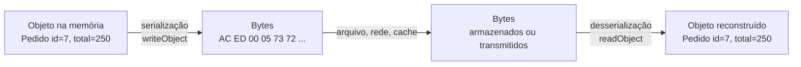
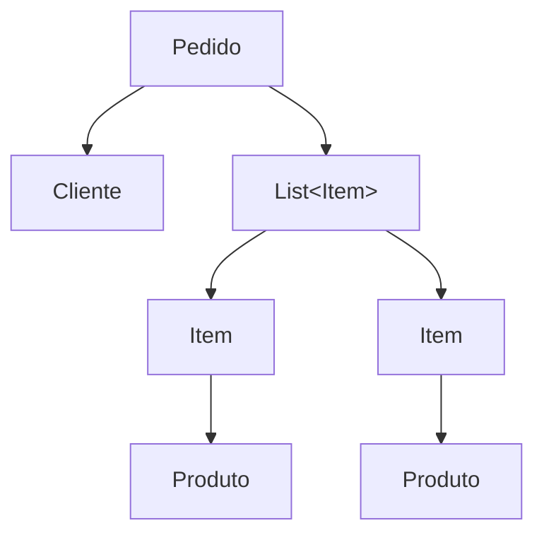

# Serialização e Desserialização

Um objeto Java vive na memória: um bloco de bytes organizado do jeito que a JVM entende, cheio de referências que só fazem sentido dentro daquele processo. Na hora que você precisa guardar esse objeto num arquivo ou mandar ele pela rede, esse formato não serve. É preciso achatar o objeto numa sequência linear de bytes que possa ser gravada, transmitida e, mais tarde, remontada. Esse processo de ida e volta é a serialização e a desserialização.

## O que é serialização

Serialização é converter um objeto em memória numa sequência de bytes. Desserialização é o contrário: pegar aquela sequência de bytes e reconstruir o objeto, com os mesmos valores de campo que ele tinha na hora em que foi serializado.



Onde isso aparece na prática:

- Salvar o estado de um objeto num arquivo para ler de volta depois
- Enviar um objeto de uma JVM para outra pela rede (é o que o RMI faz por baixo)
- Guardar objetos num cache que vive fora do heap, como o Redis ou uma sessão HTTP replicada entre servidores
- Fazer uma cópia profunda de um objeto: serializa e desserializa, e o resultado é um clone independente, sem referências compartilhadas

A serialização nativa do Java é bem diferente de gerar um JSON. O JSON descreve os dados num formato de texto que qualquer linguagem lê. A serialização nativa gera um formato binário que só o Java entende, e que carrega junto o nome das classes envolvidas. Isso tem consequências, e a gente volta nelas no fim da nota.

## A interface Serializable

Para uma classe poder ser serializada pelo mecanismo nativo, ela precisa implementar `java.io.Serializable`:

```java
import java.io.Serializable;

public class Pedido implements Serializable {
    private long id;
    private double total;
    private String cliente;

    public Pedido(long id, double total, String cliente) {
        this.id = id;
        this.total = total;
        this.cliente = cliente;
    }
}
```

`Serializable` é uma interface marcadora: não tem nenhum método para implementar. Ela só serve para a JVM saber que você autorizou aquela classe a virar bytes. Se você tentar serializar um objeto cuja classe não implementa `Serializable`, o resultado é uma `NotSerializableException` na hora.

Essa exceção também aparece por tabela. Quando você serializa um objeto, todos os objetos que ele referencia nos campos são serializados junto, e todos eles também precisam ser serializáveis. Isso é a serialização do grafo de objetos:



Se `Pedido` é serializável mas `Produto` não é, serializar um `Pedido` estoura `NotSerializableException` apontando para `Produto`. A regra vale para o grafo inteiro.

Dois tipos de campo ficam de fora do processo automático: os `static` (que pertencem à classe, não ao objeto) e os `transient` (que a gente vê daqui a pouco).

## Gravar e ler: ObjectOutputStream e ObjectInputStream

Quem faz o trabalho é o par `ObjectOutputStream` / `ObjectInputStream`. Eles são streams de "decoração": você encaixa eles em cima de um stream de bytes de verdade, que pode ser um arquivo, um socket de rede ou um buffer em memória.

Gravando num arquivo:

```java
Pedido pedido = new Pedido(7, 250.0, "Ana");

try (ObjectOutputStream out =
         new ObjectOutputStream(new FileOutputStream("pedido.ser"))) {
    out.writeObject(pedido);
}
```

Lendo de volta:

```java
try (ObjectInputStream in =
         new ObjectInputStream(new FileInputStream("pedido.ser"))) {
    Pedido pedido = (Pedido) in.readObject();
    System.out.println(pedido.getId()); // 7
}
```

Dois detalhes que pegam quem está começando:

- `readObject()` devolve um `Object`, então você precisa fazer o cast para o tipo certo. Se o byte stream não corresponder ao tipo esperado, o cast estoura `ClassCastException`.
- Se você grava vários objetos com chamadas seguidas de `writeObject`, precisa ler na mesma ordem, com a mesma quantidade de chamadas de `readObject`. O stream é sequencial, não tem índice nem chave.

## serialVersionUID

Aqui mora a parte chata da serialização nativa. Quando você serializa um objeto, o Java grava junto um número chamado `serialVersionUID`, que identifica a versão da classe usada naquele momento. Na desserialização, ele compara o número gravado no stream com o número da classe que está no classpath agora. Se os dois não baterem, você recebe uma `InvalidClassException` e a desserialização falha.

O problema: se você não declara esse número, o compilador gera um automaticamente, a partir de um hash do nome da classe, dos campos, dos métodos e das interfaces. Qualquer alteração na classe (adicionar um método, renomear um campo privado, mudar um modificador) muda o hash e, portanto, o `serialVersionUID`. Aí todo dado serializado com a versão antiga fica ilegível.

A solução é declarar o número na mão e controlar você mesmo quando ele muda:

```java
public class Pedido implements Serializable {
    private static final long serialVersionUID = 1L;

    private long id;
    private double total;
    private String cliente;
}
```

A regra prática:

- Classe nova: comece com `1L`.
- Mudança compatível (adicionar um campo novo, por exemplo): mantenha o mesmo número. Objetos serializados antes vão desserializar, e o campo novo volta com o valor default.
- Mudança incompatível (remover um campo que os dados antigos precisam, mudar o tipo de um campo): aí sim faz sentido incrementar o número, sabendo que dados antigos não vão mais ser lidos por essa versão.

O JDK ainda traz a ferramenta `serialver` para calcular o hash de uma classe existente, útil quando você precisa "congelar" o número que uma classe legada já usava.

## transient: o que fica de fora

O modificador `transient` marca um campo que não deve ser serializado. Na desserialização, ele volta com o valor default do tipo: `null` para objetos, `0` para números, `false` para boolean.

```java
public class Sessao implements Serializable {
    private static final long serialVersionUID = 1L;

    private String usuarioId;
    private transient String tokenSecreto;   // não vai para o stream
    private transient List<String> cacheDePermissoes; // recalculável
}
```

Quando usar:

- Dado sensível que não deveria ser gravado em disco nem trafegar: senha, token, chave privada
- Campo que é só um cache ou um valor derivado, que dá para recalcular a partir dos outros
- Referência a um objeto que não é serializável (uma conexão de banco, uma thread, um stream aberto)

Se o campo `transient` precisa voltar com algum valor em vez de `null`, você pode reidratar ele num método `readObject` customizado, que é o próximo assunto.

## Customizar a serialização

O formato automático atende a maioria dos casos, mas dá para intervir.

**writeObject e readObject na própria classe.** Se a sua classe declara esses dois métodos privados com essa assinatura exata, a JVM chama eles em vez de usar o processo padrão. O uso mais comum é chamar o processo padrão e complementar:

```java
public class Sessao implements Serializable {
    private static final long serialVersionUID = 1L;

    private String usuarioId;
    private transient List<String> cacheDePermissoes;

    private void writeObject(ObjectOutputStream out) throws IOException {
        out.defaultWriteObject(); // serializa os campos normais
    }

    private void readObject(ObjectInputStream in)
            throws IOException, ClassNotFoundException {
        in.defaultReadObject(); // desserializa os campos normais
        this.cacheDePermissoes = carregarPermissoes(usuarioId); // reidrata o transient
    }
}
```

**writeReplace e readResolve.** Permitem trocar o objeto que vai para o stream (ou que sai dele) por outro. É como um singleton ou um enum garante que a desserialização não crie uma segunda instância: o `readResolve` devolve sempre a instância canônica.

**A interface Externalizable.** É uma alternativa a `Serializable` em que você escreve o formato inteiro na mão, campo por campo, nos métodos `writeExternal` e `readExternal`. Dá controle total, mas hoje é raro ver: quando o time precisa desse nível de controle sobre os bytes, quase sempre a escolha é um formato com schema, tipo Protocol Buffers, e não `Externalizable`.

**Serialização de record (Java 16+).** Records são serializados de um jeito próprio e mais seguro. Em vez de a JVM criar um objeto vazio e preencher os campos por reflexão, a desserialização de um record chama o construtor canônico passando os valores lidos do stream. Isso significa que qualquer validação que você colocou no construtor roda também na desserialização, e o record nunca existe num estado inválido. Para records, os métodos `writeObject`, `readObject` e o próprio `serialVersionUID` são ignorados: o que conta são os componentes.

## Os perigos da desserialização

A desserialização de dados não confiáveis é um dos furos de segurança mais conhecidos do Java. O motivo é estrutural: o byte stream carrega o nome das classes, e o `ObjectInputStream` instancia essas classes e chama código delas durante a leitura, antes de você ter qualquer chance de validar o conteúdo.

Um atacante que consegue mandar bytes para um endpoint que faz `readObject` pode montar um payload que encadeia chamadas de métodos de classes que já estão no classpath (uma "gadget chain") até chegar a algo perigoso, como executar um comando no sistema operacional. Várias CVEs graves em bibliotecas populares vieram exatamente daí.

As defesas, em ordem de preferência:

1. Não usar serialização nativa para dado que cruza uma fronteira não confiável. Rede, fila, upload de arquivo: nada disso deveria chegar num `readObject`.
2. Quando a serialização nativa for inevitável (integração legada, por exemplo), configurar um `ObjectInputFilter` com uma allowlist explícita das classes aceitas, além de limites de profundidade do grafo e de número de referências.

Esse assunto tem um tratamento mais completo, com exemplos, em [Segurança Básica em Java](/labs/java/java/14-seguranca-basica/).

## Alternativas à serialização nativa

Para praticamente todo caso de "preciso mandar esse objeto para outro lugar", existe uma opção melhor que `Serializable`:

- **JSON** com Jackson ou Gson: texto legível, todo mundo lê, e é o padrão de fato para APIs REST
- **Protocol Buffers, Avro, MessagePack**: formatos binários com schema, mais compactos e rápidos que JSON, usados quando o volume importa

O motivo de o mercado ter migrado para longe da serialização nativa em comunicação entre serviços:

- O formato é preso à classe Java. Só outra JVM com a mesma classe no classpath consegue ler.
- Não tem schema explícito. O contrato dos dados fica implícito no código da classe, e evoluir isso sem quebrar dados antigos é frágil (é o problema do `serialVersionUID`).
- É pesado. O byte stream carrega metadados de classe que um formato com schema não precisa repetir.
- É superfície de ataque, pelo que foi visto na seção anterior.

Onde a serialização nativa ainda faz sentido: RMI, replicação de sessão HTTP entre instâncias do mesmo app, e integração com sistemas Java legados que já falam esse formato. Fora disso, prefira um formato com schema.

## Referências

- [Entendendo o serialVersionUID](https://www.alura.com.br/artigos/entendendo-o-serialversionuid) - Paulo Silveira (Alura), pt-BR
- [Serialização em Java na atualidade e novas abordagens](https://dev.to/javaefetivo/serializacao-em-java-na-atualidade-e-novas-abordagens-1jff) - Java Efetivo, pt-BR
- [Introduction to Java Serialization](https://www.baeldung.com/java-serialization) - Baeldung, inglês
- [Serialization Filtering](https://docs.oracle.com/en/java/javase/17/core/serialization-filtering1.html) - Oracle, inglês
- [Record Serialization](https://inside.java/2020/07/20/record-serialization/) - Chris Hegarty (Inside.java / Oracle), inglês
