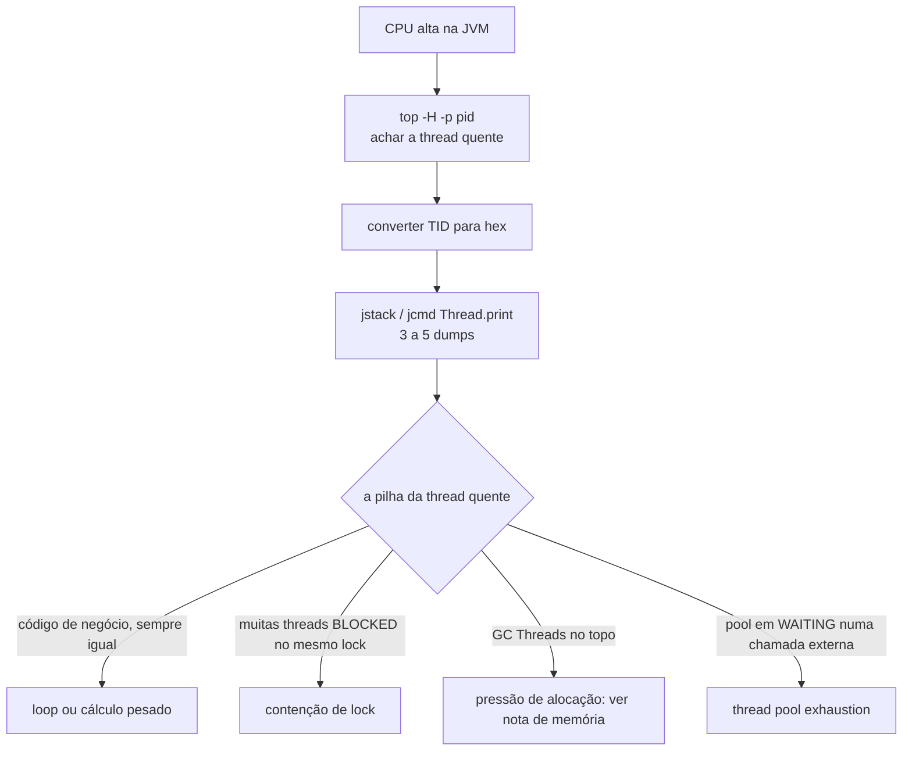
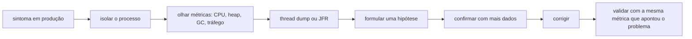

# Diagnóstico da JVM em Produção

Uma aplicação que passou em todos os testes ainda pode começar a consumir 100% de CPU às três da manhã, ou subir de memória até o container ser morto. Quando isso acontece, reiniciar resolve o sintoma e apaga a evidência. Esta nota é sobre olhar a JVM enquanto o problema está acontecendo, com as ferramentas que já vêm no JDK e sem derrubar o processo.

O ponto de partida é sempre o mesmo: transformar "o sistema está lento" numa hipótese testável. Qual processo? Quais threads? O tempo está indo para o código, para o GC, para uma trava ou para uma espera de rede? Cada resposta elimina um pedaço do mapa.

## É a JVM mesmo?

Antes de abrir qualquer ferramenta de Java, confirme que o consumo é do processo da JVM. Num host ou container compartilhado, a CPU alta pode ser de outro processo, de um sidecar, ou de um vizinho barulhento no mesmo nó do cluster.

```bash
top -p $(pgrep -f 'seu-app.jar')       # CPU e memória do processo
cat /sys/fs/cgroup/memory.max          # limite de memória do cgroup (container)
```

Se o processo Java está mesmo no topo, siga em frente. Se não está, o problema é de infraestrutura: limite de CPU do cgroup baixo demais, disco saturado, outro contêiner comendo o nó. Vale também descartar o básico: o pico começou junto com um deploy? Com um aumento de tráfego? Com um job agendado? Um gráfico de CPU alinhado com a hora de um deploy já é meio caminho andado.

## Threads consumindo CPU: o thread dump

CPU alta na JVM quase sempre é uma ou poucas threads girando. O trabalho é descobrir quais e o que elas estão fazendo.

Primeiro, ache a thread quente. O `top` no modo por thread mostra o consumo individual:

```bash
top -H -p <pid>
```

Anote o ID da thread mais gulosa (o `top` mostra em decimal). Converta para hexadecimal, porque é assim que ela aparece no thread dump:

```bash
printf '0x%x\n' 12345      # ex: 0x3039
```

Agora tire o dump. `jstack` e `jcmd` fazem a mesma coisa:

```bash
jstack <pid> > dump1.txt
# ou
jcmd <pid> Thread.print > dump1.txt
```

Tire de três a cinco dumps com alguns segundos entre eles. Um dump isolado é uma foto; a sequência mostra se a thread está travada no mesmo ponto ou avançando. No dump, procure pelo `nid` em hexadecimal que você anotou:

```
"http-nio-8080-exec-7" #34 daemon prio=5 nid=0x3039 runnable
   java.lang.Thread.State: RUNNABLE
        at com.exemplo.PedidoService.calcularTotal(PedidoService.java:88)
        ...
```

O que os padrões dizem:

- a mesma pilha, em código de negócio, em todos os dumps: loop sem fim ou cálculo pesado naquele método
- muitas threads em `BLOCKED` esperando o mesmo lock: contenção, o gargalo é a região sincronizada
- as threads de GC (`GC Thread#N`) no topo do `top -H`: o problema é pressão de alocação, não o seu código, e o caminho é [Memória na JVM e OutOfMemoryError](/labs/java/java/06-memoria-e-outofmemoryerror/)
- o pool que atende requisições todo em `WAITING` numa chamada externa: é thread pool exhaustion, tratado em [Concorrência](/labs/java/java/13-concorrencia/)



## Quando o suspeito é o garbage collector

Se as threads de GC aparecem consumindo CPU, ou se as pausas estão frequentes, ligue os logs de GC e observe quanto do tempo total a aplicação gasta parada:

```bash
# na subida da aplicação
-Xlog:gc*:file=gc.log:time,uptime,level,tags

# ao vivo, num processo já rodando
jstat -gcutil <pid> 1s
```

Se o percentual de tempo em pausa passa de um dígito, ou se cada ciclo recupera pouca memória (sinal de heap quase cheia o tempo todo), o problema é alocação, não a escolha do coletor. Trocar de GC nesse cenário costuma só mudar o sintoma de lugar. A investigação de fundo (o que está sendo alocado, o que está vazando) está em [Memória na JVM e OutOfMemoryError](/labs/java/java/06-memoria-e-outofmemoryerror/).

## Java Flight Recorder: o raio-x contínuo

O `jstack` te dá um instante. O Java Flight Recorder (JFR) grava um filme: eventos com carimbo de tempo vindos de toda a JVM, com overhead abaixo de 1% na configuração padrão, feito para rodar em produção.

Ligue uma gravação sob demanda:

```bash
jcmd <pid> JFR.start name=diag duration=120s filename=/tmp/diag.jfr settings=profile
```

Em dois minutos você tem um arquivo com CPU por método, pontos de alocação, pausas de GC, contenção de lock, I/O e exceções lançadas. Abra o `.jfr` no JDK Mission Control (JMC) e navegue pelos eventos: a aba de método quente costuma responder "para onde vai a CPU" mais rápido do que ler dezenas de thread dumps.

Dois cuidados. O overhead cresce conforme o nível de detalhe: `settings=profile` pesa mais que `settings=default`, e há configurações que vão além disso. E o arquivo pode carregar dado sensível (parâmetros de método, nomes de arquivo, URLs), então trate o `.jfr` como um artefato com informação de produção dentro.

## Vazamento de memória: para onde ir

O sintoma clássico é memória que sobe e não volta depois de um GC completo. Um heap dump sob demanda tira o retrato:

```bash
jcmd <pid> GC.heap_dump /tmp/heap.hprof
```

Para não depender de estar com o terminal aberto na hora certa, configure o dump automático no erro:

```bash
-XX:+HeapDumpOnOutOfMemoryError -XX:HeapDumpPath=/tmp/heap.hprof
```

As causas comuns (cache sem limite, coleção estática, listener não removido, `ThreadLocal` mal usado) e como ler o dump estão detalhadas em [Memória na JVM e OutOfMemoryError](/labs/java/java/06-memoria-e-outofmemoryerror/).

## Um roteiro rápido



A última etapa é a que mais se pula. Se a métrica que denunciou o problema foi o p99 do endpoint, é o p99 que precisa voltar ao normal para você dizer que resolveu, não "o CPU parece melhor agora".

## Referências

- [Troubleshooting Guide - Java SE](https://docs.oracle.com/en/java/javase/21/troubleshoot/) - Oracle, inglês
- [Monitoring Java Applications with Flight Recorder](https://www.baeldung.com/java-flight-recorder-monitoring) - Baeldung, inglês
- [How to Analyze Java Thread Dumps](https://www.baeldung.com/java-analyze-thread-dumps) - Baeldung, inglês
- [Troubleshoot Performance Problems Due to High CPU by a Java Thread](https://ops.java/performance/jvm/articles/high-cpu-use/) - ops.java, inglês
