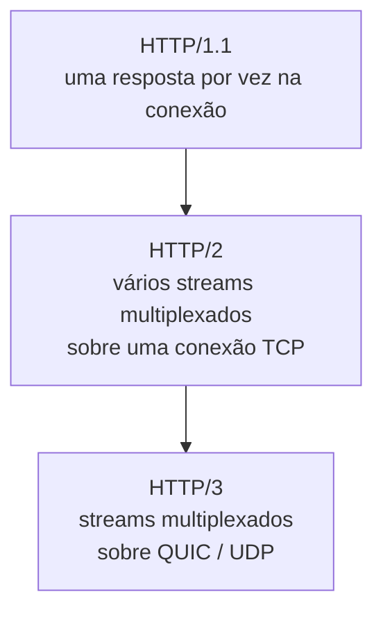

# Cliente HTTP e HTTP/3

Cedo ou tarde uma aplicação Java precisa chamar outra pela rede: consumir uma API de terceiro, falar com outro microsserviço, buscar um arquivo. Por muito tempo isso significou escolher entre o `HttpURLConnection`, uma classe da época do Java 1.1 com uma API que envelheceu mal, ou trazer uma biblioteca externa como OkHttp ou Apache HttpClient. Desde o Java 11 existe uma terceira opção que costuma ser a certa: o `HttpClient` da própria biblioteca padrão.

## O cliente HTTP da biblioteca padrão

O `java.net.http.HttpClient` chegou no Java 11 como a forma oficial de fazer requisições HTTP sem depender de nada externo. Ele já nasceu com suporte a HTTP/2, API fluente (builders) e suporte a chamadas assíncronas.

São três peças:

- `HttpClient`: guarda a configuração que você reaproveita entre requisições (versão do protocolo, timeout de conexão, proxy, política de redirecionamento, `Executor` para as chamadas assíncronas). Crie um e reutilize, não faça um por requisição.
- `HttpRequest`: uma requisição específica. URI, método, headers, corpo.
- `HttpResponse<T>`: o resultado. Status, headers e corpo, onde `T` é o tipo em que você pediu para o corpo ser entregue.

## Fazendo uma requisição

Um GET síncrono, do começo ao fim:

```java
HttpClient client = HttpClient.newBuilder()
    .connectTimeout(Duration.ofSeconds(5))
    .build();

HttpRequest request = HttpRequest.newBuilder()
    .uri(URI.create("https://api.exemplo.com/pedidos/42"))
    .header("Accept", "application/json")
    .GET()
    .build();

HttpResponse<String> response = client.send(request, HttpResponse.BodyHandlers.ofString());

System.out.println(response.statusCode()); // 200
System.out.println(response.body());       // corpo como String
```

`client.send(...)` é síncrono: a thread fica parada até a resposta chegar (ou o timeout estourar). Para um POST com corpo JSON, troca o método e passa um `BodyPublisher`:

```java
HttpRequest request = HttpRequest.newBuilder()
    .uri(URI.create("https://api.exemplo.com/pedidos"))
    .header("Content-Type", "application/json")
    .POST(HttpRequest.BodyPublishers.ofString("""
        { "cliente": "Ana", "valor": 250.0 }
        """))
    .build();
```

## Requisições assíncronas

Trocar `send` por `sendAsync` faz a chamada não bloquear a thread. O retorno é um `CompletableFuture<HttpResponse<T>>`:

```java
client.sendAsync(request, HttpResponse.BodyHandlers.ofString())
    .thenApply(HttpResponse::body)
    .thenAccept(System.out::println)
    .exceptionally(erro -> {
        System.err.println("falhou: " + erro.getMessage());
        return null;
    });
```

Isso é útil quando você dispara várias chamadas independentes e quer que elas corram em paralelo em vez de uma esperar a outra. O padrão de fan-out com `CompletableFuture` (e os cuidados com `Executor` e com `.join()` no lugar errado) está em [Concorrência](/labs/java/java/13-concorrencia/).

## O corpo da requisição e da resposta

Quem decide o formato do corpo são os `BodyHandlers` (resposta) e `BodyPublishers` (requisição). Os mais usados:

| Direção    | Fábrica                        | Para quê                      |
| ---------- | ------------------------------ | ----------------------------- |
| Resposta   | `BodyHandlers.ofString()`      | corpo como texto              |
| Resposta   | `BodyHandlers.ofByteArray()`   | corpo binário na memória      |
| Resposta   | `BodyHandlers.ofInputStream()` | corpo grande, lido aos poucos |
| Resposta   | `BodyHandlers.ofFile(path)`    | salvar direto num arquivo     |
| Resposta   | `BodyHandlers.discarding()`    | ignorar o corpo               |
| Requisição | `BodyPublishers.ofString(s)`   | enviar texto ou JSON          |
| Requisição | `BodyPublishers.ofFile(path)`  | enviar um arquivo             |
| Requisição | `BodyPublishers.noBody()`      | requisição sem corpo          |

Uma coisa que o `HttpClient` não faz: converter JSON em objeto e vice-versa. Isso continua sendo trabalho seu, com Jackson ou Gson. O `HttpClient` te entrega uma `String` (ou bytes), e você desserializa.

## Versões do protocolo HTTP

O `HttpClient` sabe falar três versões do HTTP, e você escolhe com `HttpClient.Version`:



- **HTTP/1.1**: cada conexão processa uma requisição de cada vez. Para paralelismo, o navegador ou cliente abre várias conexões.
- **HTTP/2**: multiplexação. Várias requisições e respostas viajam ao mesmo tempo na mesma conexão TCP, cada uma num "stream" lógico. É o padrão do `HttpClient` desde o Java 11.
- **HTTP/3**: mesma multiplexação, mas em cima do QUIC (que roda sobre UDP) em vez do TCP. É a novidade do Java 26.

A versão pode ser definida no `HttpClient` inteiro (`.version(...)` no builder) ou por requisição (`HttpRequest.newBuilder().version(...)`).

## HTTP/3 no Java 26

A [JEP 517](https://openjdk.org/jeps/517) adicionou o suporte a HTTP/3 no `HttpClient`. Entrou no Java 26, que ficou disponível em 17 de março de 2026, e já é um recurso final: não precisa de `--enable-preview`.

Do ponto de vista de quem escreve o código, a mudança é uma linha:

```java
// antes: HTTP/2 (o padrão)
HttpClient client = HttpClient.newBuilder()
    .version(HttpClient.Version.HTTP_2)
    .build();

// Java 26: HTTP/3
HttpClient client = HttpClient.newBuilder()
    .version(HttpClient.Version.HTTP_3)
    .build();
```

Dois detalhes que a troca de enum esconde:

O padrão do `HttpClient` **continua sendo HTTP/2**. HTTP/3 é opt-in, você pede explicitamente.

Pedir `HTTP_3` **não força** HTTP/3. O servidor do outro lado precisa suportar, e a maneira de descobrir isso varia. O cliente entra num modo de negociação controlado pelo `Http3DiscoveryMode`:

- `ALT_SVC` (o mais comum): a primeira requisição vai por HTTP/2, e se o servidor responder com um cabeçalho `Alt-Svc` anunciando HTTP/3, as próximas migram.
- `HTTP_3_URI_ONLY`: usa só HTTP/3, sem fallback. Se o handshake falhar, a requisição falha.
- Modo otimista: tenta HTTP/3 de cara e cai para HTTP/2 ou HTTP/1.1 se o handshake não completar.

Ou seja: colocar `.version(HTTP_3)` num cliente que fala com um servidor sem HTTP/3 não quebra nada, o fallback assume.

## Por que HTTP/3: QUIC sobre UDP

O HTTP/2 resolveu o problema de mandar várias requisições ao mesmo tempo, mas herdou uma limitação do TCP: o **head-of-line blocking** no transporte. O TCP entrega os bytes na ordem em que foram enviados. Se um pacote se perde, todos os dados que chegaram depois dele ficam esperando a retransmissão, mesmo que sejam de outro stream que não tem nada a ver. Numa conexão HTTP/2 com 10 requisições simultâneas, um pacote perdido de uma delas congela as outras nove.

O QUIC, que é o transporte do HTTP/3, roda sobre UDP e gerencia os streams ele mesmo. Cada stream tem controle de ordem independente: um pacote perdido no stream 3 não segura o stream 7. Só o stream afetado espera.

Outros ganhos do QUIC:

- **Handshake mais rápido**: no TCP + TLS tradicional são cerca de 3 idas e voltas (RTT) antes do primeiro byte de dado. O QUIC junta o handshake de transporte com o do TLS 1.3 num só, fechando a conexão em 1 RTT, ou 0 RTT quando o cliente está retomando uma conexão que já teve com aquele servidor.
- **Connection migration**: a identidade de uma conexão TCP é o par (IP, porta) das duas pontas. Se o seu celular troca do Wi-Fi para o 4G, o IP muda e a conexão TCP morre. O QUIC identifica a conexão por um connection ID próprio, então ela sobrevive à troca de rede sem reconectar.

## Quando isso importa

HTTP/3 rende mais em rede ruim: perda de pacote, latência alta, cliente móvel trocando de rede. É o cenário de um app no celular falando com o backend, ou de chamadas atravessando a internet pública entre regiões distantes.

Para a maioria das chamadas server-to-server dentro de um datacenter, onde a rede é estável e a perda de pacote é rara, o HTTP/2 já entrega o que precisa e a diferença é pequena. Não saia trocando tudo para `HTTP_3` sem medir.

E lembre: o ganho só aparece se o outro lado falar HTTP/3. Serviços gerenciados de nuvem, CDNs e alguns API gateways já falam; um serviço interno atrás de um load balancer antigo provavelmente não. Nesse caso o `HttpClient` usa o fallback e você fica no HTTP/2 de sempre, sem prejuízo.

## Referências

- [HTTP Client API - Java 11](https://dev.to/daienelima/http-client-api-java-11-4igj) - Daiene Lima (DEV Community), pt-BR
- [5 maneiras de fazer uma chamada HTTP em Java](https://www.twilio.com/pt-br/blog/5-maneiras-de-fazer-uma-chamada-http-em-java) - Twilio, pt-BR
- [JEP 517: HTTP/3 for the HTTP Client API](https://openjdk.org/jeps/517) - OpenJDK, inglês
- [HTTP Client Updates in Java 26](https://inside.java/2026/03/04/jdk-26-http-client/) - Billy Korando (Inside.java), inglês
- [O que é o HTTP/3?](https://www.cloudflare.com/pt-br/learning/performance/what-is-http3/) - Cloudflare, pt-BR
