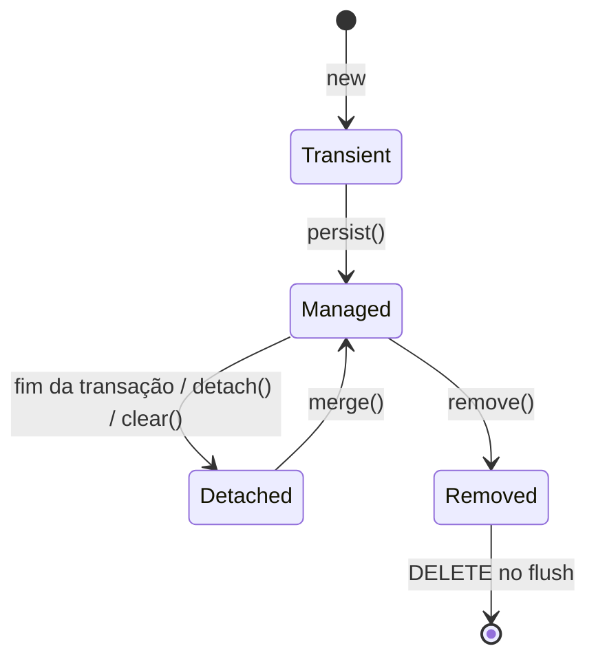

# Spring Data

Spring Data JPA abstrai o acesso a banco de dados, eliminando a maior parte do código SQL manual. Com ele, você define entidades e repositórios, e o framework cuida da persistência.

## Dependências

No `pom.xml`:

```xml
<dependency>
    <groupId>org.springframework.boot</groupId>
    <artifactId>spring-boot-starter-data-jpa</artifactId>
</dependency>

<!-- Para usar PostgreSQL -->
<dependency>
    <groupId>org.postgresql</groupId>
    <artifactId>postgresql</artifactId>
    <scope>runtime</scope>
</dependency>

<!-- Para usar H2 (banco em memória para desenvolvimento) -->
<dependency>
    <groupId>com.h2database</groupId>
    <artifactId>h2</artifactId>
    <scope>runtime</scope>
</dependency>
```

## JPA e Hibernate

**JPA** (Jakarta Persistence API) é a especificação Java para mapeamento objeto-relacional. **Hibernate** é a implementação mais popular dessa especificação - é o que Spring Data usa por baixo.

O objetivo é mapear classes Java para tabelas de banco de dados e gerenciar as operações automaticamente.

## Entidades

Uma entidade é uma classe Java mapeada para uma tabela do banco:

```java
import jakarta.persistence.*;

@Entity
@Table(name = "usuarios")
public class Usuario {

    @Id
    @GeneratedValue(strategy = GenerationType.IDENTITY)
    private Long id;

    @Column(nullable = false, length = 100)
    private String nome;

    @Column(nullable = false, unique = true, length = 150)
    private String email;

    @Column(name = "data_nascimento")
    private LocalDate dataNascimento;

    @Column(nullable = false)
    private boolean ativo = true;

    @CreationTimestamp
    @Column(name = "criado_em", updatable = false)
    private LocalDateTime criadoEm;

    // construtores, getters, setters...
}
```

### Anotações principais

| Anotação               | Função                                           |
| ---------------------- | ------------------------------------------------ |
| `@Entity`              | Marca a classe como entidade JPA                 |
| `@Table(name = "...")` | Define o nome da tabela (padrão: nome da classe) |
| `@Id`                  | Chave primária                                   |
| `@GeneratedValue`      | Estratégia de geração do ID                      |
| `@Column`              | Personaliza a coluna (nome, tamanho, nullable)   |
| `@Transient`           | Campo ignorado pelo JPA (não persiste)           |
| `@CreationTimestamp`   | Preenchido automaticamente no INSERT             |
| `@UpdateTimestamp`     | Preenchido automaticamente no UPDATE             |

Uma entidade precisa ser uma classe mutável de verdade, com construtor sem argumentos: um `record` (visto em Java Moderno) não funciona como entidade JPA, porque a especificação exige exatamente o que um record proíbe por definição (campos não-`final`, classe não-`final`, construtor vazio). Records continuam sendo a escolha certa para DTO e projeção de leitura desse mesmo dado, só não para a entidade gerenciada pelo Hibernate.

### @Enumerated e a armadilha do EnumType.ORDINAL

No código acima o campo `status` é um enum (`StatusPedido`), mas a coluna no banco é um número ou um texto. Quem decide qual dos dois é a anotação `@Enumerated`, e o default dela é justamente a opção que mais dá dor de cabeça.

Sem argumento nenhum, `@Enumerated` equivale a `@Enumerated(EnumType.ORDINAL)`: o Hibernate grava a posição da constante no enum, o valor de `ordinal()`.

```java
public enum StatusPedido {
    NOVO,       // 0
    PAGO,       // 1
    ENVIADO,    // 2
    ENTREGUE    // 3
}

@Enumerated // ORDINAL implícito
private StatusPedido status;
```

Um pedido `PAGO` vira o número `1` na coluna. Funciona, ocupa pouco espaço, e é uma bomba-relógio. No dia em que alguém precisar de um status `AGUARDANDO_PAGAMENTO` entre `NOVO` e `PAGO`:

```java
public enum StatusPedido {
    NOVO,                  // 0
    AGUARDANDO_PAGAMENTO,  // 1  <- novo
    PAGO,                  // 2  (era 1)
    ENVIADO,               // 3  (era 2)
    ENTREGUE               // 4  (era 3)
}
```

Todas as linhas que tinham `1` continuam com `1`, só que agora `1` significa `AGUARDANDO_PAGAMENTO`. Cada pedido pago virou "aguardando pagamento" de uma vez, sem erro e sem log. O banco não faz ideia de que o significado dos números mudou.

`@Enumerated(EnumType.STRING)` resolve isso gravando o nome da constante:

```java
@Enumerated(EnumType.STRING)
@Column(length = 20)
private StatusPedido status;
```

Agora a coluna guarda o texto `PAGO`. Você pode reordenar o enum, inserir constantes no meio ou remover as que não usa mais, e as linhas antigas continuam apontando para a constante certa. O preço é modesto: a coluna vira um `varchar` em vez de um `smallint`, e renomear uma constante (`PAGO` para `PAGAMENTO_CONFIRMADO`) passa a exigir um `UPDATE` para acertar os dados que já estão gravados.

Quando você quer um código curto e estável na coluna, desacoplado do nome da constante Java, dá para assumir o controle total com um `AttributeConverter`:

```java
@Converter(autoApply = true)
public class StatusPedidoConverter implements AttributeConverter<StatusPedido, String> {

    @Override
    public String convertToDatabaseColumn(StatusPedido status) {
        return status == null ? null : status.getCodigo(); // "N", "P", "E"...
    }

    @Override
    public StatusPedido convertToEntityAttribute(String codigo) {
        return StatusPedido.peloCodigo(codigo);
    }
}
```

Assim o nome da constante e o valor no banco evoluem separados: renomear o enum não toca no banco, e mudar o código gravado não toca no enum.

Regra prática: em toda entidade nova, use `EnumType.STRING`. Nunca deixe o `@Enumerated` no default. Se precisar economizar espaço ou já herdou uma coluna com códigos, parta para o `AttributeConverter` em vez de voltar para `ORDINAL`.

## Ciclo de vida de uma entidade

A maior parte da confusão com JPA some quando você entende que uma entidade não está sempre "conectada" ao banco. Ela passa por estados, e o comportamento do Hibernate muda em cada um.

O centro de tudo é o **contexto de persistência** (persistence context), também chamado de cache de primeiro nível. Durante uma transação, o Hibernate mantém ali dentro uma cópia de cada entidade que ele está gerenciando, com a garantia de que existe uma única instância por identidade: se você buscar o `Usuario` de id 7 duas vezes na mesma transação, recebe o mesmo objeto Java, não duas cópias.

### Os quatro estados



**Transient** (a especificação JPA chama de _new_): um objeto que você criou com `new` e mais nada. Não tem linha correspondente no banco, não está no contexto de persistência, e o Hibernate não sabe que ele existe. Mudar os campos dele não gera SQL nenhum.

```java
Usuario u = new Usuario("Ana", "ana@exemplo.com"); // transient
```

**Managed** (ou _persistent_): a entidade está no contexto de persistência e é um espelho de uma linha da tabela. Todo campo que você alterar é detectado e sincronizado com o banco automaticamente. Uma entidade fica managed depois de um `persist()`, ou quando você a carrega com `findById`, uma query, etc.

```java
Usuario u = repository.findById(7L).orElseThrow(); // managed
u.setNome("Ana Paula"); // sem chamar save, o UPDATE vai sair no fim da transação
```

**Detached**: a entidade já teve (ou tem) uma linha no banco, mas não está mais sendo acompanhada por nenhum contexto de persistência, porque a transação terminou, ou você chamou `detach()`/`clear()`. O objeto continua na memória com os dados que tinha, mas alterá-lo não afeta o banco.

**Removed**: a entidade foi marcada para exclusão com `remove()` (ou o `delete` do repositório). Ela ainda está no contexto, mas o Hibernate já agendou um `DELETE` para o próximo flush.

### As transições

| De        | Para     | Como                                                                      |
| --------- | -------- | ------------------------------------------------------------------------- |
| Transient | Managed  | `entityManager.persist(e)` (ou `repository.save(e)` num objeto novo)      |
| Managed   | Detached | fim da transação, `detach(e)`, `clear()`, ou `close()` do `EntityManager` |
| Detached  | Managed  | `entityManager.merge(e)`                                                  |
| Managed   | Removed  | `entityManager.remove(e)` (ou `repository.delete(e)`)                     |

Um detalhe que pega muita gente: `merge()` não transforma o objeto que você passou em managed. Ele copia os dados desse objeto para uma instância managed (buscando no banco se preciso) e devolve **essa outra instância**. Depois de `Usuario gerenciado = em.merge(destacado)`, quem está managed é `gerenciado`, não `destacado`. Continuar mexendo em `destacado` não faz nada.

### Dirty checking

O motivo de uma entidade managed não precisar de `save()` para persistir mudanças é o **dirty checking**. Quando a entidade entra no contexto, o Hibernate guarda um retrato (snapshot) do estado dela. No **flush** (quando ele envia o SQL pendente ao banco), ele compara o estado atual campo a campo com esse snapshot e, para cada entidade com pelo menos um campo diferente, gera um `UPDATE`.

Isso tem um custo: em toda entidade carregada, o Hibernate carrega o dobro de dados na memória (o objeto e o snapshot) e faz a comparação no flush. É por isso que uma consulta só de leitura se beneficia de projeções (o resultado de uma projeção não entra no contexto, então não tem snapshot nem dirty checking) e de `@Transactional(readOnly = true)`. Esse assunto está na seção **Projeções** mais abaixo.

### Flush x commit

Não são a mesma coisa. O **flush** é o momento em que o Hibernate traduz as mudanças pendentes em SQL e manda para o banco. O **commit** é o momento em que a transação é confirmada e essas mudanças ficam definitivas.

O Hibernate faz flush automaticamente antes do commit, e às vezes antes de uma query (para o resultado refletir o que você já alterou). Então o SQL pode "sair" antes do fim do método `@Transactional`, mas ainda dá para reverter tudo com um rollback até o commit acontecer. O `@Transactional` que fecha esse ciclo está na seção do fim da nota.

## Relacionamentos

### @OneToOne

Relacionamento 1:1: cada `Usuario` tem no máximo um `Perfil`, e vice-versa. A forma mais simples é unidirecional, com a chave estrangeira do lado que faz mais sentido "possuir" a referência:

```java
@Entity
public class Perfil {
    @Id
    @GeneratedValue(strategy = GenerationType.IDENTITY)
    private Long id;

    private String bio;
    private String avatarUrl;

    @OneToOne
    @JoinColumn(name = "usuario_id", unique = true)
    private Usuario usuario;
}
```

Para navegar dos dois lados (`usuario.getPerfil()` e `perfil.getUsuario()`), o relacionamento vira bidirecional. Só um dos lados pode ter a coluna de chave estrangeira (o lado **dono**, marcado com `@JoinColumn`); o outro lado só declara `mappedBy`, apontando o nome do campo dono:

```java
@Entity
public class Usuario {
    // ...

    @OneToOne(mappedBy = "usuario", cascade = CascadeType.ALL)
    private Perfil perfil;
}
```

Uma FK separada com `unique = true` funciona, mas duplica a garantia de unicidade que já existe na chave primária da outra tabela. Quando as duas entidades sempre nascem e morrem juntas (não existe `Perfil` sem `Usuario`), o `@MapsId` é a opção mais enxuta: a tabela `perfil` usa o mesmo valor de `usuario_id` como sua própria chave primária, em vez de ter um `id` autoincrementado e uma coluna de FK à parte.

```java
@Entity
public class Perfil {
    @Id
    private Long id; // sem @GeneratedValue: o valor vem do usuário associado

    private String bio;

    @OneToOne
    @MapsId
    @JoinColumn(name = "usuario_id")
    private Usuario usuario;
}
```

Antes de modelar como `@OneToOne`, vale perguntar se as duas classes realmente precisam ser entidades separadas. Se `Perfil` não tem ciclo de vida próprio nem é consultado sozinho, colocar `bio` e `avatarUrl` como colunas direto na entidade `Usuario` é mais simples e evita um `JOIN` a mais em toda consulta.

### @ManyToOne e @OneToMany

```java
@Entity
public class Pedido {
    @Id
    @GeneratedValue(strategy = GenerationType.IDENTITY)
    private Long id;

    // Muitos pedidos para um usuário
    @ManyToOne(optional = false)
    @JoinColumn(name = "usuario_id")
    private Usuario usuario;

    @Column(nullable = false)
    private BigDecimal valor;

    @Enumerated(EnumType.STRING)
    private StatusPedido status;
}

// No Usuario (opcional - mapeamento bidirecional)
@Entity
public class Usuario {
    // ...

    @OneToMany(mappedBy = "usuario", cascade = CascadeType.ALL)
    private List<Pedido> pedidos = new ArrayList<>();
}
```

### @ManyToMany

```java
@Entity
public class Produto {
    @Id
    @GeneratedValue(strategy = GenerationType.IDENTITY)
    private Long id;

    @ManyToMany
    @JoinTable(
        name = "produto_categoria",
        joinColumns = @JoinColumn(name = "produto_id"),
        inverseJoinColumns = @JoinColumn(name = "categoria_id")
    )
    private List<Categoria> categorias = new ArrayList<>();
}
```

### CascadeType: o que propaga do pai para o filho

Sem `cascade`, cada entidade é salva, atualizada e removida por conta própria: persistir um `Usuario` novo com uma lista de `Pedido` novos dentro não persiste os pedidos junto, e vai estourar erro reclamando que o `Pedido` não tem `id`. `cascade` diz ao JPA para repetir automaticamente, na entidade filha, a mesma operação que você fez na entidade pai.

Os seis tipos, e o que cada um propaga:

| Tipo      | Propaga                                                                 |
| --------- | ----------------------------------------------------------------------- |
| `PERSIST` | salvar o pai também salva o filho novo                                  |
| `MERGE`   | atualizar o pai também atualiza o filho                                 |
| `REMOVE`  | remover o pai também remove o filho                                     |
| `REFRESH` | recarregar o pai do banco também recarrega o filho                      |
| `DETACH`  | desconectar o pai do contexto de persistência também desconecta o filho |
| `ALL`     | os cinco de uma vez                                                     |

```java
@OneToMany(mappedBy = "usuario", cascade = CascadeType.ALL)
private List<Pedido> pedidos = new ArrayList<>();
```

O cuidado que mais pega gente iniciante é o `CascadeType.REMOVE` (e por consequência o `ALL`, que já inclui ele). Ele funciona bem quando o filho não existe sem o pai, um `Pedido` realmente não faz sentido sem o `Usuario` dono. Mas aplicado num relacionamento onde o filho é compartilhado ou tem vida própria, `CascadeType.REMOVE` apaga mais do que devia: remover uma `Categoria` com `cascade = CascadeType.REMOVE` sobre os `Produto` associados apagaria produtos que talvez ainda pertençam a outras categorias.

Existe ainda `orphanRemoval = true`, que resolve um problema diferente: ele remove o filho quando ele sai da coleção do pai, mesmo que o pai continue vivo.

```java
@OneToMany(mappedBy = "usuario", cascade = CascadeType.ALL, orphanRemoval = true)
private List<Pedido> pedidos = new ArrayList<>();

// ...
usuario.getPedidos().remove(pedido); // com orphanRemoval, isso já gera o DELETE do pedido
```

`CascadeType.REMOVE` cuida do "o pai morreu, o filho morre junto". `orphanRemoval` cuida do "o filho foi desligado do pai, então ele morre". Os dois juntos, num relacionamento de posse real (o filho não existe fora daquele pai), cobrem o ciclo de vida inteiro sem código manual de limpeza.

### FetchType: LAZY vs EAGER

Fetch decide **quando** o relacionamento é carregado do banco: junto com o pai, ou só quando alguém pedir explicitamente.

A especificação JPA define um padrão diferente para cada tipo de relacionamento, e ele costuma pegar quem não sabe que existe:

| Relacionamento | Padrão  |
| -------------- | ------- |
| `@OneToOne`    | `EAGER` |
| `@ManyToOne`   | `EAGER` |
| `@OneToMany`   | `LAZY`  |
| `@ManyToMany`  | `LAZY`  |

Com `EAGER`, o relacionamento vem sempre no mesmo `SELECT` (ou num `JOIN` logo em seguida), mesmo quando ninguém vai usar aquele dado. Isso é a origem do "SELECT gordo" citado na seção de Projeções, e também da armadilha clássica do N+1: buscar uma lista de 50 `Pedido` com `usuario` em `EAGER` dispara 1 query para os pedidos e mais 50, uma para cada `usuario`, se o Hibernate não conseguir otimizar num `JOIN` só.

Com `LAZY`, o relacionamento só é buscado no banco na primeira vez que o código chama o getter dele. Isso evita o custo quando ninguém precisa do dado, mas troca o problema: se esse acesso acontecer depois que a transação já fechou (por exemplo, serializando a entidade para JSON num controller sem `@Transactional`), o resultado é `LazyInitializationException`, porque não existe mais sessão aberta para buscar o dado no banco.

```java
@ManyToOne(fetch = FetchType.LAZY) // sobrescreve o padrão EAGER
@JoinColumn(name = "usuario_id")
private Usuario usuario;
```

A recomendação que a comunidade Hibernate repete há anos: declare `fetch = FetchType.LAZY` em todo relacionamento, inclusive nos que já nascem `EAGER`, e resolva a necessidade pontual de carregar junto com uma query explícita (`JOIN FETCH` no JPQL, ou `@EntityGraph` no Spring Data) no método que realmente precisa disso. Isso evita carregar dado demais no caminho comum e ainda deixa claro, no código da consulta, onde o join está acontecendo de propósito.

## Escolhendo a estratégia de chave primária

`@GeneratedValue(strategy = GenerationType.IDENTITY)` (delegando para um `AUTO_INCREMENT`/`SERIAL` do banco) é a opção mais comum para começar, mas em sistemas distribuídos ou de alto volume, a escolha do tipo de ID afeta performance de um jeito que só aparece depois que a tabela já cresceu.

`UUID.randomUUID()` (a versão 4 do UUID) é totalmente aleatório, e isso é justamente o problema para uma chave primária indexada. Bancos relacionais organizam índices numa estrutura de árvore (B-tree), pensada para inserções que chegam em sequência crescente. Um UUID aleatório cai num ponto imprevisível da árvore a cada inserção, o que aumenta a fragmentação do índice e o custo de I/O conforme a tabela cresce.

```java
@Id
private UUID id = UUID.randomUUID(); // funciona, mas fragmenta o índice ao longo do tempo
```

Isso não significa que a alternativa seja voltar para um ID sequencial simples. Sequências puras trazem problemas próprios: expõem informação do sistema (criar um registro no primeiro e no último dia do mês permite inferir quantos registros existem no período), e em arquitetura distribuída dependem de um contador centralizado, o que cria contenção e dificulta escalar horizontalmente sem coordenação entre instâncias.

O meio-termo mais usado hoje é UUIDv7 ou ULID, que incorporam um componente de tempo nos bits mais significativos do identificador, o que os torna aproximadamente ordenados por ordem de criação, e por isso muito mais amigáveis para índice B-tree e para particionamento por faixa (sharding) do que o UUIDv4 puro. UUIDv7 tem a vantagem de preservar o formato padrão de UUID, funcionando como substituto direto de `UUID.randomUUID()` sem mudar o tipo da coluna nem quebrar nenhum contrato existente.

Regra prática: se a tabela é pequena ou local a um único banco, `IDENTITY` continua sendo a opção mais simples. Se o sistema é distribuído ou de alto volume e você precisa gerar o ID antes de persistir (fora do banco), prefira UUIDv7 a UUIDv4 aleatório.

## Repositórios

Spring Data gera a implementação automaticamente. Você só define a interface:

### CrudRepository

Operações básicas de CRUD:

```java
import org.springframework.data.repository.CrudRepository;

public interface UsuarioRepository extends CrudRepository<Usuario, Long> {
    // findAll, findById, save, deleteById - já herdados
}
```

### JpaRepository

Estende `CrudRepository` com funcionalidades extras (paginação, ordenação):

```java
import org.springframework.data.jpa.repository.JpaRepository;

public interface UsuarioRepository extends JpaRepository<Usuario, Long> {
    // Todos os métodos do CrudRepository + findAll(Pageable) etc.
}
```

`JpaRepository<Entidade, TipoDoId>` - use este na maioria dos casos.

### Query methods

Spring Data deriva queries automaticamente a partir do nome do método:

```java
public interface UsuarioRepository extends JpaRepository<Usuario, Long> {

    // SELECT * FROM usuarios WHERE email = ?
    Optional<Usuario> findByEmail(String email);

    // SELECT * FROM usuarios WHERE nome LIKE '%?%'
    List<Usuario> findByNomeContaining(String nome);

    // SELECT * FROM usuarios WHERE ativo = true ORDER BY nome
    List<Usuario> findByAtivoTrueOrderByNome();

    // SELECT * FROM usuarios WHERE ativo = ? AND email LIKE ?
    List<Usuario> findByAtivoAndEmailContaining(boolean ativo, String email);

    // Existência
    boolean existsByEmail(String email);

    // Contagem
    long countByAtivo(boolean ativo);

    // Deletar por critério
    void deleteByAtivoFalse();
}
```

### @Query para queries customizadas

```java
// JPQL - usa nomes de classes e atributos Java, não SQL
@Query("SELECT u FROM Usuario u WHERE u.email = :email AND u.ativo = true")
Optional<Usuario> buscarAtivoPorEmail(@Param("email") String email);

// SQL nativo
@Query(value = "SELECT * FROM usuarios WHERE YEAR(data_nascimento) = :ano",
       nativeQuery = true)
List<Usuario> buscarPorAnoNascimento(@Param("ano") int ano);

// Update/Delete via @Modifying
@Modifying
@Query("UPDATE Usuario u SET u.ativo = false WHERE u.id = :id")
void desativar(@Param("id") Long id);
```

### Paginação e ordenação

```java
import org.springframework.data.domain.*;

// No repositório
Page<Usuario> findByAtivo(boolean ativo, Pageable pageable);

// No service/controller
Pageable pageable = PageRequest.of(0, 20, Sort.by("nome").ascending());
Page<Usuario> pagina = repository.findByAtivo(true, pageable);

System.out.println(pagina.getContent());    // lista da página
System.out.println(pagina.getTotalElements()); // total de registros
System.out.println(pagina.getTotalPages());    // total de páginas
```

## Projeções: trazer só os campos que a tela usa

Imagine uma tela que lista usuários e mostra só nome e email. O jeito óbvio é `findByAtivoTrue()`, que devolve `List<Usuario>`. Só que a entidade `Usuario` tem uns 15 campos, talvez um relacionamento com `Endereco`, outro com `Pedido`. O banco carrega tudo isso, o Hibernate monta os objetos, e você usa dois campos.

Numa lista de 50 linhas isso passa despercebido. Numa de milhares, ou com relacionamentos que puxam mais tabelas junto, a diferença aparece: consultas que levam segundos para montar dados que ninguém vai olhar.

O custo extra de carregar a entidade completa numa leitura tem três partes:

- **Dirty checking**: toda entidade carregada entra no contexto de persistência, e o Hibernate guarda um snapshot dela para, no fim da transação, comparar campo a campo e ver o que mudou. Numa consulta só de leitura, esse trabalho é jogado fora.
- **Memória**: o objeto mais o snapshot, multiplicados pela quantidade de linhas.
- **SELECT gordo**: todas as colunas da tabela, mais os joins dos relacionamentos que forem `EAGER`.

Projeção é pedir ao Spring Data para trazer só um subconjunto de campos, num objeto que não é a entidade. Existem três formatos.

### Projeção com record (a mais direta)

Um [record](/labs/java/java/03-java-moderno/) com os campos que você quer, e um método no repositório que retorna esse tipo:

```java
public record ResumoUsuario(String nome, String email) {}
```

```java
public interface UsuarioRepository extends JpaRepository<Usuario, Long> {

    List<ResumoUsuario> findByAtivoTrue();
}
```

O Spring Data olha o record, vê que os nomes dos componentes (`nome`, `email`) batem com atributos da entidade, e gera um `SELECT u.nome, u.email FROM Usuario u WHERE u.ativo = true`. O resultado é uma lista de `ResumoUsuario`, e nenhum desses objetos entra no contexto de persistência: sem snapshot, sem dirty checking, sem flush comparando estado.

Para juntar dados de mais de uma tabela, use `@Query` com uma expressão de construtor JPQL (começa com `new` e o nome completo da classe):

```java
@Query("""
    SELECT new com.exemplo.dto.ResumoPedido(p.numero, u.nome, p.valorTotal, p.criadoEm)
    FROM Pedido p JOIN p.usuario u
    WHERE p.status = :status
    """)
List<ResumoPedido> resumoPorStatus(@Param("status") StatusPedido status);
```

Isso também funciona em query nativa, com `nativeQuery = true`, desde que os nomes das colunas retornadas batam com o construtor.

### Projeção por interface

Em vez de um record, uma interface só com os getters:

```java
public interface ResumoUsuario {
    String getNome();
    String getEmail();
}

List<ResumoUsuario> findByAtivoTrue();
```

O Spring Data cria um proxy em tempo de execução que implementa a interface. É a opção mais enxuta quando você não precisa de lógica nenhuma no objeto de saída, só ler os campos.

### Projeção dinâmica

Quando o mesmo método precisa às vezes devolver a entidade e às vezes um resumo, dá para deixar o tipo aberto:

```java
<T> List<T> findByAtivoTrue(Class<T> tipo);
```

```java
repository.findByAtivoTrue(Usuario.class);        // entidade completa
repository.findByAtivoTrue(ResumoUsuario.class);  // só o resumo
```

### Quando ainda usar a entidade

Projeção é para leitura. Se o fluxo vai alterar e salvar, você precisa da entidade gerenciada, porque é o dirty checking (aquele mesmo que era desperdício na leitura) que detecta a mudança e gera o `UPDATE`. A regra prática: consulta que só exibe dados pede projeção; consulta que carrega algo para modificar pede a entidade.

Vale notar a simetria com o DTO de entrada visto em [Validação, DTO e Logging](/labs/java/spring/04-validacao-e-logs/): lá, um objeto separado protege a entidade dos dados que chegam na requisição; aqui, um objeto separado evita expor e carregar a entidade inteira na resposta. Mesma ideia, pontas opostas do fluxo.

## H2 Database

H2 é um banco relacional em memória, ideal para desenvolvimento e testes. Não precisa de instalação.

```properties
# application.properties
spring.datasource.url=jdbc:h2:mem:devdb
spring.datasource.driver-class-name=org.h2.Driver
spring.datasource.username=sa
spring.datasource.password=

spring.jpa.database-platform=org.hibernate.dialect.H2Dialect

# Console web do H2 (acessível em /h2-console)
spring.h2.console.enabled=true
spring.h2.console.path=/h2-console
```

Acesse `http://localhost:8080/h2-console` para inspecionar o banco durante o desenvolvimento.

## Configuração com PostgreSQL

```properties
spring.datasource.url=jdbc:postgresql://localhost:5432/meudb
spring.datasource.username=postgres
spring.datasource.password=senha

spring.jpa.database-platform=org.hibernate.dialect.PostgreSQLDialect

# Mostrar SQL gerado no log (útil em dev)
spring.jpa.show-sql=true
spring.jpa.properties.hibernate.format_sql=true

# DDL: create, create-drop, update, validate, none
spring.jpa.hibernate.ddl-auto=validate
```

Em produção, use `validate` ou `none` e gerencie o schema com Flyway ou Liquibase.

## Exemplo completo - CRUD de Produto

### Entidade

```java
@Entity
@Table(name = "produtos")
public class Produto {
    @Id
    @GeneratedValue(strategy = GenerationType.IDENTITY)
    private Long id;

    @Column(nullable = false, length = 200)
    private String nome;

    @Column(nullable = false, precision = 10, scale = 2)
    private BigDecimal preco;

    @Column(nullable = false)
    private int estoque;

    // getters e setters
}
```

### Repositório

```java
@Repository
public interface ProdutoRepository extends JpaRepository<Produto, Long> {
    List<Produto> findByNomeContainingIgnoreCase(String nome);
    List<Produto> findByEstoqueGreaterThan(int quantidade);
}
```

### Service

```java
@Service
@Transactional
public class ProdutoService {
    private final ProdutoRepository repository;

    public ProdutoService(ProdutoRepository repository) {
        this.repository = repository;
    }

    @Transactional(readOnly = true)
    public List<Produto> listar() {
        return repository.findAll();
    }

    @Transactional(readOnly = true)
    public Produto buscar(Long id) {
        return repository.findById(id)
            .orElseThrow(() -> new RecursoNaoEncontradoException("Produto não encontrado"));
    }

    public Produto criar(Produto produto) {
        return repository.save(produto);
    }

    public Produto atualizar(Long id, Produto dados) {
        Produto produto = buscar(id);
        produto.setNome(dados.getNome());
        produto.setPreco(dados.getPreco());
        produto.setEstoque(dados.getEstoque());
        return repository.save(produto);
    }

    public void deletar(Long id) {
        buscar(id); // verifica se existe
        repository.deleteById(id);
    }
}
```

### Controller

```java
@RestController
@RequestMapping("/produtos")
public class ProdutoController {
    private final ProdutoService service;

    public ProdutoController(ProdutoService service) {
        this.service = service;
    }

    @GetMapping
    public List<Produto> listar() {
        return service.listar();
    }

    @GetMapping("/{id}")
    public Produto buscar(@PathVariable Long id) {
        return service.buscar(id);
    }

    @PostMapping
    public ResponseEntity<Produto> criar(@RequestBody Produto produto) {
        Produto salvo = service.criar(produto);
        return ResponseEntity.status(201).body(salvo);
    }

    @PutMapping("/{id}")
    public Produto atualizar(@PathVariable Long id, @RequestBody Produto produto) {
        return service.atualizar(id, produto);
    }

    @DeleteMapping("/{id}")
    public ResponseEntity<Void> deletar(@PathVariable Long id) {
        service.deletar(id);
        return ResponseEntity.noContent().build();
    }
}
```

## @Transactional e as garantias ACID

Garante que operações de banco aconteçam dentro de uma transação:

```java
@Transactional
public void transferir(Long origemId, Long destinoId, BigDecimal valor) {
    Conta origem = buscar(origemId);
    Conta destino = buscar(destinoId);

    origem.debitar(valor);
    destino.creditar(valor);

    repository.save(origem);
    repository.save(destino);
    // Se qualquer linha acima lançar exceção, tudo é revertido (rollback)
}
```

Use `@Transactional(readOnly = true)` em métodos de apenas leitura - é uma dica de otimização para o banco.

### As quatro garantias (ACID)

`@Transactional` existe para dar a uma sequência de operações de banco as garantias que a sigla ACID descreve. No `transferir` acima:

- **Atomicidade**: débito e crédito acontecem os dois, ou nenhum dos dois. Se `destino.creditar(valor)` lançar exceção depois que `origem.debitar(valor)` já rodou, o Spring desfaz o débito também. É essa garantia que o `@Transactional` entrega diretamente, via rollback.
- **Consistência**: depois da transação, os dados continuam respeitando as regras do sistema (saldo não fica negativo se há uma constraint pra isso, chave estrangeira aponta pra uma linha que existe). Quem garante isso é o próprio banco, através de constraints e das regras de negócio que você escreve - o `@Transactional` não valida nada sozinho, só delimita onde a transação começa e termina.
- **Isolamento**: enquanto essa transferência está no meio do caminho, outra transação lendo a mesma conta não pode ver um estado "pela metade" (o débito já aplicado, o crédito ainda não). O quanto isso é garantido depende do nível de isolamento, assunto da próxima seção.
- **Durabilidade**: depois que a transação commita, o resultado sobrevive a uma queda de energia no servidor do banco no minuto seguinte. Isso é trabalho do log de transação do banco (o WAL do PostgreSQL, o redo log do MySQL), não do Spring.

Resumindo: `@Transactional` entrega atomicidade e controla isolamento. Consistência e durabilidade são responsabilidade do banco de dados por baixo.

### Isolamento e concorrência

Quando duas transações mexem nos mesmos dados ao mesmo tempo, três problemas clássicos podem aparecer:

- **Dirty read**: uma transação lê um dado que outra transação alterou mas ainda não commitou. Se a segunda transação der rollback, a primeira trabalhou em cima de um dado que nunca existiu de verdade.
- **Non-repeatable read**: dentro da mesma transação, você lê a mesma linha duas vezes e recebe valores diferentes, porque outra transação commitou uma alteração entre as duas leituras.
- **Phantom read**: parecido, mas com uma consulta que retorna um conjunto de linhas: rodar o mesmo `WHERE` duas vezes na mesma transação traz uma linha a mais (ou a menos), porque outra transação inseriu ou apagou uma linha que bate com o filtro.

O nível de isolamento decide contra quais desses três a transação está protegida:

| Nível              | Protege contra                                            |
| ------------------ | --------------------------------------------------------- |
| `READ_UNCOMMITTED` | nada - permite até dirty read                             |
| `READ_COMMITTED`   | dirty read (padrão do PostgreSQL, Oracle e SQL Server)    |
| `REPEATABLE_READ`  | dirty read e non-repeatable read (padrão do MySQL/InnoDB) |
| `SERIALIZABLE`     | os três - equivale a rodar as transações uma de cada vez  |

```java
@Transactional(isolation = Isolation.REPEATABLE_READ)
public void transferir(Long origemId, Long destinoId, BigDecimal valor) {
    // ...
}
```

O trade-off é direto: quanto mais forte o isolamento, mais proteção, e menos transações conseguem rodar em paralelo sem travar uma na outra. Na prática, o padrão do banco (`READ_COMMITTED` na maioria) resolve a esmagadora maioria dos casos. Suba o nível só quando um bug de concorrência específico exigir, não como precaução geral.

### Propagação

Propagação decide o que acontece quando um método `@Transactional` chama outro método `@Transactional`. As duas opções que aparecem o tempo todo:

- **`REQUIRED`** (o padrão): se já existe uma transação rolando, o método entra nela. Se não existe, cria uma nova. É o comportamento que você quer na maioria das vezes - um `Service` chamando outro `Service`, tudo dentro da mesma unidade de trabalho.
- **`REQUIRES_NEW`**: suspende a transação atual (se houver) e abre uma completamente independente. Útil para logging ou auditoria que precisa persistir mesmo se a transação principal der rollback depois:

```java
@Transactional(propagation = Propagation.REQUIRES_NEW)
public void registrarAuditoria(String evento) {
    auditoriaRepository.save(new Auditoria(evento));
    // commita sozinha, mesmo que o método que chamou aqui dê rollback depois
}
```

Existem outras cinco opções (`NESTED`, que cria um savepoint dentro da transação atual; `MANDATORY`, que exige uma transação já aberta e lança exceção se não houver; entre outras), mas `REQUIRED` e `REQUIRES_NEW` cobrem o que aparece no dia a dia.

### Duas pegadinhas comuns

**Self-invocation não funciona.** O `@Transactional` funciona através de um proxy que o Spring cria em volta do seu bean. Quando você chama o método de fora (outro bean chamando o `Service`), a chamada passa pelo proxy, que abre a transação antes de delegar para o método de verdade. Quando você chama de dentro da mesma classe (`this.outroMetodo()` ou simplesmente `outroMetodo()`), a chamada nunca passa pelo proxy, e o `@Transactional` daquele método é ignorado silenciosamente:

```java
@Service
public class PedidoService {

    public void processar(Long id) {
        // ...
        salvarComTransacao(id); // chamada interna: NÃO passa pelo proxy, @Transactional ignorado
    }

    @Transactional
    public void salvarComTransacao(Long id) {
        // ...
    }
}
```

A correção mais simples é mover `salvarComTransacao` para outro bean e injetar ele, em vez de chamar via `this`.

**Rollback só acontece por padrão em exceção não checada.** O Spring reverte a transação automaticamente quando uma `RuntimeException` (ou `Error`) sobe do método. Uma exceção checada (`Exception` que não é `RuntimeException`) **não** dispara rollback por padrão - a transação commita normalmente, mesmo com a exceção estourando. Se o método lança uma checada e você precisa de rollback nela, declare explicitamente:

```java
@Transactional(rollbackFor = PagamentoRecusadoException.class)
public void pagar(Long pedidoId) throws PagamentoRecusadoException {
    // ...
}
```

E se você captura a exceção dentro do próprio método sem relançar, o Spring nem chega a saber que algo deu errado - do ponto de vista dele, o método terminou normalmente, e o commit acontece.

## Referências

- [Entidades Managed, Transient e Detached no Hibernate e JPA](https://www.alura.com.br/artigos/entidades-managed-transient-e-detached-no-hibernate-e-jpa) - Alura, pt-BR
- [Hibernate Entity Lifecycle](https://www.baeldung.com/hibernate-entity-lifecycle) - Baeldung, inglês
- [Entity Lifecycle Model in JPA & Hibernate](https://thorben-janssen.com/entity-lifecycle-model/) - Thorben Janssen, inglês
- [The best way to map a @OneToOne relationship with JPA and Hibernate](https://vladmihalcea.com/the-best-way-to-map-a-onetoone-relationship-with-jpa-and-hibernate/) - Vlad Mihalcea, inglês
- [Accessing Data with JPA](https://spring.io/guides/gs/accessing-data-jpa) - guia oficial do Spring, inglês
- [Bancos de dados ACID - atomicidade, consistência, isolamento e durabilidade explicados](https://www.freecodecamp.org/portuguese/news/bancos-de-dados-acid-atomicidade-consistencia-isolamento-e-durabilidade-explicados/) - freeCodeCamp, pt-BR
- [Transaction Propagation and Isolation in Spring @Transactional](https://www.baeldung.com/spring-transactional-propagation-isolation) - Baeldung, inglês
- [JPA CascadeType.REMOVE vs orphanRemoval](https://www.baeldung.com/jpa-cascade-remove-vs-orphanremoval) - Baeldung, inglês
- [FetchType: Lazy/Eager loading for Hibernate & JPA](https://thorben-janssen.com/entity-mappings-introduction-jpa-fetchtypes/) - Thorben Janssen, inglês
