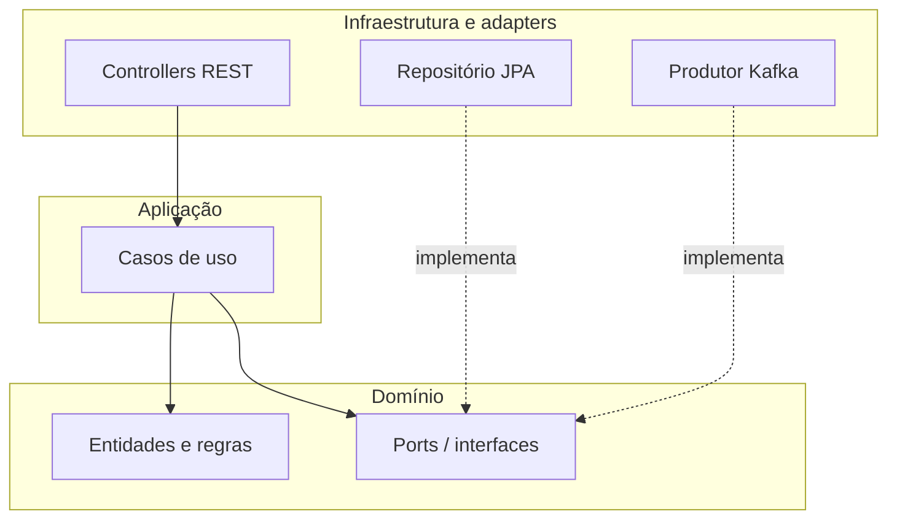
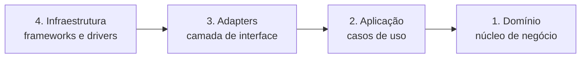
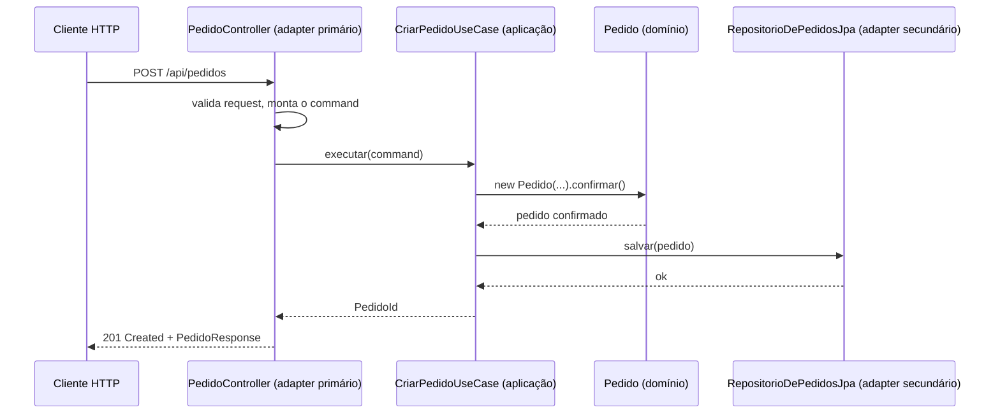
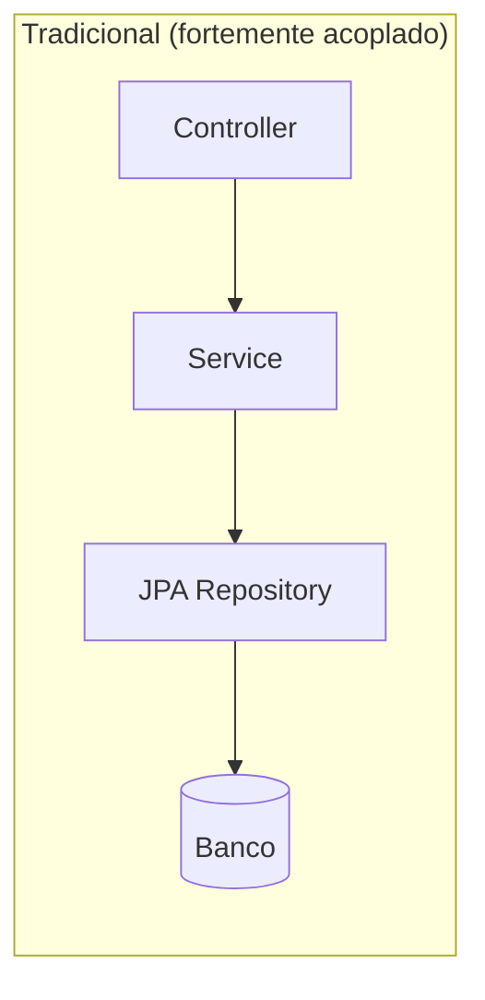
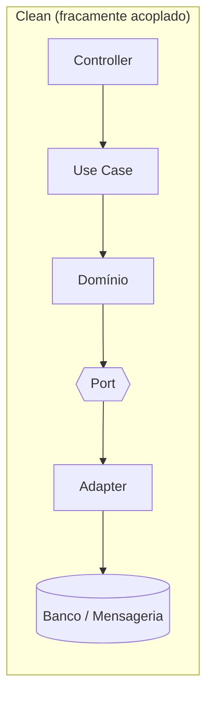

# Arquitetura Limpa com Spring Boot

O padrão Controller, Service e Repository que aparece em [Spring Web](/labs/java/spring/01-spring-web/) resolve bem a maioria dos projetos. Só que, quando o sistema cresce, a regra de negócio começa a vazar: um pouco no controller, um pouco no service, um pouco dentro de um método de repositório com `@Query`. A Arquitetura Limpa (Clean Architecture, proposta por Robert C. Martin) é uma forma de reorganizar essas responsabilidades para que o núcleo de negócio não dependa de Spring, de banco nem de nenhum detalhe de infraestrutura.

## O problema que a Clean Architecture resolve

Imagine um `PedidoService` de 400 linhas. Ele valida entrada, calcula desconto, decide se o pedido pode ser confirmado, chama o repositório JPA, publica um evento no Kafka e ainda formata a resposta. Quando o time decide trocar o Kafka por RabbitMQ, ou o Postgres por Mongo, ou expor a mesma operação via gRPC além de REST, essa classe precisa ser aberta e mexida em vários pontos. E testar a regra "pedido sem itens não pode ser confirmado" exige subir meio Spring, porque a regra está grudada no resto.

A Clean Architecture parte de uma pergunta simples: o que no seu sistema é regra de negócio de verdade e o que é só detalhe técnico que poderia ser outro? "Um pedido confirmado não pode voltar para rascunho" é regra. "Os pedidos ficam numa tabela Postgres" é detalhe. A ideia é colocar as regras no centro e empurrar os detalhes para as bordas, atrás de interfaces.

Quem já ouviu falar de **Arquitetura Hexagonal** ou **Ports and Adapters** vai reconhecer o desenho. As duas ideias são quase a mesma coisa: a hexagonal descreve as bordas do sistema (as portas e os adaptadores que plugam nelas) e não diz muito sobre o miolo, enquanto a Clean Architecture é mais detalhista sobre como organizar o interior em camadas. Na prática, os dois nomes convivem no mesmo projeto.

## A Regra da Dependência

Essa é a regra que sustenta tudo: **as dependências de código-fonte apontam sempre para dentro, na direção do domínio**. Uma camada de fora pode conhecer e chamar uma camada de dentro, nunca o contrário. O domínio não importa nada de `org.springframework`, não sabe que existe JPA, não sabe que existe HTTP.



Repare no detalhe do diagrama: o repositório JPA aponta para a interface que está **dentro** do domínio. Isso é inversão de dependência, o mesmo princípio visto em [Design e padrões de criação](/labs/java/java/12-design-e-padroes-de-criacao/). Quem define o contrato ("preciso de um jeito de salvar pedidos") é a camada de dentro. Quem cumpre o contrato usando uma tecnologia concreta é a camada de fora. Se amanhã o banco mudar, só o adaptador muda, o domínio nem fica sabendo.

O resumo que o autor do cheat sheet usa: mantenha as regras de negócio no centro, dependa de abstrações e deixe os detalhes de infraestrutura viverem nas pontas.

## As quatro camadas



### Domínio

O coração do sistema. Aqui moram as entidades e os value objects, as regras de negócio, os domain services (regras que não cabem numa entidade só) e as interfaces de repositório, que nesse contexto são chamadas de **ports**.

```java
package com.loja.pedido.domain;

public class Pedido {
    private final PedidoId id;
    private final ClienteId cliente;
    private final List<ItemDePedido> itens;
    private StatusPedido status;

    public Pedido(PedidoId id, ClienteId cliente, List<ItemDePedido> itens) {
        if (itens.isEmpty()) throw new PedidoSemItensException();
        this.id = id;
        this.cliente = cliente;
        this.itens = List.copyOf(itens);
        this.status = StatusPedido.RASCUNHO;
    }

    public void confirmar() {
        if (status != StatusPedido.RASCUNHO) {
            throw new TransicaoInvalidaException(status, StatusPedido.CONFIRMADO);
        }
        status = StatusPedido.CONFIRMADO;
    }

    public Dinheiro total() {
        return itens.stream()
            .map(ItemDePedido::subtotal)
            .reduce(Dinheiro.ZERO, Dinheiro::somar);
    }
}
```

Nenhuma anotação de framework, nenhuma menção a banco. `StatusPedido` é um enum modelando os estados válidos, exatamente o caso descrito em [Enums avançado](/labs/java/java/10-enums-avancado/). `Dinheiro` é um value object imutável, na linha do que [Java moderno](/labs/java/java/03-java-moderno/) discute sobre imutabilidade proteger o domínio. E a regra "pedido sem itens não existe" está no construtor, junto do estado que ela protege, não espalhada num service, o oposto do modelo anêmico.

### Aplicação

A camada de aplicação orquestra os casos de uso. Ela recebe um comando ou uma query, coordena as chamadas ao domínio e aos ports, cuida da transação e devolve o resultado. O que ela **não** faz é conter regra de negócio: isso é trabalho do domínio.

```java
package com.loja.pedido.application;

public class CriarPedidoUseCase {
    private final RepositorioDePedidos repositorio;
    private final PublicadorDeEventos eventos;

    public CriarPedidoUseCase(RepositorioDePedidos repositorio, PublicadorDeEventos eventos) {
        this.repositorio = repositorio;
        this.eventos = eventos;
    }

    public PedidoId executar(CriarPedidoCommand comando) {
        Pedido pedido = new Pedido(PedidoId.novo(), comando.cliente(), comando.itens());
        pedido.confirmar();
        repositorio.salvar(pedido);
        eventos.publicar(new PedidoConfirmado(pedido.id()));
        return pedido.id();
    }
}
```

`CriarPedidoCommand` é um objeto simples (um `record` serve bem) que carrega os dados de entrada já limpos. Separar comandos (operações que mudam estado) de queries (operações que só leem) é um padrão comum aqui, às vezes chamado de CQRS na sua forma mais leve. A classe depende de `RepositorioDePedidos` e `PublicadorDeEventos`, que são ports: interfaces, não implementações.

### Adapters

A camada de interface. Ela traduz o mundo de fora para o formato que a aplicação entende e vice-versa. Controllers REST, DTOs de request e response, mappers que convertem entre o DTO e o objeto de domínio, tudo isso é adapter.

Existem dois tipos:

- **Adapter primário** (ou driving): provoca o sistema. Um controller REST recebe um `POST` e chama um caso de uso. Um consumidor Kafka lê uma mensagem e chama um caso de uso.
- **Adapter secundário** (ou driven): é provocado pelo sistema. O caso de uso pede "salve esse pedido" e o adaptador de persistência atende, falando JPA com o banco.

### Infraestrutura

A camada mais externa, onde vivem os frameworks e os drivers. Acesso a banco com JPA ou JDBC, mensageria com Kafka ou RabbitMQ, clients HTTP para APIs externas, configuração do Spring. É aqui que as interfaces declaradas no domínio ganham uma implementação concreta.

```java
package com.loja.pedido.infrastructure.persistence;

@Repository
class RepositorioDePedidosJpa implements RepositorioDePedidos {
    private final PedidoJpaRepository jpa;

    RepositorioDePedidosJpa(PedidoJpaRepository jpa) {
        this.jpa = jpa;
    }

    @Override
    public void salvar(Pedido pedido) {
        jpa.save(PedidoEntity.de(pedido));
    }

    @Override
    public Optional<Pedido> porId(PedidoId id) {
        return jpa.findById(id.valor()).map(PedidoEntity::paraDominio);
    }
}
```

`PedidoEntity` é a classe anotada com `@Entity`, separada da entidade de domínio `Pedido`. Parece duplicação, e um pouco é, mas é o que impede o mapeamento do Hibernate de ditar como o seu domínio se organiza (getters e setters públicos, construtor vazio, relacionamentos lazy). O `PedidoJpaRepository` continua sendo uma interface `JpaRepository` normal do [Spring Data](/labs/java/spring/02-spring-data/).

Os quatro nomes do cheat sheet correspondem às camadas originais do livro do Robert C. Martin:

| Cheat sheet    | Nome original (Uncle Bob) |
| -------------- | ------------------------- |
| Domínio        | Entities                  |
| Aplicação      | Use Cases                 |
| Adapters       | Interface Adapters        |
| Infraestrutura | Frameworks & Drivers      |

## O fluxo de uma requisição, camada a camada

O caminho de um `POST /api/pedidos`, em seis passos: a requisição HTTP chega, o controller trata, o caso de uso executa, as regras de domínio são aplicadas, a infraestrutura é acessada (banco, mensageria) e por fim a resposta volta ou um evento é publicado.



Do lado da apresentação, o controller cuida só do que é HTTP: rota, status code, desserialização, validação de formato com Bean Validation (visto em [Validação, DTO e Logging](/labs/java/spring/04-validacao-e-logs/)). Ele nunca decide regra de negócio.

```java
package com.loja.pedido.infrastructure.web;

@RestController
@RequestMapping("/api/pedidos")
class PedidoController {
    private final CriarPedidoUseCase criarPedido;

    PedidoController(CriarPedidoUseCase criarPedido) {
        this.criarPedido = criarPedido;
    }

    @PostMapping
    ResponseEntity<PedidoResponse> criar(@RequestBody @Valid CriarPedidoRequest request) {
        PedidoId id = criarPedido.executar(request.paraComando());
        return ResponseEntity.status(201).body(new PedidoResponse(id.valor()));
    }
}
```

No meio, a aplicação coordena o fluxo. No fundo, o domínio contém as regras, é agnóstico de framework e roda independente de banco, web ou mensageria. Na outra ponta, a infraestrutura implementa os ports com código específico de cada tecnologia, que fica fácil de trocar justamente por estar isolado.

Um detalhe do Spring: como `CriarPedidoUseCase` é uma classe de domínio sem `@Service`, o Spring não a cria sozinho. Você registra o bean numa classe de configuração na camada de infraestrutura:

```java
@Configuration
class PedidoConfig {
    @Bean
    CriarPedidoUseCase criarPedidoUseCase(RepositorioDePedidos repo, PublicadorDeEventos eventos) {
        return new CriarPedidoUseCase(repo, eventos);
    }
}
```

Alguns times aceitam colocar `@Service` na camada de aplicação por praticidade, tratando o Spring como um mal necessário ali. É uma decisão de time. O importante é que o domínio puro fique livre de anotações.

## Estrutura de pastas num projeto Spring

Uma organização comum, com um pacote por camada dentro do módulo de pedidos:

```
src/main/java/com/loja/pedido
├── domain
│   ├── Pedido.java
│   ├── ItemDePedido.java
│   ├── StatusPedido.java
│   ├── Dinheiro.java
│   └── RepositorioDePedidos.java      (port)
├── application
│   ├── CriarPedidoUseCase.java
│   ├── CriarPedidoCommand.java
│   └── PublicadorDeEventos.java       (port)
└── infrastructure
    ├── web
    │   ├── PedidoController.java
    │   ├── CriarPedidoRequest.java
    │   └── PedidoResponse.java
    ├── persistence
    │   ├── RepositorioDePedidosJpa.java
    │   ├── PedidoEntity.java
    │   └── PedidoJpaRepository.java
    ├── messaging
    │   └── PublicadorDeEventosKafka.java
    └── config
        └── PedidoConfig.java
```

A regra prática para saber se algo está no lugar certo: `@RestController`, `@Entity` e a interface `JpaRepository` só aparecem em `infrastructure`. Se você viu um `import org.springframework` dentro de `domain`, alguma coisa vazou. Ferramentas como ArchUnit conseguem inclusive escrever um teste que falha a build quando essa regra é quebrada.

## Tradicional x Clean: o que muda na prática





No modelo tradicional, o service depende direto do repositório JPA, que depende direto do banco. A cadeia inteira é uma linha reta de dependências concretas: difícil de testar sem banco, difícil de mudar sem tocar em vários pontos, amarrada ao framework.

No modelo clean, a cadeia quebra no port. O domínio depende de uma interface, e o adaptador que fala com o banco é que depende do domínio. Isso dá um sistema testável, independente de tecnologia, mais fácil de manter no longo prazo e de escalar, porque você pode plugar um novo adaptador (um segundo banco, um cache, uma fila) sem mexer no miolo.

O preço disso é real e vale dizer: mais classes, mais interfaces e o trabalho chato de mapear dados entre camadas (request para command, domínio para entity, entity para domínio). Num CRUD simples, esse custo raramente compensa.

## Testabilidade

O ganho mais concreto aparece nos testes. O domínio e os casos de uso são código Java comum, sem dependência de Spring, então testar uma regra é rápido e não precisa de contexto:

```java
@Test
void pedido_sem_itens_nao_pode_ser_criado() {
    assertThrows(PedidoSemItensException.class,
        () -> new Pedido(PedidoId.novo(), umCliente(), List.of()));
}

@Test
void caso_de_uso_publica_evento_ao_criar_pedido() {
    var repo = new RepositorioDePedidosEmMemoria();
    var eventos = new PublicadorDeEventosFake();
    var useCase = new CriarPedidoUseCase(repo, eventos);

    useCase.executar(new CriarPedidoCommand(umCliente(), List.of(umItem())));

    assertEquals(1, eventos.publicados().size());
}
```

Sem `@SpringBootTest`, sem banco, sem mock de framework, só implementações fake dos ports. Os adaptadores continuam precisando de testes que tocam a tecnologia de verdade (slice tests como `@DataJpaTest` e `@WebMvcTest`, ou Testcontainers para um banco real), e isso está coberto em [Testes e Deploy](/labs/java/spring/06-testes-e-deploy/). A diferença é que esses testes mais lentos ficam concentrados na borda, não espalhados por todo lugar.

## Quando usar e quando não usar

O cheat sheet lista quatro cenários onde a Clean Architecture se paga:

| Cenário                     | Por quê                                                   |
| --------------------------- | --------------------------------------------------------- |
| Domínio de negócio complexo | As regras evoluem e são o ativo mais valioso do sistema   |
| Vários adapters             | Web, banco, mensageria e APIs externas na mesma aplicação |
| Time grande ou crescendo    | Fronteiras claras reduzem acoplamento entre pessoas       |
| Manutenção de longo prazo   | Um sistema fácil de testar, estender e refatorar          |

E o Spring Boot ajuda bastante nesse contexto, mesmo ficando na borda: auto configuration, servidor embutido e starters tiram trabalho de setup, o Actuator entrega health check e métricas prontos para produção, e o ecossistema cobre as necessidades de infraestrutura mais comuns. O [Spring Data JPA](/labs/java/spring/02-spring-data/) simplifica a persistência, o Spring for Apache Kafka integra eventos, e o [Spring Security](/labs/java/spring/03-spring-security/) cuida de autenticação e autorização. Todos entram como detalhe de infraestrutura, injetados nas pontas.

Do outro lado, se o seu serviço é basicamente um CRUD que empurra JSON para dentro de tabelas, sem regra de negócio interessante, a arquitetura em três camadas de [Spring Web](/labs/java/spring/01-spring-web/) é mais honesta. Adicionar ports, use cases e mappers só multiplica arquivos sem resolver problema nenhum. Clean Architecture é resposta para complexidade de domínio, e onde não há essa complexidade ela vira cerimônia.
