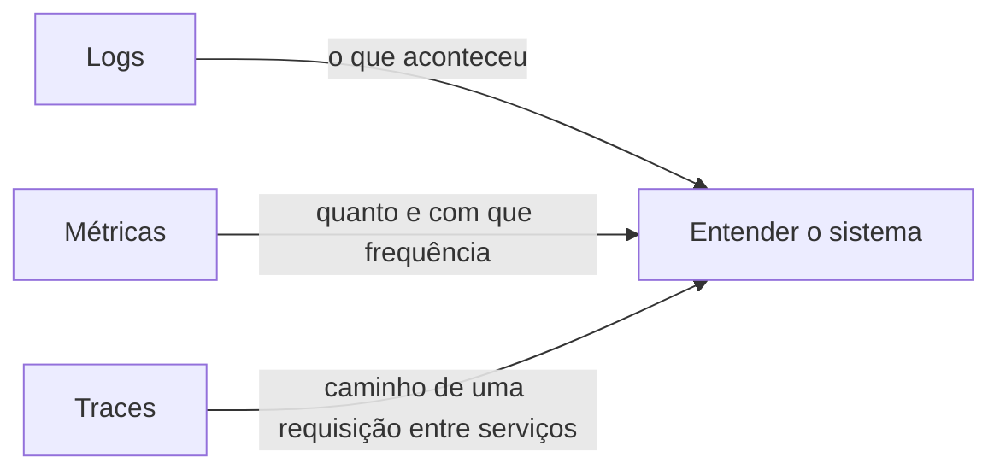
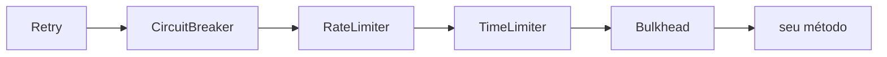
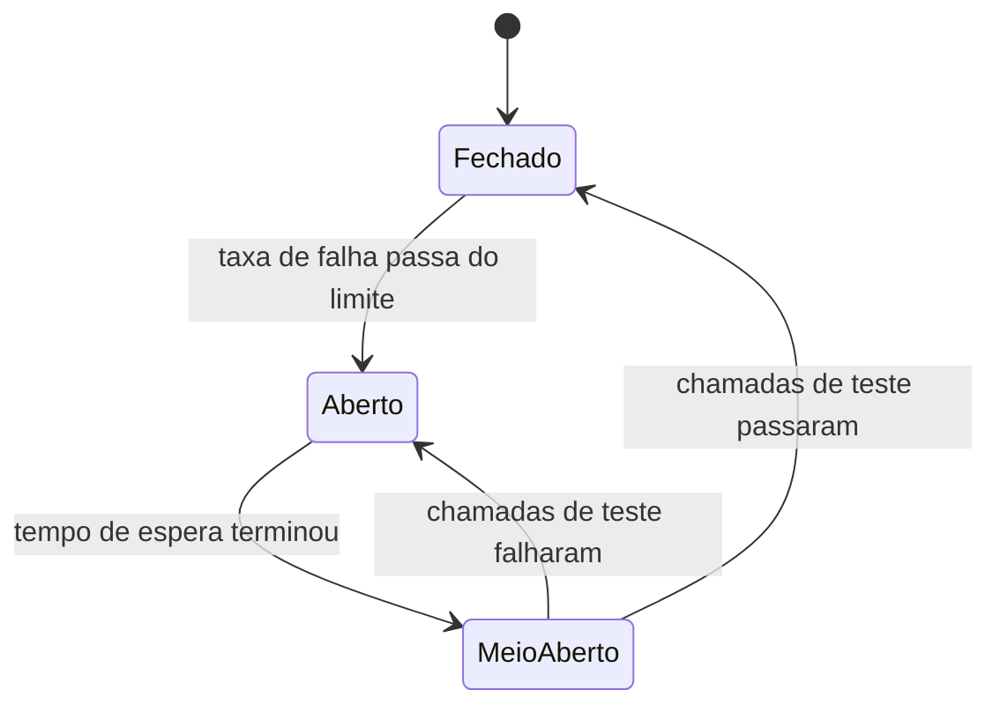
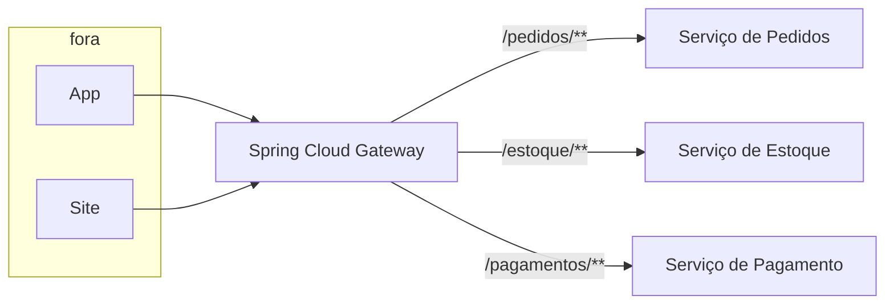
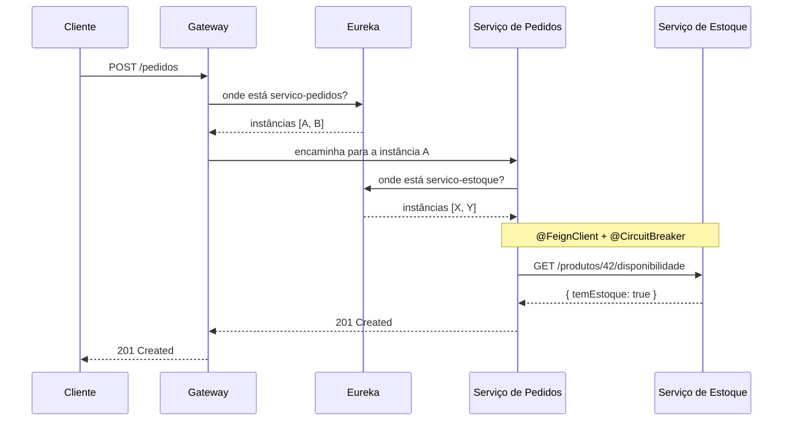

# Spring Boot e System Design

## O que system design tem a ver com as suas anotações

Quando alguém fala em "system design", a imagem que vem à cabeça costuma ser um quadro branco cheio de caixinhas: load balancer aqui, fila de mensagens ali, cache no meio. Parece um assunto de entrevista, distante do código que você escreve no dia a dia.

Só que boa parte desses padrões você já usa. Aquele `@Cacheable` num método de busca é o padrão Cache-Aside. O `@Transactional` numa transferência bancária é atomicidade e as garantias ACID. O `@Async` num envio de email é processamento em background, a mesma ideia por trás de filas de mensagens. Você aplicou o conceito antes de saber o nome dele.

Esta nota pega dez recursos do ecossistema Spring e mostra o padrão de sistema distribuído que cada um representa. Quatro deles já apareceram em outras notas do lab, então aqui a gente só recapitula e conecta os pontos. Os outros seis entram em detalhe.

| Recurso do Spring    | Padrão de system design                    | Onde está no lab                                               |
| -------------------- | ------------------------------------------ | -------------------------------------------------------------- |
| `@Cacheable`         | Caching (Cache-Aside)                      | [Recursos Avançados](/labs/java/spring/05-recursos-avancados/) |
| `@Async`             | Processamento assíncrono / background jobs | [Recursos Avançados](/labs/java/spring/05-recursos-avancados/) |
| `@Transactional`     | Transações e garantias ACID                | [Spring Data](/labs/java/spring/02-spring-data/)               |
| Spring Boot Actuator | Observabilidade                            | [Recursos Avançados](/labs/java/spring/05-recursos-avancados/) |
| `@CircuitBreaker`    | Circuit Breaker (tolerância a falhas)      | esta nota                                                      |
| `@RateLimiter`       | Rate limiting                              | esta nota                                                      |
| `@LoadBalanced`      | Load balancing client-side                 | esta nota                                                      |
| `@FeignClient`       | Comunicação entre serviços                 | esta nota                                                      |
| Spring Cloud Gateway | API Gateway                                | esta nota                                                      |
| Eureka               | Service discovery                          | esta nota                                                      |

Vale separar duas famílias antes de seguir. As quatro primeiras linhas da tabela funcionam num serviço só: você adiciona a dependência, liga uma anotação e pronto. As seis últimas fazem parte do **Spring Cloud**, um conjunto de projetos voltado para quando você tem vários serviços conversando entre si. Elas exigem dependências à parte e, quase sempre, servidores de apoio rodando (um registro de serviços, um gateway). Não são coisas que você adiciona sem querer.

## O que você já viu neste lab

### Caching com `@Cacheable`

O padrão se chama **Cache-Aside**: antes de ir ao banco, a aplicação olha o cache. Se o dado está lá (cache hit), devolve na hora e pula a consulta. Se não está (cache miss), busca no banco, guarda no cache e devolve. Na próxima vez, hit.

```java
@Cacheable(value = "produtos", key = "#id")
public Produto buscarPorId(Long id) {
    return produtoRepository.findById(id).orElse(null);
}
```

Em system design, esse é o primeiro recurso que se puxa quando o banco está sofrendo com leituras repetidas. O detalhe que a nota de [Recursos Avançados](/labs/java/spring/05-recursos-avancados/) menciona e que importa aqui: o cache em memória padrão vive dentro de uma instância. Com várias instâncias da aplicação rodando, cada uma tem o seu, e eles divergem. A solução é um cache distribuído como o **Redis**, que todas as instâncias compartilham. Aí você herda os problemas clássicos de cache: invalidação, dados velhos, o que fazer quando o Redis cai.

### Processamento assíncrono com `@Async`

`@Async` joga o trabalho para outra thread e devolve o controle para quem chamou na hora. A requisição HTTP responde rápido, o trabalho pesado (gerar um PDF, chamar um provedor externo) acontece por baixo.

Isso é a versão mais simples de **processamento em background**. A versão robusta, para sistemas maiores, troca a thread por uma **fila de mensagens** (RabbitMQ, Kafka, SQS): o trabalho vira uma mensagem que um worker separado consome. A vantagem é que a mensagem sobrevive a um restart da aplicação, pode ser reprocessada se falhar e distribui a carga entre vários workers. Mesma intenção do `@Async`, com garantias que uma thread solta não dá. Os detalhes de `@Async` estão em [Recursos Avançados](/labs/java/spring/05-recursos-avancados/).

### Transações com `@Transactional`

```java
@Transactional
public void transferir(Long origemId, Long destinoId, BigDecimal valor) {
    origem.debitar(valor);
    destino.creditar(valor);
    repository.save(origem);
    repository.save(destino);
}
```

Se qualquer linha falhar, o banco desfaz tudo. Débito e crédito acontecem juntos ou não acontecem. Isso é **atomicidade**, o A do ACID (Atomicidade, Consistência, Isolamento, Durabilidade). O I, isolamento, é o que decide o quanto duas transações rodando ao mesmo tempo enxergam o trabalho pela metade uma da outra, e o Spring deixa você ajustar isso com `@Transactional(isolation = ...)`.

Num único banco, `@Transactional` resolve. O problema difícil de system design aparece quando a operação atravessa dois serviços com bancos separados: não existe um rollback que cubra os dois. Aí entram padrões como Saga e outbox, que estão fora do escopo desta nota mas nascem exatamente dessa limitação. Os detalhes de `@Transactional` estão em [Spring Data](/labs/java/spring/02-spring-data/).

### Observabilidade com o Actuator

O Spring Boot Actuator liga endpoints prontos de monitoramento:

- `/actuator/health` - a aplicação está de pé? E o banco, o disco, as dependências?
- `/actuator/metrics` - uso de memória, contagem de requisições, threads ativas
- `/actuator/prometheus` - as mesmas métricas no formato que o Prometheus coleta

Observabilidade é a capacidade de entender o que está acontecendo dentro do sistema olhando de fora, e costuma ser dividida em três frentes:



O Actuator entrega a parte de métricas e health de graça. Numa arquitetura com vários serviços, o `/actuator/prometheus` de cada um é raspado pelo **Prometheus**, que guarda o histórico, e o **Grafana** monta os painéis em cima disso. Traces distribuídos (seguir uma requisição que passou pelo gateway, por dois serviços e pelo banco) normalmente vêm de ferramentas como OpenTelemetry, Zipkin ou Tempo. A configuração do Actuator está em [Recursos Avançados](/labs/java/spring/05-recursos-avancados/).

## Resiliência com Resilience4j

Chamada de rede falha. O serviço do outro lado cai, fica lento, devolve erro. Num sistema distribuído isso não é exceção, é rotina, e o código precisa lidar com isso sem derrubar tudo junto.

A biblioteca que o mundo Spring usa para isso é a **Resilience4j**. Ela substituiu o Netflix Hystrix, que foi descontinuado anos atrás. É leve, baseada em anotações, e cada anotação cuida de um tipo de proteção.

```xml
<dependency>
    <groupId>io.github.resilience4j</groupId>
    <artifactId>resilience4j-spring-boot3</artifactId>
</dependency>
<dependency>
    <groupId>org.springframework.boot</groupId>
    <artifactId>spring-boot-starter-aop</artifactId>
</dependency>
```

Quando você empilha várias anotações no mesmo método, a Resilience4j sempre as aplica na mesma ordem, de fora para dentro:



Ou seja, o retry é a camada mais externa: ele reexecuta o conjunto todo, incluindo a checagem do circuit breaker.

### Circuit Breaker com `@CircuitBreaker`

Imagine que o serviço de pagamento está fora do ar. Cada chamada do seu serviço para ele espera o timeout inteiro (uns 30 segundos) antes de falhar. Enquanto isso, as threads do seu serviço ficam presas nessa espera. Chegam mais requisições, mais threads travam, e em pouco tempo o seu serviço também para de responder, mesmo estando saudável. Isso é uma **falha em cascata**: um serviço quebrado derruba os vizinhos.

O circuit breaker corta esse ciclo. Ele funciona como um disjuntor elétrico, com três estados:



- **Fechado**: tudo normal, as chamadas passam. O breaker só fica contando quantas falharam.
- **Aberto**: a taxa de falha passou do limite. As chamadas nem são tentadas, falham na hora e o `fallbackMethod` assume. Isso libera as threads e dá tempo para o outro serviço se recuperar.
- **Meio-aberto**: passado o tempo de espera, o breaker deixa passar algumas chamadas de teste. Se elas voltam bem, ele fecha. Se falham, abre de novo.

```java
@Service
public class PagamentoClient {

    @CircuitBreaker(name = "pagamento", fallbackMethod = "pagamentoIndisponivel")
    public ReciboPagamento cobrar(Cobranca cobranca) {
        return restClient.post()
            .uri("http://servico-pagamento/cobrancas")
            .body(cobranca)
            .retrieve()
            .body(ReciboPagamento.class);
    }

    private ReciboPagamento pagamentoIndisponivel(Cobranca cobranca, Throwable erro) {
        return ReciboPagamento.pendente(cobranca.id());
    }
}
```

A configuração fica no `application.yml`:

```yaml
resilience4j:
  circuitbreaker:
    instances:
      pagamento:
        sliding-window-size: 20 # olha as últimas 20 chamadas
        failure-rate-threshold: 50 # abre se 50% ou mais falharam
        wait-duration-in-open-state: 10s # fica 10s aberto antes de testar
```

O ponto de atenção: o fallback precisa ser uma resposta que o sistema aguenta. Marcar o pagamento como pendente e reprocessar depois é aceitável. Fingir que cobrou sem ter cobrado, não.

### Rate Limiting com `@RateLimiter`

Rate limiting põe um teto na quantidade de chamadas que um cliente pode fazer num intervalo. Sem isso, um cliente com bug num laço, um script abusivo ou um pico de tráfego legítimo consomem toda a capacidade do serviço e derrubam ele para todo mundo.

```java
@RateLimiter(name = "relatorios", fallbackMethod = "limiteExcedido")
public Relatorio gerar(FiltroRelatorio filtro) {
    return relatorioService.gerar(filtro);
}

private Relatorio limiteExcedido(FiltroRelatorio filtro, RequestNotPermitted erro) {
    throw new ResponseStatusException(HttpStatus.TOO_MANY_REQUESTS, "Tente de novo em instantes");
}
```

```yaml
resilience4j:
  ratelimiter:
    instances:
      relatorios:
        limit-for-period: 100 # 100 chamadas
        limit-refresh-period: 1s # a cada 1 segundo
        timeout-duration: 0 # se estourou, falha na hora em vez de esperar vaga
```

Quando o limite estoura, o padrão é responder **HTTP 429 (Too Many Requests)**, muitas vezes com um cabeçalho `Retry-After` dizendo em quantos segundos tentar de novo.

Onde colocar o rate limiting importa. No **gateway**, você protege o conjunto todo e aplica regras por cliente ou por rota antes da requisição entrar. Dentro do **serviço**, você protege uma operação específica que é cara demais (uma geração de relatório, um endpoint de exportação). Os dois lugares se complementam, não competem.

### Retry, Time Limiter e Bulkhead

A Resilience4j traz mais três anotações que costumam andar junto com as duas de cima:

- **`@Retry`** reexecuta a chamada quando ela falha por um motivo transitório, um blip de rede, um `503` momentâneo. Você configura quantas tentativas e o intervalo entre elas, de preferência com backoff (esperar cada vez mais). Cuidado para não dar retry em erro que não vai mudar: um `400` vai continuar `400` nas três tentativas.
- **`@TimeLimiter`** corta a chamada se ela passar de um tempo limite, em vez de deixar sua thread esperando o timeout longo do cliente HTTP.
- **`@Bulkhead`** limita quantas chamadas simultâneas um método pode ter. O nome vem das antéparas de um navio: se um compartimento inunda, os outros seguem secos. Na prática, isola um pool de recursos para uma dependência lenta não engolir todas as threads do serviço.

## Microsserviços com Spring Cloud

As próximas quatro peças só fazem sentido quando você tem vários serviços separados, cada um com seu deploy e, muitas vezes, seu banco. Antes de seguir, um aviso que economiza meses: isso tem custo. Mais serviços significam mais pipelines, mais pontos de falha, mais latência de rede entre chamadas que antes eram um método local, e observabilidade que precisa amarrar tudo. Comece com um monólito bem organizado (a [Arquitetura Limpa](/labs/java/spring/07-arquitetura-limpa/) ajuda nisso) e só quebre em serviços quando tiver um motivo concreto: times que se atrapalham no mesmo deploy, partes do sistema com escala muito diferente, tecnologias incompatíveis no mesmo processo.

Dito isso, quando a separação se justifica, o Spring Cloud oferece as peças mínimas:

```mermaid
flowchart TD
    Cliente --> GW[API Gateway]
    GW --> S1[Serviço de Pedidos]
    GW --> S2[Serviço de Estoque]
    S1 -->|@FeignClient| S2
    S1 -.registra.-> EUREKA[(Eureka)]
    S2 -.registra.-> EUREKA
    GW -.consulta.-> EUREKA
```

### Service Discovery com Eureka

Num ambiente real, os serviços sobem e descem o tempo todo: um deploy troca as instâncias, o autoscaling adiciona três a mais no pico, uma máquina morre. Guardar o endereço `http://192.168.1.40:8080` no código ou no `application.properties` não sobrevive a isso.

O **Eureka** resolve com um registro central. Cada serviço, ao subir, se registra no Eureka Server dizendo "sou o `servico-estoque` e estou em tal endereço". Quem precisa falar com o estoque pergunta ao Eureka "onde está o `servico-estoque`?" e recebe a lista de instâncias vivas. Se uma some, ela deixa de mandar o sinal de vida e é retirada da lista.

```java
@SpringBootApplication
@EnableDiscoveryClient
public class ServicoEstoqueApplication { }
```

```yaml
eureka:
  client:
    service-url:
      defaultZone: http://localhost:8761/eureka
```

A partir daí você para de usar endereços e passa a usar o **nome** do serviço. As próximas peças dependem disso.

### Comunicação entre serviços com `@FeignClient`

Sem ajuda, chamar outro serviço é montar a requisição HTTP na mão: URL, método, serializar o corpo, tratar o código de status, desserializar a resposta. Repetitivo e fácil de errar.

O **Spring Cloud OpenFeign** troca isso por uma interface. Você declara os métodos com as anotações de mapeamento que já conhece de [Spring Web](/labs/java/spring/01-spring-web/), e o Feign gera a implementação:

```java
@FeignClient(name = "servico-estoque")
public interface EstoqueClient {

    @GetMapping("/produtos/{id}/disponibilidade")
    Disponibilidade consultar(@PathVariable Long id);
}
```

```java
@Service
public class PedidoService {

    private final EstoqueClient estoqueClient;

    public void criarPedido(Pedido pedido) {
        Disponibilidade d = estoqueClient.consultar(pedido.produtoId());
        if (!d.temEstoque()) {
            throw new EstoqueInsuficienteException();
        }
        // segue o fluxo
    }
}
```

Repare no `name = "servico-estoque"`: não tem host nem porta. O Feign pergunta ao Eureka onde está esse serviço. E como isso é uma chamada de rede de verdade, ela pode dar timeout, falhar, voltar lenta. É exatamente aqui que as anotações da Resilience4j da seção anterior entram, envolvendo os métodos do client.

### Load Balancing com `@LoadBalanced`

Quando o Eureka devolve três instâncias do `servico-estoque`, qual delas chamar? O **Spring Cloud LoadBalancer** decide, distribuindo as chamadas entre elas (por padrão, em rodízio). Isso é **load balancing client-side**: quem escolhe a instância é quem faz a chamada, não um equipamento no meio do caminho.

```java
@Bean
@LoadBalanced
RestClient.Builder restClientBuilder() {
    return RestClient.builder();
}
```

Com o `@LoadBalanced`, você chama pelo nome do serviço e o balanceamento acontece por baixo:

```java
ReciboPagamento recibo = restClient.post()
    .uri("http://servico-pagamento/cobrancas")  // "servico-pagamento" é o nome no Eureka
    .body(cobranca)
    .retrieve()
    .body(ReciboPagamento.class);
```

O Feign já usa o LoadBalancer internamente, então quando você chama por `@FeignClient` o balanceamento vem junto de graça.

A diferença para o **load balancing server-side** é onde a decisão mora: no server-side (um NGINX, um load balancer da nuvem) o cliente fala com um endereço fixo e o equipamento reparte. No client-side, cada serviço carrega essa lógica. Sistemas grandes costumam usar os dois em camadas.

### API Gateway com Spring Cloud Gateway

Se cada cliente (o app mobile, o site, um parceiro) precisasse conhecer o endereço de cada serviço e lidar com autenticação, rate limiting e CORS em cada chamada, seria um caos. O **API Gateway** é a porta única: todo mundo bate nele, e ele encaminha para o serviço certo.



O que o gateway costuma centralizar:

- **Roteamento**: `/pedidos/**` vai para o serviço de pedidos, `/estoque/**` para o de estoque
- **Autenticação**: valida o token uma vez, na entrada, em vez de cada serviço fazer isso
- **Rate limiting**: aplica limites por cliente antes da requisição consumir recurso interno
- **Filtros**: adiciona cabeçalhos, reescreve caminhos, registra logs, corta requisições malformadas

```yaml
spring:
  cloud:
    gateway:
      routes:
        - id: pedidos
          uri: lb://servico-pedidos # lb:// = resolve pelo LoadBalancer + Eureka
          predicates:
            - Path=/pedidos/**
```

O `lb://` no `uri` amarra tudo: o gateway não sabe o endereço do serviço de pedidos, ele resolve pelo Eureka e balanceia entre as instâncias, igual ao Feign.

## Como as peças se encaixam

Juntando resiliência e Spring Cloud, o caminho de uma requisição fica assim:



E em cada serviço da ponta, por baixo desse fluxo, estão o cache no acesso ao banco, o `@Transactional` na escrita, o `@Async` no que não precisa bloquear a resposta e o Actuator expondo métricas para o Prometheus. Nenhuma peça nova, só os padrões que você já conhecia, agora com nome e no lugar certo.

## Quando você precisa disso (e quando não)

Nem todo projeto precisa de Spring Cloud, e forçar essas peças num sistema que não pede é um jeito rápido de complicar a vida.

O que dá para adotar isolado, sem virar microsserviço, e quase sempre compensa:

- **Cache** quando o banco sofre com leitura repetida
- **Actuator** desde o primeiro dia, é praticamente de graça
- **Resilience4j** em qualquer serviço que chama uma API externa, mesmo sendo um monólito

O que só faz sentido com vários serviços de verdade:

- **Eureka, Feign, LoadBalancer e Gateway** pressupõem que você já tem serviços separados com bom motivo para isso

Sinais de que quebrar em serviços pode valer a pena: times diferentes travando no mesmo deploy, partes do sistema com necessidade de escala muito diferente (o processamento de imagem precisa de 10 máquinas, o resto de 1), ou um pedaço que precisa de uma stack que não convive com o resto no mesmo processo. Se não é nada disso, um monólito modular bem estruturado entrega mais rápido e quebra menos.

Para o outro lado do problema, quando o objetivo é fazer uma API só aguentar muita carga (banco, cache, escala horizontal, teste de carga), veja [Escalando uma API para Alta Carga](/labs/java/spring/11-escalando-para-alta-carga/).
