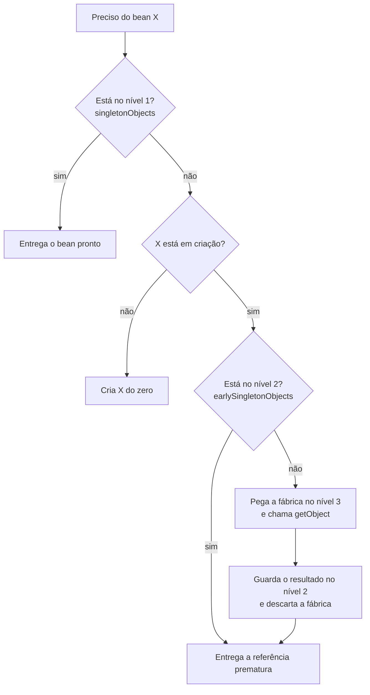

# Dependência circular no Spring

Uma dependência circular acontece quando dois beans precisam um do outro para serem construídos. O caso clássico: `OrderService` recebe `PaymentService` no construtor, e `PaymentService` recebe `OrderService`. Para montar um, o Spring precisa do outro pronto, e vice-versa. É o problema do ovo e da galinha dentro do container.

Na maioria das vezes isso é um recado de que o desenho das classes está errado. Mas dá para entender como o Spring lida com o ciclo quando ele é resolvível, e por que às vezes ele simplesmente desiste e joga uma exceção na sua cara no startup.

## O problema

Veja o ciclo mais simples possível, com injeção por campo:

```java
@Service
public class OrderService {
    @Autowired
    private PaymentService paymentService;
}

@Service
public class PaymentService {
    @Autowired
    private OrderService orderService;
}
```

O Spring começa a criar o `OrderService`. Para preencher o campo `paymentService`, ele precisa de um `PaymentService`. Vai criar o `PaymentService`, e aí precisa de um `OrderService`, que ainda está no meio da criação. Sem um mecanismo de escape, o container ficaria preso nesse vai e volta.

O ciclo também pode ser indireto e passar por vários beans: A depende de B, B depende de C, C depende de A. O tamanho do ciclo não muda a natureza do problema.

Quem cuida disso é a classe `DefaultSingletonBeanRegistry`, o registro interno onde o Spring guarda os beans singleton enquanto eles são criados.

## O ciclo de vida de um bean, revisitado

A nota de [Spring Web](/labs/java/spring/01-spring-web/) já mostrou que todo bean passa por uma sequência fixa:

```mermaid
flowchart LR
    A[Instancia<br/>o objeto] --> B[Popula as<br/>propriedades]
    B --> C[Inicializa<br/>@PostConstruct]
    C --> D[Disponível<br/>para uso]
    D --> E[Destrói<br/>@PreDestroy]
```

O detalhe que interessa aqui é o intervalo entre o passo 1 e o passo 2. Depois de "instanciar", o objeto Java já existe na memória: dá para guardar uma referência a ele, passar essa referência adiante, chamar métodos. Ele só não teve as dependências injetadas ainda. O Spring chama isso de **referência prematura** (early reference): o bean meio-pronto, útil o suficiente para quebrar o ciclo.

## O cache de três níveis

Para gerenciar beans em criação, o `DefaultSingletonBeanRegistry` mantém três mapas, consultados nessa ordem:

| Nível | Mapa                    | O que guarda                                                                         |
| ----- | ----------------------- | ------------------------------------------------------------------------------------ |
| 1     | `singletonObjects`      | beans totalmente prontos, com dependências injetadas e `@PostConstruct` já executado |
| 2     | `earlySingletonObjects` | a referência prematura: bean instanciado, ainda sem propriedades                     |
| 3     | `singletonFactories`    | uma fábrica (`ObjectFactory`) que sabe produzir a referência prematura sob demanda   |

Quando o Spring precisa de um bean para injetar em outro, ele procura assim:



O ponto chave: assim que a fábrica do nível 3 é usada, o resultado sobe para o nível 2 e a fábrica é jogada fora. A partir daí, qualquer outro bean que peça esse mesmo bean pega a referência já pronta no nível 2, não gera uma nova.

## Acompanhando a resolução passo a passo

Ciclo `OrderService` (O) e `PaymentService` (P), com injeção por campo:

1. Container manda criar O. O é marcado como "em criação".
2. O é instanciado. Antes de popular os campos de O, o Spring registra uma fábrica de O no nível 3.
3. O Spring tenta injetar o campo `paymentService` de O. P não existe ainda, então manda criar P. P é marcado como "em criação".
4. P é instanciado. Registra uma fábrica de P no nível 3.
5. O Spring tenta injetar o campo `orderService` de P. Procura O: não está no nível 1, não está no nível 2, mas tem fábrica no nível 3. Chama a fábrica, pega a referência prematura de O, sobe para o nível 2.
6. P recebe essa referência prematura de O no campo `orderService`. P termina de inicializar e vai para o nível 1, bean completo.
7. Volta para o passo 3: O agora recebe P (já completo) no campo `paymentService`. O termina de inicializar e vai para o nível 1.
8. A referência prematura de O que ficou no nível 2 é descartada. O e P apontam um para o outro, tudo consistente.

Repare que P segurou uma referência de O **antes de O estar pronto**. Isso funciona porque, no fim das contas, é o mesmo objeto na memória: quando O termina de inicializar, quem tem a referência enxerga o estado final.

## Por que três níveis e não dois

Bate a dúvida: se o nível 2 guarda a referência prematura, para que serve o nível 3? Não bastava instanciar o bean e jogar direto no nível 2?

Bastaria, se não fosse a AOP. Quando um bean tem `@Transactional`, `@Async`, `@Cacheable` ou qualquer aspecto, o que o Spring entrega no fim não é o objeto original, é um **proxy** que embrulha esse objeto. E o proxy só é criado no passo de inicialização, depois de popular as propriedades.

Se houver um ciclo envolvendo um bean que precisa de proxy, o Spring tem que decidir, no meio da criação, se a referência prematura vai ser o objeto cru ou o proxy. A fábrica do nível 3 existe para adiar essa decisão: só quando alguém realmente pede a referência prematura é que a fábrica roda, aplica os `BeanPostProcessor` que possam gerar o proxy e devolve o resultado certo. Aí ele sobe para o nível 2 para não ser recalculado.

Sem esse nível intermediário, ou o Spring criaria proxy para todo mundo cedo demais (desperdício), ou a referência prematura poderia ser o objeto cru enquanto o resto da aplicação recebe o proxy, e você teria duas referências diferentes para o "mesmo" bean.

## Por que injeção por construtor não resolve

Troque o exemplo para injeção por construtor:

```java
@Service
public class OrderService {
    private final PaymentService paymentService;

    public OrderService(PaymentService paymentService) {
        this.paymentService = paymentService;
    }
}

@Service
public class PaymentService {
    private final OrderService orderService;

    public PaymentService(OrderService orderService) {
        this.orderService = orderService;
    }
}
```

Agora o truque do cache não tem como funcionar. A referência prematura só é registrada **depois** que o construtor termina, no passo de instanciação. Mas o construtor de `OrderService` não termina: ele está parado esperando um `PaymentService` chegar como argumento. E para criar o `PaymentService`, o construtor dele está parado esperando um `OrderService`.

Nenhum dos dois chega a ser instanciado, então não existe referência prematura para colocar no nível 2. O Spring detecta o impasse e aborta com `BeanCurrentlyInCreationException`.

Isso costuma ser vendido como desvantagem da injeção por construtor, mas é o contrário: o ciclo aparece na sua frente no startup, alto e claro, em vez de ser costurado por baixo dos panos e virar um bug estranho meses depois.

## Injeção por setter ou campo

Com setter ou campo, o objeto é instanciado primeiro, por um construtor que não pede as dependências do ciclo:

```java
@Service
public class OrderService {
    private PaymentService paymentService;

    @Autowired
    public void setPaymentService(PaymentService paymentService) {
        this.paymentService = paymentService;
    }
}
```

Como o `OrderService` é criado sem argumentos e só depois recebe o `PaymentService` pelo setter, existe uma janela entre "instanciado" e "dependências setadas". É nessa janela que a referência prematura fica disponível no nível 2 para o outro bean se completar. Por isso o cache de três níveis só quebra ciclos de setter e campo, nunca de construtor.

## BeanCurrentlyInCreationException

Quando o Spring não acha rota de saída para o ciclo, a exceção é essa, com uma mensagem parecida com:

```
Error creating bean with name 'orderService':
Requested bean is currently in creation:
Is there an unresolvable circular reference?
```

Para achar o ciclo, leia o encadeamento de causas do stack trace de baixo para cima: ele lista "creating bean X" -> "which needs bean Y" -> "which needs bean X" e fecha no bean que já estava em criação. Os beans que aparecem entre a primeira e a última menção do mesmo nome são o ciclo.

## Spring Boot 2.6+: ciclos proibidos por padrão

Até o Spring Boot 2.5, ciclos resolvíveis (setter e campo) eram quebrados em silêncio. A partir do 2.6, isso mudou: **qualquer referência circular é rejeitada no startup**, mesmo as que o cache conseguiria resolver. A ideia é forçar o time a encarar o problema de desenho em vez de conviver com ele.

Se você precisa do comportamento antigo enquanto refatora, dá para religar:

```properties
spring.main.allow-circular-references=true
```

Trate isso como band-aid, não como solução. A orientação oficial do Spring é quebrar o ciclo, e versões futuras podem remover a opção.

## Como evitar dependência circular

Um ciclo quase sempre indica que as responsabilidades estão mal divididas: se A chama B e B chama A, provavelmente existe uma terceira coisa que os dois deveriam usar.

**Extrair um terceiro bean.** Se `OrderService` e `PaymentService` compartilham lógica que causa o vai e volta, mova essa lógica para um `PricingService` (ou o que fizer sentido) do qual os dois dependem. O grafo deixa de ter ciclo.

**Repensar quem chama quem.** Muitas vezes só um dos sentidos da dependência é essencial. O outro pode ser invertido com um callback, uma interface no pacote de quem precisa, ou movendo o método para o lado certo.

**Desacoplar com eventos.** Se `OrderService` só precisa avisar `PaymentService` de que algo aconteceu, publique um evento com `ApplicationEventPublisher` em vez de injetar o bean. Quem reage não precisa ser conhecido por quem publica. Isso está detalhado em [Recursos Avançados do Spring Boot](/labs/java/spring/05-recursos-avancados/).

**`@Lazy` como saída rápida.** Anotar um dos pontos de injeção com `@Lazy` faz o Spring injetar um proxy leve ali e só resolver o bean de verdade no primeiro uso, o que quebra o ciclo no startup:

```java
@Service
public class OrderService {
    private final PaymentService paymentService;

    public OrderService(@Lazy PaymentService paymentService) {
        this.paymentService = paymentService;
    }
}
```

Funciona até com injeção por construtor, mas esconde o acoplamento em vez de resolver. Serve para destravar enquanto você arruma o desenho, não como estado final.

**Preferir injeção por construtor.** Não é solução de ciclo, é prevenção: com construtor, um ciclo acidental estoura no startup e você conserta na hora, antes de ir para produção.
