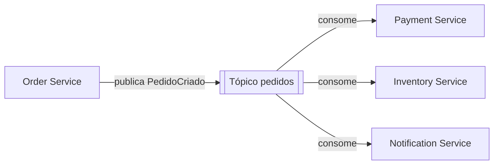
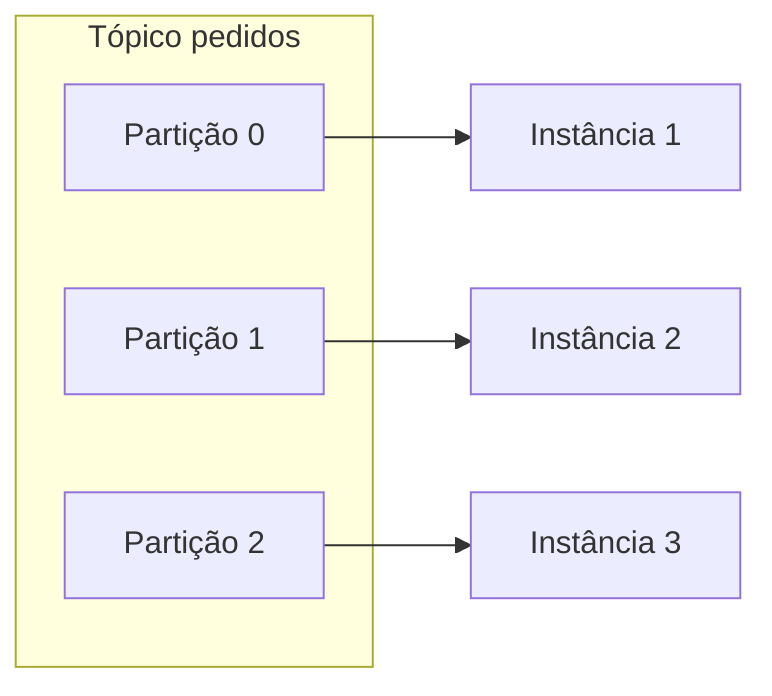
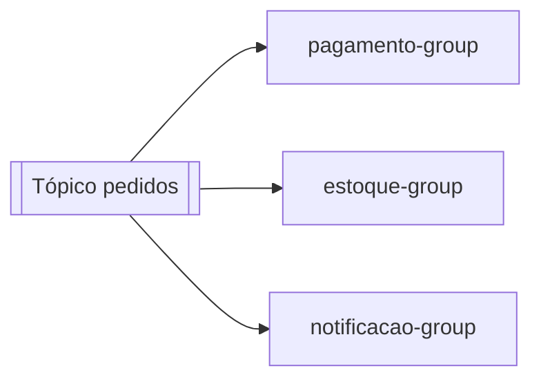

# Mensageria com Apache Kafka no Spring Boot

Até aqui, quando um serviço precisava falar com outro neste lab, a conversa era síncrona: uma chamada HTTP com `RestClient`, `WebClient` ou `@FeignClient`, e o serviço que chamou fica esperando a resposta. Mensageria é a outra forma de comunicação entre serviços: em vez de chamar e esperar, um serviço anuncia que algo aconteceu e segue em frente, e quem tem interesse reage depois. O Apache Kafka é a peça mais comum para isso no mundo Java. Esta nota mostra como um produtor e um consumidor funcionam com Spring Boot, o que são partições e consumer groups, e o que separa um exemplo de tutorial de algo que aguenta produção.

## Por que mensageria

Imagine um `PedidoService` que, ao criar um pedido, precisa avisar o serviço de pagamento, o de estoque e o de notificação. Na versão síncrona, ele faz três chamadas HTTP em sequência e só responde ao cliente quando as três voltam. Os problemas:

- **Acoplamento temporal**: se o serviço de estoque está fora do ar, a criação do pedido falha, mesmo que o pedido em si pudesse ter sido registrado.
- **Falha em cascata**: uma lentidão no serviço de notificação segura a thread do `PedidoService`, que sob carga fica sem threads e cai também.
- **Rigidez**: para adicionar um quarto interessado no evento "pedido criado", você edita o `PedidoService`.

Com mensageria, o `PedidoService` publica um evento `PedidoCriado` num tópico e responde ao cliente. Os três serviços consomem esse evento no seu próprio ritmo. Se um está fora do ar, ele processa a mensagem quando voltar, porque o Kafka guarda o evento. Adicionar um quarto consumidor não toca no produtor.



Isso já apareceu de passagem em outras notas: o produtor Kafka como adapter primário em [Arquitetura Limpa](/labs/java/spring/07-arquitetura-limpa/), e a dificuldade de manter consistência entre serviços com bancos separados em [Spring Boot e System Design](/labs/java/spring/08-system-design-com-spring/). Aqui a gente desce ao código.

Nem tudo pede evento. Se o `PedidoService` precisa do CEP validado _antes_ de salvar o pedido, isso é uma pergunta com resposta, e uma chamada síncrona é o modelo certo. Mensageria brilha quando a ação é "me avise quando X acontecer" e o produtor não precisa saber o que os consumidores fazem com isso.

## Os conceitos do Kafka

Antes do código, os termos:

- **Tópico**: o canal onde as mensagens vão. Por baixo, é um log append-only: mensagens são adicionadas no fim e ficam guardadas por um tempo configurável (dias, semanas), mesmo depois de lidas.
- **Partição**: cada tópico é dividido em uma ou mais partições, e é a partição, não o tópico, que garante ordem. Mensagens dentro de uma partição são lidas na ordem em que chegaram; entre partições diferentes, não há garantia de ordem.
- **Chave da mensagem**: um valor opcional que decide em qual partição a mensagem cai. Todas as mensagens com a mesma chave vão para a mesma partição, então usar `pedidoId` como chave garante que todos os eventos de um mesmo pedido sejam processados em ordem.
- **Offset**: a posição de uma mensagem dentro da partição. Cada consumidor guarda até que offset já leu, e é assim que ele sabe de onde continuar.
- **Broker**: um servidor Kafka. Em produção são vários, formando um cluster.
- **Producer** e **Consumer**: quem escreve e quem lê. É o que você programa.

## Configurando o projeto

A dependência:

```xml
<dependency>
    <groupId>org.springframework.kafka</groupId>
    <artifactId>spring-kafka</artifactId>
</dependency>
```

Anote uma classe de configuração com `@EnableKafka` para o Spring detectar os métodos `@KafkaListener`. Em muitas versões recentes do Spring Boot isso já vem ligado pela autoconfiguração, mas deixar explícito não custa.

No `application.properties`:

```properties
spring.kafka.bootstrap-servers=localhost:9092

# Producer
spring.kafka.producer.key-serializer=org.apache.kafka.common.serialization.StringSerializer
spring.kafka.producer.value-serializer=org.springframework.kafka.support.serializer.JsonSerializer

# Consumer
spring.kafka.consumer.group-id=pedidos-app
spring.kafka.consumer.key-deserializer=org.apache.kafka.common.serialization.StringDeserializer
spring.kafka.consumer.value-deserializer=org.springframework.kafka.support.serializer.JsonDeserializer
spring.kafka.consumer.properties.spring.json.trusted.packages=com.exemplo.eventos
```

Para rodar um Kafka local, um `docker-compose.yml` resolve:

```yaml
services:
  kafka:
    image: apache/kafka:3.8.0
    ports:
      - "9092:9092"
```

## Produtor com KafkaTemplate

O Spring Boot cria um `KafkaTemplate` a partir das propriedades. Você injeta e usa:

```java
public record PedidoCriado(Long pedidoId, BigDecimal total) {}

@Service
public class PedidoService {

    private final KafkaTemplate<String, PedidoCriado> kafkaTemplate;

    public PedidoService(KafkaTemplate<String, PedidoCriado> kafkaTemplate) {
        this.kafkaTemplate = kafkaTemplate;
    }

    public void criarPedido(Pedido pedido) {
        // salva o pedido...
        var evento = new PedidoCriado(pedido.getId(), pedido.getTotal());
        kafkaTemplate.send("pedidos", pedido.getId().toString(), evento);
    }
}
```

O primeiro argumento do `send` é o tópico, o segundo é a chave (aqui o id do pedido, para manter a ordem por pedido), o terceiro é o valor. O `JsonSerializer` transforma o record em JSON antes de enviar.

O `send` é assíncrono e devolve um `CompletableFuture`. Para saber se a publicação deu certo:

```java
kafkaTemplate.send("pedidos", chave, evento)
    .whenComplete((resultado, erro) -> {
        if (erro != null) {
            log.error("falha ao publicar PedidoCriado {}", chave, erro);
        }
    });
```

Você pode deixar o Kafka criar o tópico no primeiro uso, mas é comum declarar com o número de partições que você quer:

```java
@Bean
public NewTopic topicoPedidos() {
    return TopicBuilder.name("pedidos").partitions(3).replicas(1).build();
}
```

## Consumidor com @KafkaListener

Do outro lado, um método anotado consome as mensagens:

```java
@Component
public class PagamentoListener {

    @KafkaListener(topics = "pedidos", groupId = "pagamento-group")
    public void aoReceberPedido(PedidoCriado evento) {
        log.info("processando pagamento do pedido {}", evento.pedidoId());
        // lógica de cobrança...
    }
}
```

O `JsonDeserializer` reconstrói o record a partir do JSON, e você recebe o objeto direto no parâmetro. Para acessar metadados da mensagem, adicione parâmetros com `@Header`:

```java
@KafkaListener(topics = "pedidos", groupId = "pagamento-group")
public void aoReceberPedido(
        @Payload PedidoCriado evento,
        @Header(KafkaHeaders.RECEIVED_KEY) String chave,
        @Header(KafkaHeaders.RECEIVED_PARTITION) int particao,
        @Header(KafkaHeaders.OFFSET) long offset) {
    // ...
}
```

Por padrão, o Spring confirma o offset (faz o commit) automaticamente depois que o método retorna sem lançar exceção. Dá para mudar para commit manual configurando o `AckMode`, quando você precisa de controle fino sobre quando a mensagem é considerada processada.

## Consumer groups e escala

Todo consumidor pertence a um **consumer group**, definido pelo `groupId`. A regra que rege tudo:

> Dentro de um group, cada partição é entregue a no máximo um consumidor.

As consequências:

- Se o tópico `pedidos` tem 3 partições e você sobe 1 instância do serviço de pagamento, essa instância lê as 3 partições.
- Se você sobe 3 instâncias (todas com `groupId = "pagamento-group"`), o Kafka distribui uma partição para cada. O processamento fica 3 vezes mais rápido.
- Se você sobe 4 instâncias, a quarta fica ociosa, porque não há partição sobrando. O paralelismo máximo de um group é o número de partições.



Quando uma instância entra ou sai do group, o Kafka faz um **rebalanceamento**: redistribui as partições entre os consumidores que restaram. Durante esse intervalo curto, o consumo pausa.

Um mesmo tópico pode alimentar vários groups independentes. O serviço de pagamento, o de estoque e o de notificação usam `groupId` diferentes, e cada group tem seu próprio controle de offset:



Cada group recebe todas as mensagens do tópico e processa no seu ritmo. Se o estoque estiver atrasado, isso não afeta o pagamento.

## Entrega confiável na prática

O Kafka entrega **at-least-once** por padrão: ele garante que a mensagem chega pelo menos uma vez, mas pode entregar duas. Isso acontece quando o consumidor processa a mensagem mas cai antes de confirmar o offset, e ao voltar lê a mesma mensagem de novo.

A defesa é fazer o handler **idempotente**: processar a mesma mensagem duas vezes tem que dar o mesmo resultado que processar uma vez. Formas comuns:

- Guardar numa tabela os ids de evento já processados e ignorar repetidos.
- Usar `UPDATE ... WHERE status = 'PENDENTE'` em vez de somar valores, para que a segunda execução não faça nada.
- Checar o estado antes de agir ("esse pedido já foi cobrado?").

Idempotência e deduplicação têm uma nota dedicada, com o padrão Idempotency-Key para APIs, a tabela de mensagens processadas e as garantias at-least-once/exactly-once: [Idempotência e Deduplicação](/labs/java/spring/10-idempotencia-e-deduplicacao/).

Do lado do produtor, ative o **produtor idempotente** para não gerar duplicatas quando ele mesmo faz retry de um envio:

```properties
spring.kafka.producer.properties.enable.idempotence=true
spring.kafka.producer.acks=all
```

Com `enable.idempotence=true`, o Kafka já força `acks=all` e retries, e passa a descartar envios duplicados do mesmo produtor.

Há ainda o problema de publicar o evento e salvar o dado de forma consistente: se você salva o pedido no banco e a publicação no Kafka falha, os dois ficam fora de sincronia. O padrão **Transactional Outbox** resolve isso gravando o evento numa tabela na mesma transação do pedido, e um processo separado lê essa tabela e publica no Kafka. É o mesmo raciocínio da ressalva sobre `@TransactionalEventListener` em [Recursos Avançados do Spring Boot](/labs/java/spring/05-recursos-avancados/).

## Tratamento de erro e dead letter

O que acontece quando o método do `@KafkaListener` lança uma exceção? Por padrão, o Spring tenta reentregar a mensagem algumas vezes e, se continuar falhando, registra o erro e segue para a próxima (com o `DefaultErrorHandler`). O risco é perder a mensagem problemática.

O padrão para não perder nada é o **dead letter topic** (DLT). Você configura um `DeadLetterPublishingRecoverer`: depois de esgotar as tentativas, em vez de descartar, ele publica a mensagem num tópico separado, por convenção `pedidos.DLT`. Lá as mensagens ficam paradas para você investigar e, se for o caso, reprocessar.

```java
@Bean
public DefaultErrorHandler errorHandler(KafkaTemplate<Object, Object> template) {
    var recoverer = new DeadLetterPublishingRecoverer(template);
    // 3 tentativas com 1s de intervalo, depois manda para a DLT
    return new DefaultErrorHandler(recoverer, new FixedBackOff(1000L, 3));
}
```

Para retry que não trava o consumo das outras mensagens enquanto espera, o Spring Kafka oferece a anotação `@RetryableTopic`, que cria tópicos de retry intermediários (`pedidos-retry-0`, `pedidos-retry-1`, ...) e a DLT automaticamente.

## Quando usar Kafka (e quando não)

Kafka é uma peça de infraestrutura a mais para operar: cluster, monitoramento, tuning de partições. Vale quando:

- Vários serviços precisam reagir ao mesmo evento.
- O volume de mensagens é alto e você precisa escalar o consumo horizontalmente.
- Você precisa reprocessar o histórico de eventos (reconstruir um cache, alimentar um serviço novo com dados antigos).

Provavelmente é cedo demais quando há um único consumidor, o volume é baixo e o time é pequeno. Nesses casos, alternativas mais simples costumam bastar: uma fila com RabbitMQ, os [eventos in-process do Spring](/labs/java/spring/05-recursos-avancados/) quando produtor e consumidor estão na mesma aplicação, ou uma tabela de outbox lida por um job agendado.

## Referências

- [Introdução ao Apache Kafka com Spring Boot](https://medium.com/rapaduratech/introdu%C3%A7%C3%A3o-ao-apache-kafka-com-spring-boot-3a2c450a510f) - Odilio Noronha / RapaduraTech, pt-BR
- [Spring for Apache Kafka - Receiving Messages](https://docs.spring.io/spring-kafka/reference/kafka/receiving-messages/listener-annotation.html) - documentação oficial do Spring, inglês
- [Spring for Apache Kafka - Handling Exceptions](https://docs.spring.io/spring-kafka/reference/kafka/annotation-error-handling.html) - documentação oficial do Spring, inglês
- [Apache Kafka Documentation - Design](https://kafka.apache.org/documentation/#design) - documentação oficial do Apache Kafka, inglês
