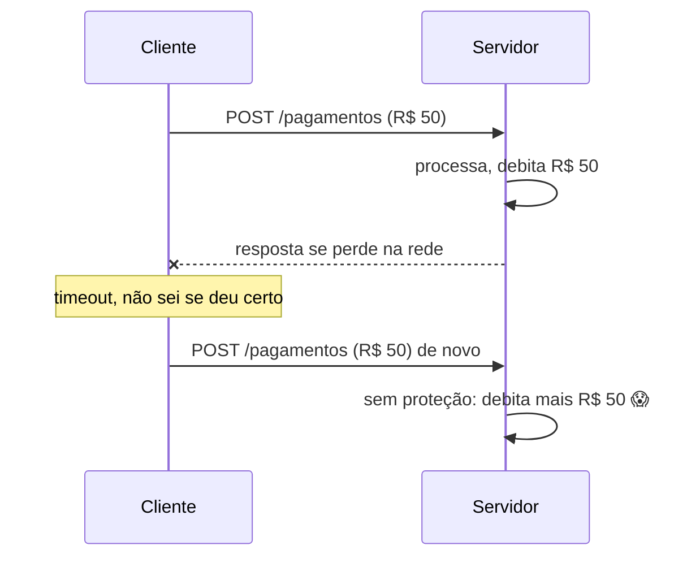
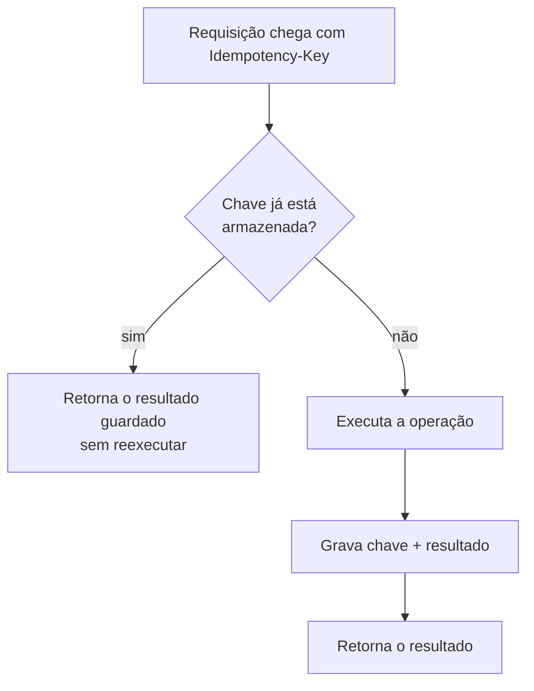
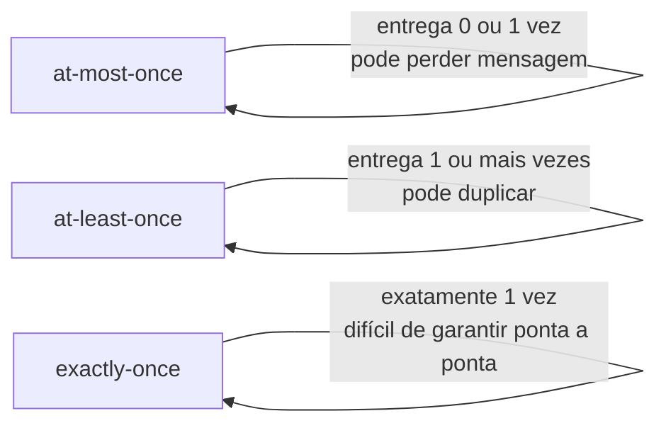

# Idempotência e Deduplicação

Quando você chama um método local, ou ele executa ou lança uma exceção, e você sabe qual dos dois aconteceu. Numa chamada de rede não é assim: dá para o servidor processar a requisição inteira e a resposta se perder no caminho de volta. O cliente fica sem saber se deu certo, e a reação natural (dele ou da biblioteca HTTP que ele usa) é tentar de novo. Idempotência e deduplicação são as duas ferramentas para essa segunda tentativa não virar cobrança dobrada, email repetido ou pedido duplicado.

## Por que isso importa

Em qualquer sistema que fala com outro sistema pela rede, algumas coisas são dadas:

- Requisições e respostas se perdem. Timeout não quer dizer "não aconteceu", quer dizer "não sei".
- Clientes e bibliotecas HTTP fazem retry automático quando não recebem resposta.
- Brokers de mensagem como o Kafka reentregam uma mensagem quando o consumidor cai antes de confirmar que processou.

O resultado prático: a mesma operação chega ao seu código mais de uma vez. Se o handler soma R$ 50 no saldo toda vez que roda, duas entregas viram R$ 100. Projetar para a duplicata chegar é o caminho normal, não uma precaução exagerada.



## O que é idempotência

Uma operação é idempotente quando executá-la uma vez ou várias vezes deixa o sistema no mesmo estado final. A pergunta que define o conceito: "o que acontece se eu processar isso de novo?". Se a resposta é "nada muda", a operação é idempotente.

O exemplo clássico é o pagamento com timeout: o cliente manda a requisição, a rede engasga, o cliente reenvia, e o dinheiro sai da conta uma vez só porque o servidor reconheceu que era a mesma operação.

Os métodos HTTP já carregam essa ideia no contrato. `GET`, `PUT` e `DELETE` são idempotentes por definição: buscar um recurso, substituir um recurso por um valor fixo ou apagar um recurso dá no mesmo resultado se repetido. `POST` não é, porque a semântica dele é "crie uma coisa nova". A relação entre método HTTP e idempotência está detalhada em [Spring Web](/labs/java/spring/01-spring-web/).

## O que é deduplicação

Deduplicação é reconhecer que uma mensagem ou evento já foi visto e descartar as cópias, de forma que cada item único seja processado uma vez. A pergunta aqui é outra: "eu já vi essa mensagem antes?".

O cenário típico é o consumidor de eventos: o produtor publica um evento no Kafka, o consumidor processa, e mais tarde uma cópia do mesmo evento aparece de novo (porque o consumidor tinha caído antes de confirmar o offset, ou porque o produtor fez retry). A deduplicação detecta essa cópia pelo id do evento e não faz nada.

## A diferença essencial

Os dois conceitos resolvem o mesmo problema de fundo (a duplicata) mas olham para ângulos diferentes:

| Aspecto              | Idempotência                                             | Deduplicação                                          |
| -------------------- | -------------------------------------------------------- | ----------------------------------------------------- |
| Foco                 | O efeito de reprocessar a mesma operação                 | Reconhecer e remover a cópia repetida                 |
| Pergunta-chave       | "O que acontece se eu processar de novo?"                | "Eu já vi essa mensagem antes?"                       |
| Implementação típica | Idempotency-Key, operações que "setam" em vez de "somam" | Registro de ids já processados, constraint `UNIQUE`   |
| Onde aparece         | APIs REST, pagamentos, criação de pedido                 | Consumidores Kafka e RabbitMQ, streams, sincronização |

Na prática eles não competem, se completam. Deduplicação é uma das maneiras de tornar um processamento idempotente: se você ignora a mensagem repetida, o efeito de recebê-la duas vezes é igual ao de recebê-la uma. Um sistema bem feito costuma usar os dois em camadas: uma chave de idempotência na borda da API, para pegar o retry do cliente, e deduplicação nos consumidores, para pegar a reentrega da fila.

## Idempotência na prática

A técnica mais comum para operações que criam ou alteram estado (um `POST /pagamentos`, por exemplo) é a chave de idempotência.

O cliente gera um identificador único para aquela operação lógica e manda junto da requisição, normalmente num header:

```http
POST /pagamentos HTTP/1.1
Idempotency-Key: 9f1c2b7a-3e4d-4a10-8b21-5c6f7e8d9a0b
Content-Type: application/json

{ "valor": 50.00, "destino": "conta-123" }
```

Do lado do servidor, o fluxo é:



Um esboço disso num interceptor do Spring, guardando as chaves numa tabela:

```java
@Component
public class IdempotencyInterceptor implements HandlerInterceptor {

    private final ChaveIdempotenciaRepository repo;

    public IdempotencyInterceptor(ChaveIdempotenciaRepository repo) {
        this.repo = repo;
    }

    @Override
    public boolean preHandle(HttpServletRequest req, HttpServletResponse res, Object handler) {
        String chave = req.getHeader("Idempotency-Key");
        if (chave == null) return true; // sem chave, segue o fluxo normal

        return repo.findByChave(chave)
            .map(registro -> {
                // já processado: responde com o resultado guardado e corta aqui
                escreverResposta(res, registro);
                return false;
            })
            .orElse(true);
    }
}
```

Alguns detalhes que fazem diferença:

- Onde guardar a chave: uma tabela no banco ou um cache distribuído como o Redis. O Redis facilita expirar a chave sozinho.
- Por quanto tempo guardar (o TTL): não precisa ser para sempre. O retry acontece em segundos ou minutos; provedores reais usam de 24 horas (Stripe) a alguns dias. Depois disso a chave pode sumir.
- Quem gera a chave é o cliente, porque só ele sabe que "esta requisição é a mesma de antes, estou só reenviando".

Nem toda operação precisa de chave. Se você consegue escrever a lógica de um jeito naturalmente idempotente, melhor ainda:

```sql
-- idempotente: rodar de novo não muda nada
UPDATE pedido SET status = 'PAGO' WHERE id = 42 AND status = 'PENDENTE';

-- NÃO idempotente: cada execução soma de novo
UPDATE conta SET saldo = saldo + 50 WHERE id = 123;
```

## Deduplicação na prática

Do lado de quem consome eventos, a ideia é manter um registro do que já foi processado. Cada evento precisa carregar um id único, gerado por quem produz (o id do pedido, um UUID, o offset combinado com a partição).

O jeito mais direto é uma tabela de mensagens processadas, usando o próprio banco para barrar a repetição:

```java
@KafkaListener(topics = "pedidos", groupId = "estoque-app")
@Transactional
public void processar(PedidoEvento evento) {
    try {
        mensagensProcessadas.save(new MensagemProcessada(evento.id())); // PK = id do evento
    } catch (DataIntegrityViolationException duplicada) {
        return; // esse evento já passou por aqui, ignora
    }

    estoque.reservar(evento.itens()); // efeito acontece uma vez só
}
```

Como o id do evento é chave primária (ou tem uma constraint `UNIQUE`), a segunda tentativa de inserir falha, a transação inteira faz rollback e o efeito no estoque não acontece de novo. Simples e confiável.

Quando o registro do id e o efeito precisam acontecer de forma atômica, esse padrão tem nome: **Inbox**. Ele é a contraparte, do lado do consumidor, do padrão Outbox (que resolve o problema equivalente do lado de quem publica). O Outbox e a entrega at-least-once do Kafka estão na seção "Entrega confiável na prática" de [Mensageria com Kafka](/labs/java/spring/09-mensageria-com-kafka/), que também mostra o handler idempotente com `@KafkaListener`.

## Garantias de entrega e o "exactly-once"

Todo sistema de mensagens escolhe entre três garantias:



- **at-most-once**: manda e esquece. Se falhar, a mensagem se perde. Serve para telemetria onde perder um ponto não importa.
- **at-least-once**: garante que a mensagem chega, aceitando que às vezes chega duas vezes. É o padrão do Kafka e da maioria dos brokers.
- **exactly-once**: o ideal, cada mensagem processada uma vez só. O Kafka oferece isso dentro do seu próprio mundo (com transações e `read-committed`), mas quando a mensagem sai para um serviço externo, um banco de terceiro ou uma API, garantir exactly-once de ponta a ponta fica muito difícil.

A saída que todo mundo usa: entrega at-least-once mais processamento idempotente ou deduplicado. Você aceita que a mensagem pode chegar de novo e faz o consumidor lidar com isso. O efeito visível é o de exactly-once, sem depender de uma garantia que o sistema não consegue dar.

Um ponto que confunde: o Kafka tem o **produtor idempotente** (`enable.idempotence=true`), mas ele resolve só um pedaço. Ele impede que o próprio produtor grave a mensagem duas vezes quando faz retry interno. Não impede que o consumidor processe a mesma mensagem duas vezes numa reentrega. A deduplicação no consumidor continua sendo sua responsabilidade.

## Onde usar cada um

Idempotência entra em qualquer operação que muda estado e pode ser repetida por um retry: API de pagamento, criação de pedido, endpoints REST de escrita em geral, chamadas entre serviços.

Deduplicação entra do lado de quem consome fluxo de eventos: consumidores Kafka e RabbitMQ, sistemas orientados a evento, pipelines de processamento de mensagem, jobs de sincronização de dados.

Quando for desenhar uma operação nova, quatro perguntas resolvem a maior parte dos casos:

1. Ela muda estado? (Se só lê, relaxa.)
2. Ela pode chegar duas vezes? (Rede no meio? Retry de cliente? Broker? Quase sempre sim.)
3. O que acontece se chegar duas vezes? (Cobrança dobrada? Só um update inofensivo?)
4. Como eu reconheço que já vi essa operação? (Chave de idempotência? Id do evento? Estado atual do recurso?)

## Referências

- [Idempotência em APIs REST: o que é e como implementar](https://blog.hubdodesenvolvedor.com.br/idempotencia-em-apis-evitar-duplicidade-registros/) - Hub do Desenvolvedor, pt-BR
- [Garantindo Idempotência com o Padrão Inbox](https://dev.to/actor-dev/garantindo-idempotencia-com-o-padrao-inbox-id1) - actor-dev (DEV Community), pt-BR
- [Pattern: Idempotent Consumer](https://microservices.io/patterns/communication-style/idempotent-consumer.html) - Chris Richardson (microservices.io), inglês
- [On Idempotency Keys](https://www.morling.dev/blog/on-idempotency-keys/) - Gunnar Morling, inglês
- [Exactly-Once Semantics Are Possible: Here's How Kafka Does It](https://www.confluent.io/blog/exactly-once-semantics-are-possible-heres-how-apache-kafka-does-it/) - Confluent, inglês
