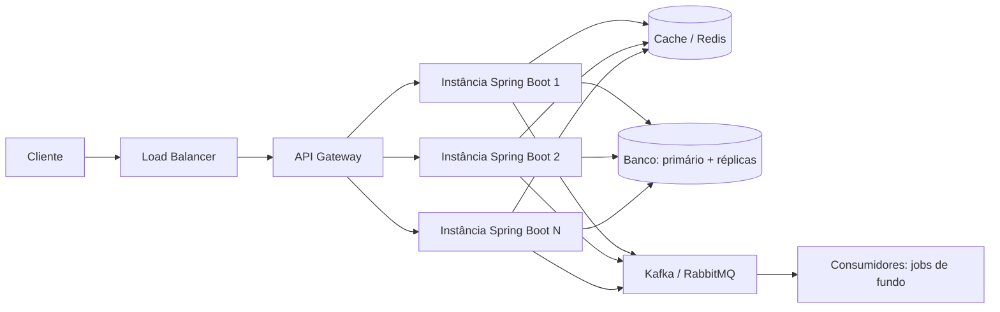

# Escalando uma API para Alta Carga

Quando uma API precisa aguentar 10 mil requisições por segundo, a resposta não é "colocar uma máquina maior". Adicionar CPU resolve pouco se o gargalo está no banco, no cache, na concorrência ou no fato de a aplicação não escalar para várias instâncias. Passar de "funciona no meu teste" para "aguenta produção" é um problema de arquitetura, onde cada camada precisa escalar sem virar o ponto de estrangulamento.

Esta nota é um mapa dessas camadas. Cada seção resume uma frente e aponta para a nota do lab que entra no detalhe.

## Medir antes de mexer

O erro mais comum é adivinhar o gargalo e sair otimizando. O instinto quase sempre erra o alvo.

Um caso real ilustra bem: numa API Spring Boot com banco relacional, todo mundo apostava no cache como solução. O profiling mostrou outra coisa: consultas N+1 e junções trazendo colunas que ninguém usava. Corrigir só isso tirou 25% do p95, sem nenhum Redis envolvido. Se o cache tivesse entrado primeiro, ele teria mascarado o problema real e ainda deixado um bug de invalidação para alguém descobrir meses depois.

Antes de otimizar, olhe os números:

- latência em percentis: p50, p95, p99. A média engana, porque uma minoria de requisições lentas quase não mexe nela, mas é essa minoria que o usuário reclama
- throughput (requisições por segundo) e taxa de erro
- CPU, memória e tempo gasto em pausas de GC
- conexões de banco em uso, taxa de acerto do cache (cache hit ratio), atraso da fila (Kafka lag)

Boa parte disso sai de graça: `/actuator/metrics` e `/actuator/prometheus` no Spring Boot, mais um painel no Grafana. Para pegar N+1 ainda em desenvolvimento, ligue o log de SQL local e conte as queries de um endpoint. O diagnóstico de CPU, memória e GC num processo já rodando está em [Diagnóstico da JVM em Produção](/labs/java/java/18-diagnostico-em-producao/).

Uma última distinção antes de seguir: 10 mil GETs leves por segundo não é a mesma coisa que 10 mil transações complexas por segundo. Cargas diferentes quebram em lugares diferentes, e o número sozinho não diz quase nada.

## O caminho de uma requisição

Numa API de alto tráfego, a requisição costuma passar por esta sequência:

O load balancer (HAProxy, Nginx, LB de nuvem) espalha o tráfego entre as instâncias. O API gateway (Spring Cloud Gateway, Kong) concentra autenticação, rate limiting e roteamento. O cache tira leitura do banco. O banco separa escrita (primário) de leitura (réplicas). A mensageria tira o trabalho pesado do caminho da resposta. Cada uma dessas caixas é uma frente de escala, e é isso que as próximas seções destrincham.

## APIs sem estado (stateless)

Uma API stateless não guarda, na memória de uma instância, nada que seja necessário para atender a próxima requisição: nem sessão de usuário, nem cache que afeta a correção, nem contador.

O motivo é direto. Se a instância guarda a sessão do usuário na memória, a próxima requisição desse usuário precisa cair na mesma instância (o que chamam de sticky session). Isso amarra o load balancer, complica o deploy (derrubar uma instância derruba as sessões dela) e impede que você simplesmente adicione mais instâncias.

A saída é jogar o estado para um store compartilhado. Sessão vira um token JWT que o cliente carrega, ou um registro no Redis que todas as instâncias enxergam. Feito isso, cada instância é descartável: pode subir, cair ou ser substituída sem ninguém perceber.

## Otimizar o banco

O banco é o gargalo mais frequente de uma API, e as correções costumam ser baratas.

- **Índices** nas colunas usadas em `WHERE`, `JOIN` e `ORDER BY`. Uma query que varre a tabela inteira fica lenta na exata proporção em que a tabela cresce.
- **Revisão de query**: olhar o plano de execução (`EXPLAIN`), evitar `SELECT *` e trazer só as colunas que a resposta usa. Junção que puxa 30 campos para exibir 3 é desperdício em toda requisição.
- **Problema N+1**: o código faz uma query para buscar a lista de pedidos e depois uma query por pedido para buscar o cliente. Vinte pedidos viram 21 idas ao banco. Resolve com `JOIN FETCH`, `@EntityGraph` ou uma projeção que já traz tudo junto.
- **Paginação** com `Pageable` em vez de `findAll()`. Retornar 50 mil linhas num endpoint é problema garantido.
- **Pool de conexões**: contraintuitivamente, um pool grande demais deixa o banco mais lento, porque ele passa a alternar entre conexões demais. O número certo é pequeno e sai da capacidade do banco e da duração média das queries, não de "quanto mais melhor".
- **Réplicas de leitura**: mandar as consultas para réplicas e deixar o primário só com a escrita separa as duas cargas.

Repositórios, projeções e mapeamento de entidade estão em [Spring Data](/labs/java/spring/02-spring-data/).

## Cache com critério

O padrão mais comum é o Cache-Aside: antes de ir ao banco, a aplicação olha o cache; no acerto, devolve na hora; no erro, busca no banco, guarda no cache e devolve. Na prática, `@Cacheable` num método de leitura.

O cache resolve pressão de leitura, mas traz os problemas dele junto: definir o TTL, invalidar quando o dado muda, conviver com cache e banco momentaneamente divergentes.

Um problema que só aparece sob carga é o cache stampede (ou thundering herd): uma chave popular expira e, no mesmo instante, todas as requisições que a queriam dão miss ao mesmo tempo e batem no banco juntas. O pico chega justo quando o banco menos espera. As defesas se combinam:

- jitter no TTL: somar um valor aleatório pequeno ao tempo de expiração para as chaves não vencerem todas juntas
- um lock no caminho de recomputação: só a primeira requisição recalcula, as outras esperam e leem o resultado
- servir o valor velho enquanto uma requisição atualiza em background
- cache em camadas: um cache local na instância na frente do Redis, para absorver parte dos misses antes de eles saírem da JVM

Vale lembrar que o cache em memória padrão vive dentro de uma instância. Com várias instâncias, cada uma tem o seu e eles divergem, então o caminho é um Redis compartilhado. A configuração de `@Cacheable` está em [Recursos Avançados do Spring Boot](/labs/java/spring/05-recursos-avancados/).

## Trabalho pesado no assíncrono

Se um pedaço do trabalho não precisa terminar antes de a resposta sair (gerar um PDF, enviar um email, notificar um provedor externo), ele não deveria estar no caminho da requisição.

A versão simples é `@Async`: joga a tarefa para outra thread e responde na hora. A versão que aguenta produção troca a thread por uma fila de mensagens. O trabalho vira uma mensagem que um worker separado consome, e você ganha o que uma thread solta não dá: a mensagem sobrevive a um restart, pode ser reprocessada se falhar, e a carga se distribui entre vários workers.

Kafka e o consumo com `@KafkaListener`, entrega confiável e dead letter estão em [Mensageria com Apache Kafka no Spring Boot](/labs/java/spring/09-mensageria-com-kafka/).

## Escalar horizontalmente

Escalar para cima (uma máquina maior) tem teto e mantém um ponto único de falha. Escalar para os lados é rodar várias instâncias atrás do load balancer e ajustar a quantidade conforme a demanda.

O autoscaling faz esse ajuste sozinho, subindo e descendo instâncias com base em CPU, requisições por segundo ou profundidade de fila. Só que ele depende da aplicação ser stateless, senão adicionar uma instância nova não ajuda em nada.

Um cuidado: o banco não escala do mesmo jeito que as instâncias de API. Dobrar o número de instâncias sem cuidar do banco só move o gargalo de lugar, e agora com mais conexões disputando o mesmo banco.

## Controlar a concorrência

Mais threads não são mais vazão. A partir de certo ponto, o custo de alternar entre threads e a disputa por CPU comem o ganho, e o throughput cai em vez de subir.

O que olhar: o tamanho dos pools (o de requisições HTTP, o de conexões de banco, os executores da aplicação), chamadas bloqueantes que seguram uma thread parada esperando I/O, e contenção de CPU quando há trabalho pesado demais para os núcleos disponíveis.

As Virtual Threads (Java 21+) mudam a conta quando o trabalho é dominado por I/O bloqueante: dá para ter muitas chamadas de rede em andamento sem precisar de um pool gigante. Thread pool exhaustion, o que causa e como diagnosticar com thread dump estão em [Concorrência](/labs/java/java/13-concorrencia/).

## Proteger o sistema

Sob carga, uma falha pequena vira um apagão se nada a contém. As proteções trabalham juntas:

- **rate limiting**: recusar o excesso de requisições na entrada, antes de elas consumirem thread e conexão
- **timeouts** em toda chamada de saída. Sem timeout, uma dependência lenta segura threads que vão se acumulando até a aplicação parar de responder
- **retries** com backoff e jitter, sempre com um limite. Retry sem limite numa dependência caída só piora o incidente
- **circuit breaker**: depois de X falhas seguidas, parar de chamar a dependência por um tempo em vez de insistir
- **bulkhead**: isolar os pools por dependência, para uma delas travada não afundar as chamadas para as outras
- **backpressure**: quando a aplicação está no limite, sinalizar isso em vez de aceitar trabalho que não vai dar conta

A implementação com Resilience4j (`@RateLimiter`, `@CircuitBreaker`, `@Bulkhead`, `@Retry`) está em [Spring Boot e System Design](/labs/java/spring/08-system-design-com-spring/).

## Testar sob carga

Nenhuma das seções acima vale sem um teste que prove o número. E o teste precisa ser realista: um mix de endpoints parecido com o de produção, dados de tamanho real, e uma curva que sobe aos poucos em vez de despejar 10 mil RPS de uma vez.

O objetivo é achar o gargalo no ambiente de teste, não descobrir em produção. As ferramentas mais usadas:

- **k6**: scripts em JavaScript, leve, roda da linha de comando, boa para API
- **Gatling**: DSL em Java ou Kotlin, relatório HTML detalhado, encaixa bem num projeto que já é JVM
- **JMeter**: interface gráfica, suporta muitos protocolos além de HTTP, custa mais recurso por usuário virtual

Rodar o teste de carga no CI ajuda a pegar regressão de performance antes de ela chegar em produção.

## Referências

- [System Design Primer](https://github.com/donnemartin/system-design-primer) - Donne Martin (GitHub), inglês
- [The N+1 Query Problem](https://vladmihalcea.com/n-plus-1-query-problem/) - Vlad Mihalcea, inglês
- [About Pool Sizing](https://github.com/brettwooldridge/HikariCP/wiki/About-Pool-Sizing) - HikariCP wiki, inglês
- [How to tame the thundering herd problem](https://redis.io/blog/how-to-tame-the-thundering-herd-problem/) - Redis, inglês
- [Timeouts, retries, and backoff with jitter](https://aws.amazon.com/builders-library/timeouts-retries-and-backoff-with-jitter/) - Amazon Builders' Library, inglês
- [Testes de carga usando o k6](https://eltonminetto.substack.com/p/testes-de-carga-usando-o-k6) - Elton Minetto, pt-BR
