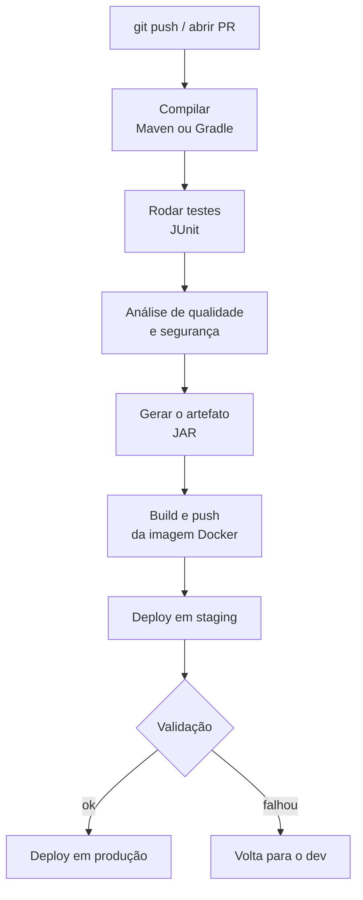
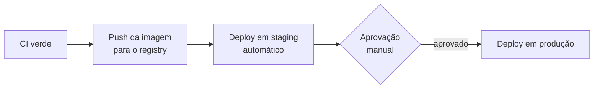

# CI/CD

Em [Testes, Build e Deploy](/labs/java/spring/06-testes-e-deploy/) você viu como rodar os testes, gerar o JAR e subir a aplicação num container. Fazer isso na mão, toda vez, é onde mora o erro: alguém esquece de rodar a suíte antes de subir, o deploy de sexta à noite pula um passo, e ninguém sabe ao certo qual versão está em produção. CI/CD é tirar esse processo das mãos e colocar numa esteira automática.

## Por que automatizar a entrega

O caminho manual costuma ser assim: você compila na sua máquina, roda os testes quando lembra, gera o JAR, copia para o servidor e reinicia o serviço. Cada passo depende de uma pessoa lembrar de fazer certo.

Os problemas clássicos que aparecem daí:

- "Na minha máquina funciona": o código depende de algo que só existe no seu setup
- Teste que ninguém rodou: a suíte quebrou três commits atrás e passou batido
- Passo esquecido no deploy: faltou aplicar a migração de banco, faltou setar uma variável
- Ninguém sabe o que está no ar: a última tag não bate com o que está rodando

A proposta do CI/CD é simples: toda mudança passa pelo mesmo processo automático, sempre, antes de chegar perto de produção. Se o processo é uma esteira e não uma sequência de passos manuais, ele não esquece nada e faz igual toda vez.

Uma ressalva que o autor do post que originou esta nota fez bem: CI/CD não substitui ter uma boa bateria de testes. Ele automatiza e dá consistência à validação que você já deveria estar fazendo. Um pipeline que roda três testes rasos dá uma falsa sensação de segurança.

## CI e CD: o que cada sigla quer dizer

**CI (Continuous Integration, integração contínua):** integrar seu código no repositório central com frequência, várias vezes ao dia. Cada push dispara um build e a suíte de testes automaticamente. Se dois colegas mexeram no mesmo trecho, o conflito aparece em horas, não depois de duas semanas numa branch que ninguém tocou. A parte técnica é a automação; a parte cultural é a disciplina de integrar sempre, sem deixar branch envelhecer.

**CD:** aqui a sigla tem dois significados que costumam ser confundidos.

- **Continuous Delivery (entrega contínua):** o software fica _sempre pronto_ para ir a produção. O pipeline builda, testa, empacota e deixa o artefato a um clique de distância. Quem aperta o botão é uma pessoa.
- **Continuous Deployment (implantação contínua):** todo commit que passa em tudo vai para produção _sozinho_, sem gate manual.

A maioria dos times faz Continuous Delivery e chama de "CD". Continuous Deployment exige uma confiança na suíte de testes que poucos projetos têm.

## O fluxo de um pipeline Java

Um pipeline típico de um projeto Java com Maven ou Gradle:



Cada etapa é uma barreira: se os testes quebram, o pipeline para ali e nada segue para o passo seguinte. O artefato só é gerado se a compilação e os testes passaram; o deploy só acontece se o artefato foi gerado.

## Um pipeline com GitHub Actions

O GitHub Actions é a opção mais direta para quem já usa o GitHub: o pipeline é um arquivo YAML dentro de `.github/workflows/` no próprio repositório.

A hierarquia é: um **workflow** tem um ou mais **jobs**, e cada job tem uma sequência de **steps**. Cada step ou roda um comando (`run:`) ou usa uma ação pronta (`uses:`).

Um workflow de CI para um projeto Maven fica assim:

```yaml
name: CI

on:
  push:
    branches: [main]
  pull_request:

jobs:
  build:
    runs-on: ubuntu-latest
    steps:
      - uses: actions/checkout@v6

      - name: Configurar o JDK
        uses: actions/setup-java@v4
        with:
          java-version: "21"
          distribution: "temurin"
          cache: maven

      - name: Compilar e testar
        run: mvn --batch-mode --update-snapshots verify
```

O que cada parte faz:

- `on:` define os gatilhos. Aqui: todo push na `main` e toda abertura ou atualização de PR.
- `actions/checkout` baixa o código do repositório para a máquina do runner.
- `actions/setup-java` instala o JDK. `distribution: temurin` é a distribuição do Eclipse Adoptium, a mais usada. `cache: maven` guarda as dependências baixadas entre execuções (mais sobre isso abaixo).
- `mvn --batch-mode --update-snapshots verify` roda a fase `verify` do Maven, que compila, roda os testes unitários e de integração. O `--batch-mode` tira a saída interativa que não faz sentido num pipeline.

Se qualquer step falhar, o job falha, e o GitHub marca o commit ou o PR com um X vermelho. Dá para configurar o repositório para bloquear o merge de um PR enquanto o CI não estiver verde.

## Cache, artefatos e matrix

Três recursos que valem a pena desde cedo:

**Cache de dependências.** Sem cache, cada execução do pipeline baixa todas as dependências do Maven Central de novo, o que leva minutos. O `cache: maven` do `setup-java` guarda o `~/.m2` e restaura na próxima execução, invalidando quando o `pom.xml` muda. Para Gradle a ideia é a mesma com `cache: gradle`.

**Artefatos.** O JAR gerado (ou o relatório de cobertura, ou o resultado dos testes) só existe na máquina efêmera do runner. Para guardá-lo depois que o job termina, use `actions/upload-artifact`:

```yaml
- name: Guardar o JAR
  uses: actions/upload-artifact@v4
  with:
    name: app-jar
    path: target/*.jar
```

**Matrix build.** Se a aplicação precisa rodar em mais de uma versão do JDK, um `strategy.matrix` roda o mesmo job em paralelo para cada versão:

```yaml
strategy:
  matrix:
    java: ["21", "25"]
```

## Da CI para a CD

Depois que o CI garante que o código compila e passa nos testes, o CD leva o artefato adiante.

O passo mais comum num projeto Spring Boot é empacotar numa imagem Docker (o `Dockerfile` está na nota de [Testes, Build e Deploy](/labs/java/spring/06-testes-e-deploy/)) e publicar num registry: Docker Hub, GitHub Container Registry (GHCR) ou o registry da sua nuvem.

Isso precisa de credenciais, e credencial não vai no YAML. O GitHub tem **secrets**: você cadastra `DOCKER_TOKEN`, `SSH_KEY` e afins nas configurações do repositório, e o workflow acessa com `${{ secrets.DOCKER_TOKEN }}`. O valor nunca aparece no log.

Para o gate de produção, o GitHub tem **environments**. Você cria um environment chamado `production` e marca "required reviewers": o job de deploy para produção fica pendente até alguém aprovar na interface. Staging pode ser automático, produção espera o clique. É assim que se faz Continuous Delivery na prática.



## Quality gates e DevSecOps

Um quality gate é uma condição que o pipeline verifica e que, se não for atendida, derruba o build. Alguns comuns num projeto Java:

- **Cobertura de testes:** o JaCoCo mede a cobertura e o build falha se ela cai abaixo de um limite
- **Análise estática:** SpotBugs e Checkstyle procuram bugs prováveis e violações de estilo sem rodar o código; o SonarQube junta isso num painel com histórico
- **Dependências vulneráveis:** o OWASP Dependency-Check e o Dependabot avisam quando uma biblioteca do projeto tem CVE conhecida

A ideia por trás disso é o "shift left": puxar a descoberta do problema para o começo do processo. Um bug encontrado no PR custa cinco minutos; o mesmo bug em produção custa um incidente. Colocar a análise de segurança dentro do pipeline, e não como uma auditoria trimestral, é o que se chama de DevSecOps.

## Onde isso encosta no resto do lab

- O build com Maven e o deploy com Docker que o pipeline automatiza estão em [Testes, Build e Deploy](/labs/java/spring/06-testes-e-deploy/), inclusive a dica de usar seed determinística para o teste que roda no CI não ficar intermitente
- Depois que a mudança está no ar, observar o comportamento dela (métricas, logs, tracing) é assunto de [Escalando uma API para Alta Carga](/labs/java/spring/12-escalando-para-alta-carga/)

## Referências

- [O que é CI/CD? Aprenda integração contínua/entrega contínua criando um projeto](https://www.freecodecamp.org/portuguese/news/o-que-e-ci-cd-aprenda-integracao-continua-entrega-continua-criando-um-projeto/) - freeCodeCamp, pt-BR
- [O que é integração contínua e entrega/implantação contínuas?](https://docs.aws.amazon.com/pt_br/whitepapers/latest/practicing-continuous-integration-continuous-delivery/what-is-continuous-integration-and-continuous-deliverydeployment.html) - AWS, pt-BR
- [Compilar e testar Java com o Maven](https://docs.github.com/pt/actions/tutorials/build-and-test-code/java-with-maven) - GitHub Docs, pt-BR
- [Continuous Integration](https://martinfowler.com/articles/continuousIntegration.html) - Martin Fowler, inglês
- [Building Secure CI/CD Pipelines with GitHub Actions for Your Java Application](https://foojay.io/today/building-secure-ci-cd-pipelines-with-github-actions-for-your-java-application/) - Foojay, inglês
